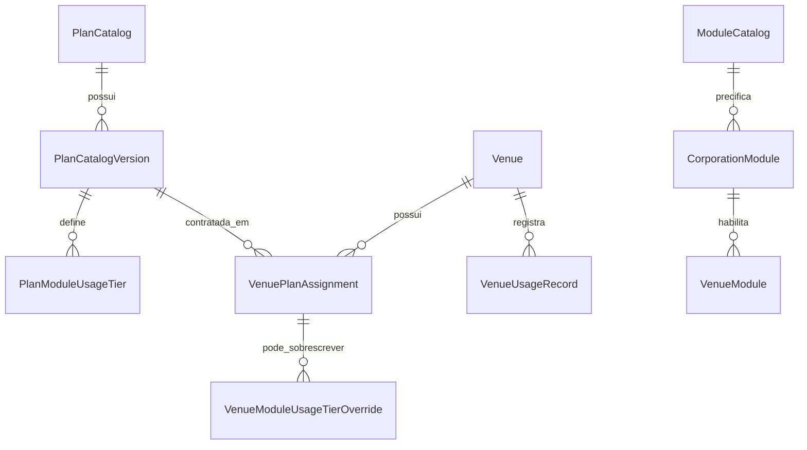

# Cobrança versionada do NeuraBar

Este documento explica como planos, módulos e consumo medido formam a assinatura de um cliente. Ele serve como referência para os times Comercial, Suporte e Desenvolvimento.

## Resumo executivo

O valor mensal de cada estabelecimento (`Venue`) é composto por quatro parcelas:

$$
\text{total} =
\text{compromisso do plano}
+ \text{mensalidade dos módulos}
+ \text{consumo medido}
+ \text{infraestrutura dedicada}
$$

Em termos comerciais:

- O **plano** define o compromisso mínimo mensal e as cotas de consumo.
- Os **módulos** são produtos contratados à parte e podem ter mensalidade própria.
- O **consumo medido** cobra o uso que excede a cota definida para cada módulo.
- A **infraestrutura dedicada** pode acrescentar uma sobretaxa à assinatura.

Um plano comercial possui versões. Quando um cliente contrata `Pro`, por exemplo, o contrato aponta para uma versão específica, como `Pro v2`. Novas versões não mudam automaticamente contratos existentes.

## Respostas rápidas por área

### Comercial

- O cliente escolhe um plano comercial, mas fica vinculado à versão vigente desse plano.
- A cota e o preço excedente podem variar entre planos.
- A mensalidade de um módulo e sua cobrança por consumo são parcelas diferentes.
- Uma condição negociada para um estabelecimento pode substituir as faixas padrão do plano.
- Alterações futuras de preço devem gerar uma nova versão com data de vigência.

### Suporte

- Confira primeiro o estabelecimento e o período questionado.
- Identifique a versão do plano atribuída naquele período.
- Confirme quais módulos estavam contratados e ativos.
- Verifique o consumo registrado no período de referência, normalmente o mês anterior.
- Verifique se há uma condição especial (`override`) para o estabelecimento.
- Compare as parcelas `base`, `modules`, `metered` e `dedicated_surcharge` separadamente.

### Desenvolvimento

- Todos os totais finais são persistidos em centavos.
- Preços unitários de consumo são persistidos em micros, com quatro casas decimais.
- O cálculo de consumo é progressivo: cada parte do volume usa a faixa correspondente.
- A prioridade de resolução é override da venue, versão do plano e fallback legado.
- `calculateVenue()` é puro; `refreshVenueSnapshot()` persiste o resultado na assinatura.

## Glossário

| Termo | Entidade | Responsabilidade |
|---|---|---|
| Plano comercial | `PlanCatalog` | Produto apresentado ao cliente, como Basic, Pro ou Enterprise |
| Versão do plano | `PlanCatalogVersion` | Compromisso, vigência, infraestrutura e faixas válidas em determinado momento |
| Atribuição contratual | `VenuePlanAssignment` | Liga uma venue a uma versão específica durante um período |
| Catálogo de módulo | `ModuleCatalog` | Define o módulo e sua mensalidade padrão |
| Módulo corporativo | `CorporationModule` | Contratação do módulo e eventual preço mensal negociado |
| Módulo da venue | `VenueModule` | Ativação e quantidade do módulo em um estabelecimento |
| Faixa do plano | `PlanModuleUsageTier` | Cota e preços de consumo de um módulo em uma versão do plano |
| Condição especial | `VenueModuleUsageTierOverride` | Substitui integralmente as faixas do plano para uma venue |
| Faixa legada | `ModuleUsageTier` | Fallback global temporário, sem vínculo direto com plano |
| Registro de consumo | `VenueUsageRecord` | Quantidade consumida por venue, módulo e período |

## Relação entre as entidades



### O que o cliente escolhe

Na interface, o cliente escolhe um `PlanCatalog`. O backend resolve a versão publicada vigente e cria um `VenuePlanAssignment` contendo:

```text
VenuePlanAssignment
├── venue_id
├── plan_catalog_id
├── plan_catalog_version_id
├── starts_on
└── ends_on
```

A partir desse momento, preço e cotas vêm do `PlanCatalogVersion` contratado. Publicar uma versão nova apenas a torna disponível; contratos existentes continuam na versão anterior até uma mudança de plano aprovada.

## Composição da assinatura

### 1. Compromisso do plano

O valor-base vem de:

```php
$planAssignment->planCatalogVersion->minimum_monthly_price
```

Quando ainda não existe assignment, o sistema utiliza temporariamente:

```php
$subscription->base_value
```

Essa parcela aparece como `base`.

### 2. Mensalidade dos módulos

Para cada módulo contratado pela corporation e ativo na venue, o preço unitário mensal é:

```php
$corporationModule->custom_monthly_price
    ?? $moduleCatalog->base_monthly_price
```

O preço é multiplicado pela quantidade do módulo na venue. Se o módulo foi ativado ou encerrado durante o mês, a cobrança da fatura é proporcional aos dias de vigência.

Essa parcela aparece como `modules`.

### 3. Consumo medido

O sistema considera somente registros de módulos que estavam contratados no período. Para cada `VenueUsageRecord`, ele:

1. Localiza as faixas aplicáveis.
2. Divide a quantidade entre as faixas alcançadas.
3. Calcula preço-base e excedente de cada faixa.
4. Soma o resultado em `metered`.
5. Grava no registro as faixas e a versão utilizadas para auditoria.

### 4. Infraestrutura dedicada

Quando aplicável, `dedicated_surcharge` é somado às demais parcelas. Esse valor é independente do compromisso e do consumo.

## Faturamento por venue ou unificado

O cálculo sempre acontece primeiro por estabelecimento. O modo de faturamento define apenas como esses resultados são cobrados:

- **`per_venue`:** cada venue possui sua própria cobrança.
- **`unified`:** os totais das venues são somados em uma cobrança corporativa.

No modo unificado:

$$
	ext{total da corporation} = \sum \text{total de cada venue}
$$

As cotas não são compartilhadas entre estabelecimentos. Se duas venues possuem uma cota de 1.000 unidades, cada uma é calculada separadamente contra sua própria cota e seu próprio consumo; somente os valores finais são agrupados.

## Como as faixas são escolhidas

A resolução segue esta prioridade:

1. **Condição especial da venue:** `VenueModuleUsageTierOverride`.
2. **Faixas da versão contratada:** `PlanModuleUsageTier`.
3. **Fallback global legado:** `ModuleUsageTier`.

Um conjunto de overrides substitui integralmente as faixas do plano para aquele módulo e assignment; ele não é somado às faixas padrão.

`ModuleUsageTier` não possui `plan_catalog_id` nem `plan_catalog_version_id`. Ele será removível quando todas as venues tiverem assignments e faixas versionadas completas.

## Propriedades de uma faixa

As mesmas propriedades existem nas faixas do plano, nos overrides e no modelo legado.

| Propriedade | Significado |
|---|---|
| `module_code` | Módulo medido, como `kds` ou `taker` |
| `min_quantity` | Início inclusivo da faixa |
| `max_quantity` | Final inclusivo; `null` significa sem limite superior |
| `included_quantity` | Unidades desta faixa tratadas pelo preço-base antes do excedente |
| `price_per_unit` | Preço-base de cada unidade incluída, em micros |
| `flat_price` | Preço-base fixo da faixa, em centavos; substitui `price_per_unit` quando não é `null` |
| `overage_price_per_unit` | Preço de cada unidade excedente, em micros |
| `overage_flat_fee` | Taxa fixa em centavos, aplicada uma vez quando há excedente na faixa |
| `currency` | Moeda, normalmente `BRL` |

### Atenção ao significado de “incluído”

`included_quantity` não significa necessariamente “gratuito”. Essas unidades são cobradas por `price_per_unit`, salvo quando esse preço é zero.

Para que a cota seja gratuita:

```php
'included_quantity' => 1000,
'price_per_unit' => 0,
```

## Escalas monetárias

| Tipo | Escala | Exemplo persistido | Valor comercial |
|---|---:|---:|---:|
| Compromisso do plano | Centavos | `14900` | R$ 149,00 |
| Mensalidade do módulo | Centavos | `3000` | R$ 30,00 |
| `flat_price` | Centavos | `500` | R$ 5,00 |
| `overage_flat_fee` | Centavos | `1000` | R$ 10,00 |
| `price_per_unit` | Micros | `500` | R$ 0,0500 |
| `overage_price_per_unit` | Micros | `1000` | R$ 0,1000 |

Não interpretar `1000` da mesma forma em todos os campos: em um preço final significa R$ 10,00; em um preço unitário significa R$ 0,1000.

## Fórmula do consumo

Para cada faixa alcançada:

$$
\text{unidades incluídas} =
\min(\text{unidades na faixa}, \text{included\_quantity})
$$

$$
\text{unidades excedentes} =
\text{unidades na faixa} - \text{unidades incluídas}
$$

Quando `flat_price` é `null`:

$$
\text{preço-base} =
\text{unidades incluídas} \times \text{price\_per\_unit}
$$

Quando `flat_price` não é `null`, ele substitui o preço-base por unidade:

$$
\text{preço-base} = \text{flat\_price}
$$

Se houver excedente:

$$
\text{preço excedente} =
\text{overage\_flat\_fee}
+ (\text{unidades excedentes} \times \text{overage\_price\_per\_unit})
$$

O total medido é a soma do preço-base e do excedente de todas as faixas alcançadas.

## Configurações comerciais comuns

### Cota gratuita e excedente único

Para oferecer 1.000 unidades gratuitas e cobrar R$ 0,10 por unidade adicional:

```php
[
    'min_quantity' => 0,
    'max_quantity' => null,
    'included_quantity' => 1000,
    'price_per_unit' => 0,
    'flat_price' => null,
    'overage_price_per_unit' => 1000,
    'overage_flat_fee' => 0,
]
```

Com consumo de 1.200 unidades:

$$
\text{consumo medido} =
(1000 \times R\$\,0{,}00) + (200 \times R\$\,0{,}10)
= R\$\,20{,}00
$$

Para essa política, uma faixa com `max_quantity: null` é a configuração mais simples. Se a única faixa terminasse em 1.000, as unidades seguintes não encontrariam faixa de cobrança.

### Cota paga e excedente

Para cobrar R$ 0,05 pelas primeiras 1.000 unidades e R$ 0,10 pelo excedente:

```php
[
    'min_quantity' => 0,
    'max_quantity' => null,
    'included_quantity' => 1000,
    'price_per_unit' => 500,
    'flat_price' => null,
    'overage_price_per_unit' => 1000,
    'overage_flat_fee' => 0,
]
```

Com 1.200 unidades:

$$
(1000 \times R\$\,0{,}05) + (200 \times R\$\,0{,}10)
= R\$\,70{,}00
$$

### Múltiplas faixas progressivas

Cada faixa deve começar exatamente após o fim da anterior. Exemplo:

```text
0–1000
1001–5000
5001–sem limite
```

O cálculo é progressivo: consumir 5.200 unidades atravessa e soma as três faixas. `included_quantity` é aplicado separadamente em cada faixa, portanto deve ser configurado com cuidado para não conceder cotas repetidas involuntariamente.

## Exemplo completo de assinatura

Considere uma venue com:

- compromisso do plano: R$ 149,00;
- mensalidade do módulo KDS: R$ 30,00;
- cota gratuita: 1.000 unidades;
- consumo registrado: 1.200 unidades;
- excedente: R$ 0,10 por unidade;
- sem infraestrutura dedicada.

O consumo medido é:

$$
200 \times R\$\,0{,}10 = R\$\,20{,}00
$$

A assinatura total é:

$$
R\$\,149{,}00 + R\$\,30{,}00 + R\$\,20{,}00
= \boxed{R\$\,199{,}00}
$$

Em centavos:

```php
[
    'base' => 14900,
    'modules' => 3000,
    'metered' => 2000,
    'dedicated_surcharge' => 0,
    'total' => 19900,
]
```

## Período de cobrança

Por padrão, a fatura de um mês usa:

- compromisso, módulos e infraestrutura vigentes no mês faturado;
- consumo medido no mês anterior.

Exemplo:

```php
calculateVenue(
    venue: $venue,
    period: '2026-09',
    usagePeriod: '2026-08',
);
```

Nesse caso, a fatura é de setembro e o consumo cobrado é o registrado em agosto.

## Persistência e auditoria

`calculateVenue()` apenas calcula. `refreshVenueSnapshot()` persiste na `VenueSubscription`:

```text
base_value
modules_value
metered_value
total_value
```

O `VenueUsageRecord` também recebe os valores calculados e as referências usadas:

```text
included_quantity
overage_quantity
base_calculated_price
overage_calculated_price
total_calculated_price
venue_plan_assignment_id
plan_catalog_version_id
plan_module_usage_tier_id
venue_module_usage_tier_override_id
```

Esses campos permitem explicar qual contrato e qual faixa produziram uma cobrança.

## Alteração de preços

Planos versionados não devem ser editados retroativamente. Uma mudança de compromisso ou faixas deve criar uma nova versão com vigência futura.

O comando operacional é:

```bash
sail artisan billing:update-prices --defaults --effective-from=2026-09-01
```

Antes de confirmar, ele mostra:

- preços dos planos;
- mensalidades dos módulos;
- faixas de cada módulo por plano;
- data de início da nova vigência.

O processo é transacional: se qualquer plano, módulo ou faixa for inválido, nenhuma alteração é persistida.

## Checklist de atendimento do Suporte

Quando um cliente questionar uma cobrança:

1. Confirme a venue e o mês da fatura.
2. Confirme o período de consumo associado.
3. Identifique o `VenuePlanAssignment` vigente.
4. Confirme o `PlanCatalogVersion` e seu compromisso mínimo.
5. Liste os módulos ativos e eventuais preços customizados.
6. Localize o `VenueUsageRecord` do módulo questionado.
7. Verifique se foi usado override, faixa do plano ou fallback legado.
8. Compare quantidade incluída, excedente e preços persistidos no registro.
9. Separe a explicação em plano, módulos, consumo e infraestrutura.
10. Em caso de divergência, preserve os IDs do assignment, versão, tier e registro para análise técnica.

## Regras para propostas comerciais

- Sempre informar se a cota é gratuita ou cobrada pelo preço-base.
- Informar claramente a unidade medida: pedido, impressão, mensagem ou outra.
- Informar a periodicidade da cota e do consumo.
- Informar o preço excedente com quatro casas quando necessário.
- Registrar condições especiais como override da venue, não alterando a versão padrão do plano.
- Definir uma data futura para reajustes.
- Não prometer migração automática de contratos existentes para uma nova versão.

## Referências técnicas

- Cálculo total: [`SubscriptionCalculator`](../app/Services/Billing/SubscriptionCalculator.php)
- Resolução das faixas: [`UsagePricingResolver`](../app/Services/Billing/UsagePricingResolver.php)
- Cálculo progressivo: [`UsageTierCalculator`](../app/Services/Billing/UsageTierCalculator.php)
- Atualização de preços: [`UpdateCatalogPrices`](../app/Console/Commands/UpdateCatalogPrices.php)
- Aplicação transacional: [`UpdateCatalogPricesAction`](../app/Actions/Billing/UpdateCatalogPricesAction.php)
- Conversão monetária: [`Money`](../app/Support/Money.php)
