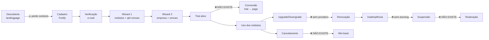
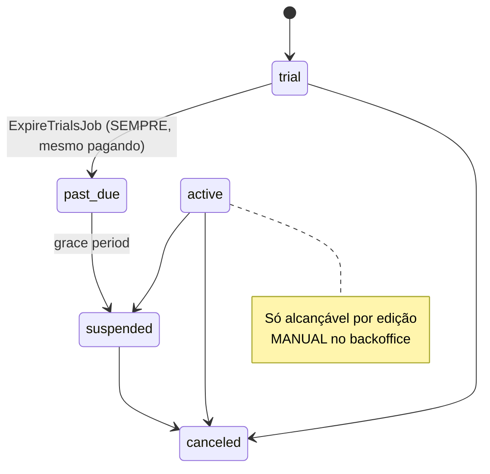

Lista de tarefas pendentes atualizada

I'll start by examining the repository state and extracting the diff. 

Ran terminal command: git --no-pager branch -a | head -50 && echo "---CURRENT---" && git rev-parse --abbrev-ref HEAD

Ran terminal command: git --no-pager diff --stat main...feat/sistema-modulos-assinaturas | tail -20 && echo "===MERGEBASE===" && git merge-base main feat/sistema-modulos-assinaturas

Ran terminal command: git --no-pager diff --stat main...feat/sistema-modulos-assinaturas | head -270

Read memory [](file:///home/rodrigo/.config/Code/User/workspaceStorage/ea65ade0a3ac20d60ab4cee05f9bdc64/GitHub.copilot-chat/memory-tool/memories/repo/module-subscription-planning.md)

Read [](file:///home/rodrigo/.config/Code/User/workspaceStorage/ea65ade0a3ac20d60ab4cee05f9bdc64/GitHub.copilot-chat/chat-session-resources/18c8cf4f-e619-4901-99a7-b4f7c399a97e/toolu_01GKc9LQ2XxntzPkMga6KUyp__vscode-1785684898355/content.txt)

Vou analisar o épico em profundidade. Dado o volume (279 arquivos, ~16k linhas), vou paralelizar a análise em frentes especializadas.     

Analisar jornada onboarding/cadastro

Analisar ciclo de vida da assinatura

Analisar gateway de pagamento

Analisar permissões e módulos

Analisar UI/UX do épico

Ran terminal command: git --no-pager diff --stat main...feat/sistema-modulos-assinaturas | tail -40 && echo "---BRANCH---" && git branch --show-current

Ran terminal command: git --no-pager diff --stat main...feat/sistema-modulos-assinaturas -- resources/js resources/translations

Read memory [](file:///home/rodrigo/.config/Code/User/workspaceStorage/ea65ade0a3ac20d60ab4cee05f9bdc64/GitHub.copilot-chat/memory-tool/memories/repo/neurabar-app-structure.md)

Read memory [](file:///home/rodrigo/.config/Code/User/workspaceStorage/ea65ade0a3ac20d60ab4cee05f9bdc64/GitHub.copilot-chat/memory-tool/memories/repo/module-subscription-planning.md)

Read memory [](file:///home/rodrigo/.config/Code/User/workspaceStorage/ea65ade0a3ac20d60ab4cee05f9bdc64/GitHub.copilot-chat/memory-tool/memories/repo/module-subscription-planning.md)

Read memory [](file:///home/rodrigo/.config/Code/User/workspaceStorage/ea65ade0a3ac20d60ab4cee05f9bdc64/GitHub.copilot-chat/memory-tool/memories/repo/neurabar-app-structure.md)

Read memory [](file:///home/rodrigo/.config/Code/User/workspaceStorage/ea65ade0a3ac20d60ab4cee05f9bdc64/GitHub.copilot-chat/memory-tool/memories/repo/module-subscription-planning.md)

Read memory [](file:///home/rodrigo/.config/Code/User/workspaceStorage/ea65ade0a3ac20d60ab4cee05f9bdc64/GitHub.copilot-chat/memory-tool/memories/repo/neurabar-app-structure.md)

Ran terminal command: git --no-pager diff --stat main...feat/sistema-modulos-assinaturas | tail -40 && echo "=== ROUTES ===" && ls routes/web/ && echo "=== MIDDLEWARE ===" && ls app/Http/Middleware/ && echo "=== PLATFORM CTRL ===" && ls app/Http/Controllers/Platform/ && echo "=== POLICIES ===" && ls app/Policies/ && echo "=== REQUESTS ===" && ls app/Http/Requests/

Search complete: Mapear arquivos de pagamento

Searched for files matching `**/app/Services/Billing/*.php`, 2 matches

Searched for files matching `**/app/Jobs/Billing/*.php`, 7 matches

Searched for files matching `**/app/Actions/Subscription/*.php`, 6 matches

Searched for files matching `**/app/Enums/{SubscriptionStatus,InvoiceStatus,BillingMode,ModuleStatus,ModuleBillingType}.php`, 5 matches

Searched codebase for "integração pagamento Asaas gateway webhooks assinaturas faturas métodos de pagamento", 20 results

Searched for files matching `**/app/Services/Subscription/**`, 4 matches

Searched for files matching `**/app/Actions/Subscription/**`, 6 matches

Searched for files matching `**/app/Jobs/Subscription/**`, 1 match

Searched for files matching `**/app/Http/Controllers/**`, 64 matches

Searched for files matching `**/app/Models/Tenant/**`, 18 matches

Searched for files matching `**/app/Exceptions/Subscription/**`, 2 matches

Searched for files matching `**/tests/Unit/**/Subscription/**`, 3 matches

Searched for files matching `**/tests/Feature/**/Subscription/**`, 3 matches

Searched for regex `Asaas|asaas`, 59 results

Searched for regex `webhook.*payment|payment.*webhook|gateway.*payment`, 159 results

Searched for regex `subscription|assinatura|fatura|invoice` (`**/app/**`), 722 results

Read [](file:///home/rodrigo/workplace/inteligenciakn2/neurabar2/app/Actions/Fortify/CreateNewUser.php)

Read [](file:///home/rodrigo/workplace/inteligenciakn2/neurabar2/app/Actions/Fortify/CreateNewUserPlatform.php)

Read [](file:///home/rodrigo/workplace/inteligenciakn2/neurabar2/app/Actions/Fortify/CreateUserOwnerDefinitions.php#1-1), lines 1 to 250

Read [](file:///home/rodrigo/workplace/inteligenciakn2/neurabar2/bootstrap/app.php)

Read [](file:///home/rodrigo/workplace/inteligenciakn2/neurabar2/resources/js/Components)

Read [](file:///home/rodrigo/workplace/inteligenciakn2/neurabar2/docs/visual_identity.md#1-1), lines 1 to 200

Read skill [inertia-vue-development](file:///home/rodrigo/workplace/inteligenciakn2/neurabar2/.github/skills/inertia-vue-development/SKILL.md?vscodeLinkType%3Dskill#1-1), lines 1 to 200

Read [](file:///home/rodrigo/workplace/inteligenciakn2/neurabar2/app/Actions/Onboarding/FinalizeOnboardingAction.php)

Read [](file:///home/rodrigo/workplace/inteligenciakn2/neurabar2/app/Actions/Onboarding/StartCorporationSubscriptionAction.php)

Read [](file:///home/rodrigo/workplace/inteligenciakn2/neurabar2/app/Http/Controllers/Onboarding/SubscriptionController.php)

Read [](file:///home/rodrigo/workplace/inteligenciakn2/neurabar2/app/Http/Controllers/Onboarding/CorporationController.php)

Read [](file:///home/rodrigo/workplace/inteligenciakn2/neurabar2/app/Services/Billing/SubscriptionCalculator.php)

Read [](file:///home/rodrigo/workplace/inteligenciakn2/neurabar2/app/Services/Billing/BillingStatusService.php)

Read [](file:///home/rodrigo/workplace/inteligenciakn2/neurabar2/app/Jobs/Billing/GenerateInvoicesJob.php)

Read [](file:///home/rodrigo/workplace/inteligenciakn2/neurabar2/app/Enums/SubscriptionStatus.php)

Read [](file:///home/rodrigo/workplace/inteligenciakn2/neurabar2/resources/js/Pages/Onboarding/Subscription.vue)

Read [](file:///home/rodrigo/workplace/inteligenciakn2/neurabar2/resources/js/Pages/Onboarding/Corporation.vue)

Read [](file:///home/rodrigo/workplace/inteligenciakn2/neurabar2/resources/js/Pages/Settings/Subscription/Index.vue)

Read [](file:///home/rodrigo/workplace/inteligenciakn2/neurabar2/resources/js/Pages/Settings/Subscription/PaymentMethods.vue)

Read [](file:///home/rodrigo/workplace/inteligenciakn2/neurabar2/app/Http/Middleware/RequireRole.php)

Read [](file:///home/rodrigo/workplace/inteligenciakn2/neurabar2/app/Http/Middleware/RequirePlatformProfile.php)

Read [](file:///home/rodrigo/workplace/inteligenciakn2/neurabar2/app/Http/Middleware/RequirePlatformRole.php)

Read [](file:///home/rodrigo/workplace/inteligenciakn2/neurabar2/app/Http/Middleware/RequireModule.php)

Read [](file:///home/rodrigo/workplace/inteligenciakn2/neurabar2/app/Http/Middleware/SetVenueContext.php)

Read [](file:///home/rodrigo/workplace/inteligenciakn2/neurabar2/app/Http/Requests/Onboarding/StoreSubscriptionRequest.php)

Read [](file:///home/rodrigo/workplace/inteligenciakn2/neurabar2/app/Http/Requests/Onboarding/StoreCorporationRequest.php)

Read [](file:///home/rodrigo/workplace/inteligenciakn2/neurabar2/app/Http/Responses/LoginResponse.php)

Read [](file:///home/rodrigo/workplace/inteligenciakn2/neurabar2/app/Http/Responses/VerifyEmailResponse.php)

Read [](file:///home/rodrigo/workplace/inteligenciakn2/neurabar2/app/Jobs/Billing/ExpireTrialsJob.php)

Read [](file:///home/rodrigo/workplace/inteligenciakn2/neurabar2/app/Jobs/Billing/SuspendOverdueSubscriptionsJob.php)

Read [](file:///home/rodrigo/workplace/inteligenciakn2/neurabar2/app/Jobs/Billing/MarkInvoicesOverdueJob.php)

Read [](file:///home/rodrigo/workplace/inteligenciakn2/neurabar2/app/Jobs/Billing/NotifyTrialEndingSoonJob.php)

Read [](file:///home/rodrigo/workplace/inteligenciakn2/neurabar2/app/Services/Subscription/FakePaymentGateway.php)

Read [](file:///home/rodrigo/workplace/inteligenciakn2/neurabar2/app/Services/Subscription/AsaasPaymentGateway.php#1-1), lines 1 to 260

Read [](file:///home/rodrigo/workplace/inteligenciakn2/neurabar2/app/Services/Subscription/PaymentSaasService.php#1-1), lines 1 to 260

Read [](file:///home/rodrigo/workplace/inteligenciakn2/neurabar2/app/Actions/Subscription/ProcessWebhookPaymentAction.php)

Read [](file:///home/rodrigo/workplace/inteligenciakn2/neurabar2/app/Actions/Subscription/ActivateGatewaySubscriptionAction.php)

Read [](file:///home/rodrigo/workplace/inteligenciakn2/neurabar2/app/Models/Tenant/GatewayWebhookEvent.php)

Read [](file:///home/rodrigo/workplace/inteligenciakn2/neurabar2/app/Models/Tenant/PaymentAttempt.php)

Read [](file:///home/rodrigo/workplace/inteligenciakn2/neurabar2/app/Http/Controllers/Api/PaymentWebhookController.php)

Read [](file:///home/rodrigo/workplace/inteligenciakn2/neurabar2/app/Providers/AppServiceProvider.php#30-30), lines 30 to 80

Read [](file:///home/rodrigo/workplace/inteligenciakn2/neurabar2/routes/web.php)

Read [](file:///home/rodrigo/workplace/inteligenciakn2/neurabar2/routes/web/platform.php)

Read [](file:///home/rodrigo/workplace/inteligenciakn2/neurabar2/routes/web/operational.php)

Read [](file:///home/rodrigo/workplace/inteligenciakn2/neurabar2/routes/api.php)

Read [](file:///home/rodrigo/workplace/inteligenciakn2/neurabar2/resources/js/Pages/Settings/Subscription/Invoices.vue)

Read [](file:///home/rodrigo/workplace/inteligenciakn2/neurabar2/resources/js/Pages/Settings/Subscription/InvoiceShow.vue)

Read [](file:///home/rodrigo/workplace/inteligenciakn2/neurabar2/resources/js/Pages/Settings/Subscription/BillingAddress.vue)

Read [](file:///home/rodrigo/workplace/inteligenciakn2/neurabar2/resources/js/Composables/useModules.ts)

Searched for files matching `**/docs/module-subscription-architecture.md`, no matches

Read [](file:///home/rodrigo/workplace/inteligenciakn2/neurabar2/app/Providers/AppServiceProvider.php#20-20), lines 20 to 80

Read [](file:///home/rodrigo/workplace/inteligenciakn2/neurabar2/app/Models/Tenant/GatewayWebhookEvent.php)

Read [](file:///home/rodrigo/workplace/inteligenciakn2/neurabar2/app/Models/Tenant/PaymentAttempt.php)

Read [](file:///home/rodrigo/workplace/inteligenciakn2/neurabar2/app/Actions/Subscription/SubscribeModuleAction.php)

Read [](file:///home/rodrigo/workplace/inteligenciakn2/neurabar2/app/Actions/Subscription/UnsubscribeModuleAction.php)

Read [](file:///home/rodrigo/workplace/inteligenciakn2/neurabar2/app/Actions/Platform/UpdateCorporationSubscriptionAction.php)

Read [](file:///home/rodrigo/workplace/inteligenciakn2/neurabar2/app/Services/Subscription/GatewayCustomerResolver.php)

Read [](file:///home/rodrigo/workplace/inteligenciakn2/neurabar2/routes/web.php)

Read [](file:///home/rodrigo/workplace/inteligenciakn2/neurabar2/app/Http/Middleware/SetVenueContext.php)

Read [](file:///home/rodrigo/workplace/inteligenciakn2/neurabar2/routes/web/onboarding.php)

Read [](file:///home/rodrigo/workplace/inteligenciakn2/neurabar2/app/Providers/FortifyServiceProvider.php)

Read [](file:///home/rodrigo/workplace/inteligenciakn2/neurabar2/app/Actions/Subscription/SubscribeModuleAction.php)

Read [](file:///home/rodrigo/workplace/inteligenciakn2/neurabar2/app/Actions/Subscription/UnsubscribeModuleAction.php)

Read [](file:///home/rodrigo/workplace/inteligenciakn2/neurabar2/app/Jobs/Billing/RecalculateSubscriptionJob.php)

Read [](file:///home/rodrigo/workplace/inteligenciakn2/neurabar2/app/Jobs/Billing/RecordModuleUsageJob.php)

Ran terminal command: git --no-pager diff main...feat/sistema-modulos-assinaturas -- resources/js/Pages/Delivery/Index.vue resources/js/Pages/Finance/Index.vue resources/js/Pages/Settings/Index.vue resources/js/Layouts/SettingsLayout.vue resources/js/Pages/Auth/Login.vue resources/js/Pages/Platform/Corporations/Index.vue

Read [](file:///home/rodrigo/workplace/inteligenciakn2/neurabar2/app/Actions/Corporation/CreateVenueAction.php)

Read [](file:///home/rodrigo/workplace/inteligenciakn2/neurabar2/app/Actions/Corporation/ProvisionPlanModulesAction.php)

Read [](file:///home/rodrigo/workplace/inteligenciakn2/neurabar2/app/Http/Middleware/HandleInertiaRequests.php)

Read [](file:///home/rodrigo/workplace/inteligenciakn2/neurabar2/routes/web/guest.php)

Read [](file:///home/rodrigo/workplace/inteligenciakn2/neurabar2/resources/js/Pages/Auth/Register.vue)

Read [](file:///home/rodrigo/workplace/inteligenciakn2/neurabar2/resources/js/Pages/Platform/Corporations/Modules/Index.vue)

Read [](file:///home/rodrigo/workplace/inteligenciakn2/neurabar2/app/Models/Tenant/CorporationSubscription.php)

Read [](file:///home/rodrigo/workplace/inteligenciakn2/neurabar2/app/Actions/Subscription/CancelSubscriptionAction.php)

Read [](file:///home/rodrigo/workplace/inteligenciakn2/neurabar2/app/Models/Tenant/VenueSubscription.php)

Read [](file:///home/rodrigo/workplace/inteligenciakn2/neurabar2/routes/console.php)

Read [](file:///home/rodrigo/workplace/inteligenciakn2/neurabar2/app/Services/Subscription/PaymentSaasService.php#200-200), lines 200 to 362

Read [](file:///home/rodrigo/workplace/inteligenciakn2/neurabar2/app/Services/Subscription/AsaasPaymentGateway.php#250-250), lines 250 to 286

Read [](file:///home/rodrigo/workplace/inteligenciakn2/neurabar2/app/Jobs/Subscription/ProcessGatewayWebhookJob.php)

Read [](file:///home/rodrigo/workplace/inteligenciakn2/neurabar2/app/Contracts/Subscription/PaymentGatewayContract.php)

Read [](file:///home/rodrigo/workplace/inteligenciakn2/neurabar2/app/Services/Billing/BillingStatusService.php)

Read [](file:///home/rodrigo/workplace/inteligenciakn2/neurabar2/app/Enums/ProfileEnum.php)

Read [](file:///home/rodrigo/workplace/inteligenciakn2/neurabar2/app/Enums/ModuleCode.php)

Read [](file:///home/rodrigo/workplace/inteligenciakn2/neurabar2/app/Services/VenueModuleCache.php)

Read [](file:///home/rodrigo/workplace/inteligenciakn2/neurabar2/app/Services/CorporationModuleCache.php)

Read [](file:///home/rodrigo/workplace/inteligenciakn2/neurabar2/resources/js/Pages/Onboarding/Subscription.vue)

Read [](file:///home/rodrigo/workplace/inteligenciakn2/neurabar2/resources/js/Pages/Onboarding/Corporation.vue)

Read [](file:///home/rodrigo/workplace/inteligenciakn2/neurabar2/app/Http/Controllers/Settings/SubscriptionPaymentMethodController.php)

Read [](file:///home/rodrigo/workplace/inteligenciakn2/neurabar2/app/Http/Controllers/Settings/SubscriptionInvoiceController.php)

Read [](file:///home/rodrigo/workplace/inteligenciakn2/neurabar2/app/Http/Requests/Settings/StorePaymentMethodRequest.php)

Read [](file:///home/rodrigo/workplace/inteligenciakn2/neurabar2/app/Http/Requests/Settings/PayInvoiceRequest.php)

Searched for regex `globalProperties.__|__ =|useTranslate` (`**/resources/js/{app.js,Composables/useTranslate.js,Composables/useTranslate.ts}`), 2 results

Read [](file:///home/rodrigo/workplace/inteligenciakn2/neurabar2/resources/js/Pages/Platform/Invoices/Index.vue)

Read [](file:///home/rodrigo/workplace/inteligenciakn2/neurabar2/resources/js/Pages/Platform/Corporations/Venues/Modules/Index.vue)

Read [](file:///home/rodrigo/workplace/inteligenciakn2/neurabar2/app/Http/Controllers/Platform/CorporationModuleController.php)

Read [](file:///home/rodrigo/workplace/inteligenciakn2/neurabar2/app/Http/Controllers/Platform/VenueModuleController.php)

Read [](file:///home/rodrigo/workplace/inteligenciakn2/neurabar2/app/Http/Controllers/Platform/InvoiceController.php)

Read [](file:///home/rodrigo/workplace/inteligenciakn2/neurabar2/app/Http/Controllers/Platform/ManualInvoiceController.php)

Read [](file:///home/rodrigo/workplace/inteligenciakn2/neurabar2/resources/js/Pages/Auth/Register.vue)

Read [](file:///home/rodrigo/workplace/inteligenciakn2/neurabar2/config/fortify.php)

Read [](file:///home/rodrigo/workplace/inteligenciakn2/neurabar2/config/billing.php)

Read [](file:///home/rodrigo/workplace/inteligenciakn2/neurabar2/tests/Feature/OnboardingTest.php)

Read [](file:///home/rodrigo/workplace/inteligenciakn2/neurabar2/app/Models/Tenant/VenueInvoice.php)

Read [](file:///home/rodrigo/workplace/inteligenciakn2/neurabar2/app/Models/Tenant/CorporationInvoice.php)

Read [](file:///home/rodrigo/workplace/inteligenciakn2/neurabar2/app/Models/Tenant/CorporationDiscount.php)

Read [](file:///home/rodrigo/workplace/inteligenciakn2/neurabar2/app/Models/Tenant/ModuleUsageTier.php)

Searched for regex `globalProperties|mixin\(|app\.config` (`**/resources/js/**`), 3 results

No matches found. Your search pattern might be excluded completely by either the search.exclude settings or .*ignore files.
If you believe that it should have results, you can check into the .*ignore files and the exclude setting (here are some excluded patterns for reference:[**/node_modules,**/bower_components,**/*.code-search]).
Then if you want to include those files you can call the tool again by setting "includeIgnoredFiles" to true.

Read [](file:///home/rodrigo/workplace/inteligenciakn2/neurabar2/resources/js/Composables/useTranslate.js)

Read [](file:///home/rodrigo/workplace/inteligenciakn2/neurabar2/routes/api.php)

Searched for text `asaas` (`**/config/**`), 6 results

Read [](file:///home/rodrigo/workplace/inteligenciakn2/neurabar2/config/subscription.php)

Read [](file:///home/rodrigo/workplace/inteligenciakn2/neurabar2/app/Models/Tenant/UserPaymentMethod.php)

Searched for regex `Gate::define|view-invoice|manage-|Gate::authorize`, 31 results

Read [](file:///home/rodrigo/workplace/inteligenciakn2/neurabar2/app/Http/Middleware/HandleInertiaRequests.php)

Read [](file:///home/rodrigo/workplace/inteligenciakn2/neurabar2/app/Http/Controllers/Settings/SubscriptionController.php)

Read [](file:///home/rodrigo/workplace/inteligenciakn2/neurabar2/app/Models/Tenant/Corporation.php)

Read [](file:///home/rodrigo/workplace/inteligenciakn2/neurabar2/app/Models/User.php#1-1), lines 1 to 140

Read [](file:///home/rodrigo/workplace/inteligenciakn2/neurabar2/bootstrap/app.php)

Read [](file:///home/rodrigo/workplace/inteligenciakn2/neurabar2/app/Models/Tenant/Venue.php#1-1), lines 1 to 120

Read [](file:///home/rodrigo/workplace/inteligenciakn2/neurabar2/app/Http/Controllers/Settings/SubscriptionController.php)

Searched for files matching `**/app/Listeners/Billing/*.php`, 3 matches

Read [](file:///home/rodrigo/workplace/inteligenciakn2/neurabar2/config/billing.php)

Read [](file:///home/rodrigo/workplace/inteligenciakn2/neurabar2/config/subscription.php)

Read [](file:///home/rodrigo/workplace/inteligenciakn2/neurabar2/app/Models/User.php)

Read [](file:///home/rodrigo/workplace/inteligenciakn2/neurabar2/app/Models/Tenant/Venue.php)

Read [](file:///home/rodrigo/workplace/inteligenciakn2/neurabar2/app/Providers/AppServiceProvider.php#40-40), lines 40 to 106

Searched for text `formatMoney` (`**/*.{php,js,vue}`), 9 results

Read [](file:///home/rodrigo/workplace/inteligenciakn2/neurabar2/resources/js/Plugins/autoGlobalInject.js)

Read [](file:///home/rodrigo/workplace/inteligenciakn2/neurabar2/bootstrap/app.php)

Read [](file:///home/rodrigo/workplace/inteligenciakn2/neurabar2/app/Actions/Subscription/CancelSubscriptionAction.php)

No matches found. Your search pattern might be excluded completely by either the search.exclude settings or .*ignore files.
If you believe that it should have results, you can check into the .*ignore files and the exclude setting (here are some excluded patterns for reference:[**/node_modules,**/bower_components,**/*.code-search]).
Then if you want to include those files you can call the tool again by setting "includeIgnoredFiles" to true.

Read [](file:///home/rodrigo/workplace/inteligenciakn2/neurabar2/app/Http/Controllers/Settings/SubscriptionBillingAddressController.php)

Read [](file:///home/rodrigo/workplace/inteligenciakn2/neurabar2/app/Actions/Corporation/CreateVenueDefaultsAction.php#1-1), lines 1 to 120

Read [](file:///home/rodrigo/workplace/inteligenciakn2/neurabar2/app/Models/Tenant/CorporationSubscription.php)

Read [](file:///home/rodrigo/workplace/inteligenciakn2/neurabar2/routes/web/operational.php#1-1), lines 1 to 120

Read [](file:///home/rodrigo/workplace/inteligenciakn2/neurabar2/tests/Feature/RegistrationTest.php)

Searched for regex `SubscriptionStatus::Active|is_finalized.*true|InvoiceStatus::Paid` (`**/app/**`), 14 results

Read [](file:///home/rodrigo/workplace/inteligenciakn2/neurabar2/app/Services/Subscription/PaymentSaasService.php)

Ran terminal command: echo "=== users table role col ===" && grep -rn "'role'" database/migrations/*users* 2>/dev/null; grep -rn "role" database/migrations/*create_users* 2>/dev/null; echo "=== User role attr ==="; grep -rn "public function role\|\$user->role\|->role\b" app/Models/User.php; echo "=== ACTIONS Subscription ==="; ls app/Actions/Subscription/ app/Actions/Platform/ app/Actions/Corporation/ 2>/dev/null; echo "=== REQUESTS Platform/Settings ==="; ls app/Http/Requests/Platform app/Http/Requests/Settings

Read [](file:///home/rodrigo/workplace/inteligenciakn2/neurabar2/app/Actions/Subscription/SubscribeModuleAction.php)

Read [](file:///home/rodrigo/workplace/inteligenciakn2/neurabar2/app/Http/Requests/Settings/StoreSubscriptionModuleRequest.php)

Ran terminal command: for l in pt en es; do echo "=== $l ==="; ls $l; done

Searched for regex `SubscriptionStatus::[A-Za-z]+` (`**/app/**`), 36 results

Searched for files matching `**/app/Actions/Platform/*.php`, 5 matches

Searched for regex `'tenant'|'language'|share|=> \[` (`**/app/Http/Middleware/HandleInertiaRequests.php`), 8 results

Searched for regex `subscription|payment|invoice|billing` (`**/routes/**`), 46 results

Read [](file:///home/rodrigo/workplace/inteligenciakn2/neurabar2/app/Exceptions/Subscription)

Searched for regex `gateway_webhook_events|user_payment_methods|payment_attempts|gateway_customers` (`**/database/migrations/**`), 8 results

Ran terminal command: echo "=== gate usages ===" && grep -rn "manage-menu\|manage-settings\|manage-users\|access-corporation\|register-payment" app/ resources/js --include=*.php --include=*.vue --include=*.ts | head -30; echo "=== can( usages ==="; grep -rn "->can(\|@can\|Gate::allows\|->cannot(" app/ resources/js | head -20

Read [](file:///home/rodrigo/workplace/inteligenciakn2/neurabar2/app/Actions/Platform/UpdateCorporationSubscriptionAction.php)

Read [](file:///home/rodrigo/workplace/inteligenciakn2/neurabar2/app/Actions/Platform/AssignPlanToCorporationAction.php)

Read [](file:///home/rodrigo/workplace/inteligenciakn2/neurabar2/app/Actions/Platform/EnableCorporateModuleAction.php)

Read [](file:///home/rodrigo/workplace/inteligenciakn2/neurabar2/app/Actions/Platform/DisableCorporateModuleAction.php)

Ran terminal command: git --no-pager diff main...feat/sistema-modulos-assinaturas -- resources/translations/en/UnknownComponent.json resources/translations/pt/UnknownComponent.json resources/translations/en/Index.json resources/translations/en/Subscription.json resources/translations/pt/Register.json && echo "--- pt/Edit vs en/Edit keys ---" && head -30 resources/translations/pt/Edit.json

Read [](file:///home/rodrigo/workplace/inteligenciakn2/neurabar2/routes/web/operational.php#155-155), lines 155 to 180

Read [](file:///home/rodrigo/workplace/inteligenciakn2/neurabar2/database/migrations/saas/2026_08_02_120003_create_gateway_webhook_events_table.php)

Read [](file:///home/rodrigo/workplace/inteligenciakn2/neurabar2/database/migrations/saas/2026_07_24_120002_create_user_payment_methods_table.php)

Read [](file:///home/rodrigo/workplace/inteligenciakn2/neurabar2/database/migrations/saas/2026_07_18_172740_create_payment_attempts_table.php)

Read [](file:///home/rodrigo/workplace/inteligenciakn2/neurabar2/routes/web/corporation.php)

Read [](file:///home/rodrigo/workplace/inteligenciakn2/neurabar2/routes/web/onboarding.php)

Read [](file:///home/rodrigo/workplace/inteligenciakn2/neurabar2/routes/web/guest.php)

Searched for regex `module:|EnsureModule|delivery|finance|voice-command` (`**/routes/**`), 20 results

Read [](file:///home/rodrigo/workplace/inteligenciakn2/neurabar2/app/Http/Controllers/Settings/SubscriptionController.php#1-1), lines 1 to 200

Read [](file:///home/rodrigo/workplace/inteligenciakn2/neurabar2/tests/Unit/Services/Subscription/AsaasPaymentGatewayTest.php#1-1), lines 1 to 120

Searched for regex `class Ensure|abort\(|redirect\(` (`**/app/Http/Middleware/**`), 11 results

No matches found. Your search pattern might be excluded completely by either the search.exclude settings or .*ignore files.
If you believe that it should have results, you can check into the .*ignore files and the exclude setting (here are some excluded patterns for reference:[**/node_modules,**/bower_components,**/*.code-search]).
Then if you want to include those files you can call the tool again by setting "includeIgnoredFiles" to true.

Searched for regex `manage-menu|manage-settings|manage-users|access-corporation|register-payment`, 10 results

Read [](file:///home/rodrigo/workplace/inteligenciakn2/neurabar2/resources/js/Composables/useModules.ts)

Read [](file:///home/rodrigo/workplace/inteligenciakn2/neurabar2/app/Http/Controllers/Api/PaymentWebhookController.php)

Read [](file:///home/rodrigo/workplace/inteligenciakn2/neurabar2/app/Models/Tenant/Venue.php#100-100), lines 100 to 181

Read [](file:///home/rodrigo/workplace/inteligenciakn2/neurabar2/app/Models/Tenant/Corporation.php#40-40), lines 40 to 112

Read [](file:///home/rodrigo/workplace/inteligenciakn2/neurabar2/app/Actions/Corporation/ActivateVenueModuleAction.php)

Read [](file:///home/rodrigo/workplace/inteligenciakn2/neurabar2/app/Actions/Onboarding/StartCorporationSubscriptionAction.php)

Read [](file:///home/rodrigo/workplace/inteligenciakn2/neurabar2/app/Http/Controllers/Settings/SubscriptionController.php#198-198), lines 198 to 217

Searched for regex `cvv|ccv|holder_name|number` (`**/resources/js/**`), 97 results

Read [](file:///home/rodrigo/workplace/inteligenciakn2/neurabar2/app/Enums/PaymentSaasMethod.php)

Searched for text `useModules` (`**/resources/js/**`), 1 result

Read [](file:///home/rodrigo/workplace/inteligenciakn2/neurabar2/app/Http/Middleware/RequireModule.php)

Searched for regex `venue_invoices|corporation_invoices|corporation_subscriptions|venue_subscriptions` (`**/database/migrations/**`), 18 results

Searched for regex `VenueSubscription::create|VenueSubscription::updateOrCreate|firstOrCreate\(\[\s*'venue_id'` (`**/app/**`), 3 results

Searched for files matching `**/resources/js/Pages/Settings/Subscription/**`, 5 matches

Read [](file:///home/rodrigo/workplace/inteligenciakn2/neurabar2/tests/Feature/Subscription/ProcessWebhookPaymentActionTest.php)

Searched for regex `useModules|props\.tenant|defs\.tenant|\$page\.props\.defs` (`**/resources/js/**`), 11 results

Read [](file:///home/rodrigo/workplace/inteligenciakn2/neurabar2/app/Http/Controllers/Platform/CorporationController.php)

Read [](file:///home/rodrigo/workplace/inteligenciakn2/neurabar2/app/Http/Controllers/Platform/SubscriptionController.php)

Read [](file:///home/rodrigo/workplace/inteligenciakn2/neurabar2/app/Http/Controllers/Platform/CorporationDiscountController.php)

Searched for regex `delivery.index|finance.index|direct-waiter.index|Error.vue|status === 403` (`**/resources/js/**`), 20 results

Read [](file:///home/rodrigo/workplace/inteligenciakn2/neurabar2/resources/js/Pages/Platform/Corporations/Edit.vue#1-1), lines 1 to 340

Read [](file:///home/rodrigo/workplace/inteligenciakn2/neurabar2/resources/js/Pages/Settings/Subscription/PaymentMethods.vue)

Read [](file:///home/rodrigo/workplace/inteligenciakn2/neurabar2/tests/Unit/Services/Subscription/PaymentSaasServiceWebhookTest.php)

Read [](file:///home/rodrigo/workplace/inteligenciakn2/neurabar2/database/migrations/saas/2026_07_18_172739_create_venue_invoices_table.php)

Read [](file:///home/rodrigo/workplace/inteligenciakn2/neurabar2/database/migrations/saas/2026_07_18_172738_create_corporation_invoices_table.php)

Read [](file:///home/rodrigo/workplace/inteligenciakn2/neurabar2/database/migrations/saas/2026_07_18_172736_create_corporation_subscriptions_table.php)

Read [](file:///home/rodrigo/workplace/inteligenciakn2/neurabar2/app/Actions/Corporation/CreateVenueAction.php#1-1), lines 1 to 100

Ran terminal command: for f in app/Http/Requests/Platform/StoreCorporationModuleRequest.php app/Http/Requests/Platform/StoreVenueModuleRequest.php app/Http/Requests/Platform/StoreCorporationRequest.php app/Http/Requests/Platform/UpdateCorporationRequest.php app/Http/Requests/Platform/UpdateSubscriptionRequest.php app/Http/Requests/Platform/StoreCorporationDiscountRequest.php app/Http/Requests/Platform/StoreManualInvoiceRequest.php app/Http/Requests/Platform/UpdateInvoiceStatusRequest.php; do echo "===== $f ====="; cat "$f"; done

Searched for text `'default' =>` (`**/config/database.php`), 2 results

Searched for text `onboarding_completed_at`, 29 results

Read [](file:///home/rodrigo/workplace/inteligenciakn2/neurabar2/app/Http/Controllers/InvitationController.php)

Read [](file:///home/rodrigo/workplace/inteligenciakn2/neurabar2/app/Http/Controllers/Delivery/DashboardController.php)

Read [](file:///home/rodrigo/workplace/inteligenciakn2/neurabar2/app/Http/Controllers/Platform/PlanCatalogController.php)

Read [](file:///home/rodrigo/workplace/inteligenciakn2/neurabar2/app/Http/Controllers/Platform/PlatformUserController.php)

Searched for text `trait HasOperationalConnection`, 1 result

Searched for regex `corporations|owner_id` (`**/database/migrations/saas/**`), 18 results

Read [](file:///home/rodrigo/workplace/inteligenciakn2/neurabar2/app/Actions/Settings/AcceptVenueInvitationAction.php)

Read [](file:///home/rodrigo/workplace/inteligenciakn2/neurabar2/database/migrations/saas/2026_07_22_120000_add_onboarding_completed_at_to_users_table.php)

Read [](file:///home/rodrigo/workplace/inteligenciakn2/neurabar2/app/Enums/InvoiceStatus.php)

Read [](file:///home/rodrigo/workplace/inteligenciakn2/neurabar2/app/Enums/ModuleBillingType.php)

Read [](file:///home/rodrigo/workplace/inteligenciakn2/neurabar2/app/Http/Controllers/Settings/SubscriptionInvoiceController.php)

Read [](file:///home/rodrigo/workplace/inteligenciakn2/neurabar2/app/Listeners/Billing/RecordOrderModuleUsage.php)

Searched for regex `unifiedInvoices|route\('delivery|route\('finance|route\('production|route\('direct` (`**/resources/js/**`), 1 result

Read [](file:///home/rodrigo/workplace/inteligenciakn2/neurabar2/resources/js/Layouts/GuestLayout.vue#1-1), lines 1 to 40

Searched for regex `canTransitionTo|BillingStatusService::isBlocked` (`**/app/**`), 7 results

Searched for files matching `**/tests/Feature/Billing/**`, 13 matches

Searched for files matching `**/app/Http/Middleware/*.php`, 8 matches

Searched for regex `venue_invoices|corporation_invoices` (`**/database/migrations/**`), 5 results

Read [](file:///home/rodrigo/workplace/inteligenciakn2/neurabar2/app/Enums/InvoiceStatus.php)

Searched for regex `Log::(info|debug|error|warning)` (`**/app/**`), 10 results

No matches found. Your search pattern might be excluded completely by either the search.exclude settings or .*ignore files.
If you believe that it should have results, you can check into the .*ignore files and the exclude setting (here are some excluded patterns for reference:[**/node_modules,**/bower_components,**/*.code-search]).
Then if you want to include those files you can call the tool again by setting "includeIgnoredFiles" to true.

Read [](file:///home/rodrigo/workplace/inteligenciakn2/neurabar2/database/migrations/saas/2026_05_22_184239_create_corporations_table.php)

Read [](file:///home/rodrigo/workplace/inteligenciakn2/neurabar2/app/Models/Concerns/HasOperationalConnection.php)

Read [](file:///home/rodrigo/workplace/inteligenciakn2/neurabar2/app/Http/Middleware/RequireModule.php)

Read [](file:///home/rodrigo/workplace/inteligenciakn2/neurabar2/app/Models/User.php#130-130), lines 130 to 175

Searched for regex `module:|subscription` (`**/routes/**`), 43 results

Searched for regex `confirm\(__\(|confirm\(` (`**/resources/js/Pages/**`), 8 results

Searched for regex `\$inertia|flex items-center gap-3|label class` (`**/resources/js/Pages/Settings/Subscription/PaymentMethods.vue`), 9 results

Read [](file:///home/rodrigo/workplace/inteligenciakn2/neurabar2/app/Http/Controllers/Settings/SubscriptionInvoiceController.php)

Searched for regex `function monitor` (`**/app/Http/Controllers/Kitchen/KdsController.php`), 1 result

Read [](file:///home/rodrigo/workplace/inteligenciakn2/neurabar2/app/Http/Controllers/Settings/SubscriptionPaymentMethodController.php)

Read [](file:///home/rodrigo/workplace/inteligenciakn2/neurabar2/app/Http/Controllers/Auth/VenueSelectorController.php)

Searched for regex `Route::(get|post|middleware)` (`**/routes/**`), 133 results

Read [](file:///home/rodrigo/workplace/inteligenciakn2/neurabar2/routes/web.php)

Read [](file:///home/rodrigo/workplace/inteligenciakn2/neurabar2/app/Enums/ModuleStatus.php)

Read [](file:///home/rodrigo/workplace/inteligenciakn2/neurabar2/database/migrations/saas/2026_07_18_172739_create_venue_invoices_table.php#1-1), lines 1 to 40

Read [](file:///home/rodrigo/workplace/inteligenciakn2/neurabar2/database/migrations/saas/2026_07_18_172738_create_corporation_invoices_table.php)

Read [](file:///home/rodrigo/workplace/inteligenciakn2/neurabar2/routes/console.php)


Read [](file:///home/rodrigo/workplace/inteligenciakn2/neurabar2/routes/web/guest.php)

Read [](file:///home/rodrigo/workplace/inteligenciakn2/neurabar2/tests/Feature/Billing/Jobs/GenerateInvoicesJobTest.php#1-1), lines 1 to 120

Searched for text `corporation_subscriptions` (`**/database/migrations/**`), 8 results

Searched for files matching `**/tests/Feature/WelcomeTest.php`, 1 match

Searched for text `CreateVenueAction` (`**/app/**`), 11 results

Ran terminal command: for f in app/Actions/Platform/EnableCorporateModuleAction.php app/Actions/Platform/DisableCorporateModuleAction.php app/Actions/Corporation/ActivateVenueModuleAction.php app/Actions/Corporation/DeactivateVenueModuleAction.php app/Actions/Subscription/UnsubscribeModuleAction.php; do echo "===== $f ====="; cat "$f"; done

Read [](file:///home/rodrigo/workplace/inteligenciakn2/neurabar2/app/Jobs/Billing/GenerateInvoicesJob.php#1-1), lines 1 to 120

Executado `search` 
Completed with input: {
  "query": "webhook autenticação token asaas-access-token segurança"
}

Read [](file:///home/rodrigo/workplace/inteligenciakn2/neurabar2/app/Http/Controllers/Kitchen/KdsController.php#40-40), lines 40 to 91

Read [](file:///home/rodrigo/workplace/inteligenciakn2/neurabar2/app/Http/Controllers/Onboarding/SubscriptionController.php)

Read [](file:///home/rodrigo/workplace/inteligenciakn2/neurabar2/database/migrations/saas/2026_07_18_172736_create_corporation_subscriptions_table.php)

Read [](file:///home/rodrigo/workplace/inteligenciakn2/neurabar2/tests/Feature/WelcomeTest.php)

Read [](file:///home/rodrigo/workplace/inteligenciakn2/neurabar2/app/Http/Controllers/NoVenueController.php)

Read [](file:///home/rodrigo/workplace/inteligenciakn2/neurabar2/app/Models/Tenant/ModuleCatalog.php)

Read [](file:///home/rodrigo/workplace/inteligenciakn2/neurabar2/app/Models/Tenant/ModuleCatalog.php)

Read [](file:///home/rodrigo/workplace/inteligenciakn2/neurabar2/app/Models/Tenant/CorporationModule.php)

Read [](file:///home/rodrigo/workplace/inteligenciakn2/neurabar2/app/Models/Tenant/VenueUsageRecord.php)

Read [](file:///home/rodrigo/workplace/inteligenciakn2/neurabar2/app/Actions/Corporation/DeactivateVenueModuleAction.php)

Ran terminal command: git --no-pager diff --stat main...feat/sistema-modulos-assinaturas -- app/Actions/Onboarding app/Http/Controllers/Onboarding app/Http/Requests/Onboarding routes/web/onboarding.php resources/js/Pages/Onboarding app/Http/Responses landingpage 2>&1 | tail -30

Searched for regex `dependencies|'code'|base_monthly_price` (`**/database/seeders/ModuleCatalogsSeeder.php`), 31 results

Read [](file:///home/rodrigo/workplace/inteligenciakn2/neurabar2/resources/js/Layouts/GuestLayout.vue)

Searched for regex `billing_type|ModuleBillingType` (`**/app/**`), 8 results

Searched for regex `billing_type|overage_price_per_unit|included_quantity` (`**/database/seeders/**`), 14 results

Read [](file:///home/rodrigo/workplace/inteligenciakn2/neurabar2/routes/console.php)

Read [](file:///home/rodrigo/workplace/inteligenciakn2/neurabar2/app/Models/Tenant/Corporation.php)

Read [](file:///home/rodrigo/workplace/inteligenciakn2/neurabar2/app/Http/Requests/Onboarding/StoreSubscriptionRequest.php)

Read [](file:///home/rodrigo/workplace/inteligenciakn2/neurabar2/app/Actions/Subscription/ProcessWebhookPaymentAction.php)

Read [](file:///home/rodrigo/workplace/inteligenciakn2/neurabar2/database/seeders/ModuleUsageTiersSeeder.php)

Read [](file:///home/rodrigo/workplace/inteligenciakn2/neurabar2/database/seeders/ModuleCatalogsSeeder.php#1-1), lines 1 to 50

Searched for regex `terms\.show|policy\.show`, 2 results

Searched for regex `register|cadastr|Come[çc]ar|href=` (`**/landingpage/index.html`), 30 results

Searched for text `Monte sua assinatura` (`**/resources/translations/**`), 1 result

Searched for regex `Features::|'features'|termsAndPrivacyPolicy` (`**/config/jetstream.php`), 6 results

No matches found. Your search pattern might be excluded completely by either the search.exclude settings or .*ignore files.
If you believe that it should have results, you can check into the .*ignore files and the exclude setting (here are some excluded patterns for reference:[**/node_modules,**/bower_components,**/*.code-search]).
Then if you want to include those files you can call the tool again by setting "includeIgnoredFiles" to true.

Searched for text `Quase lá,` (`**/resources/translations/**`), 1 result

Ran terminal command: for f in app/Jobs/Billing/ExpireTrialsJob.php app/Jobs/Billing/SuspendOverdueSubscriptionsJob.php app/Http/Requests/Settings/StoreUserRequest.php app/Http/Requests/Settings/UpdateUserRequest.php; do echo "===== $f ====="; cat "$f"; done; echo "===== config/cache default ====="; grep -n "'default'" config/cache.php

Read [](file:///home/rodrigo/workplace/inteligenciakn2/neurabar2/app/Http/Controllers/Settings/UserController.php)

Read [](file:///home/rodrigo/workplace/inteligenciakn2/neurabar2/tests/Feature/Module/RequireModuleMiddlewareTest.php)

Read [](file:///home/rodrigo/.config/Code/User/workspaceStorage/ea65ade0a3ac20d60ab4cee05f9bdc64/GitHub.copilot-chat/chat-session-resources/18c8cf4f-e619-4901-99a7-b4f7c399a97e/toolu_014BVG5fYF5a2ZHQ94hozzmT__vscode-1785684898663/content.txt#1-1), lines 1 to 300

Searched for regex `affiliate_code|AffiliateCode::`, 29 results

Searched for files matching `**/app/Jobs/**/*Trial*.php`, 2 matches

Searched for regex `TrialEnding|trial_ends_at` (`**/app/**`), 29 results

Ran terminal command: for f in app/Enums/UserRole.php app/Actions/Settings/UpdateUserAction.php app/Actions/Settings/CreateUserAction.php app/Actions/Settings/DeleteUserAction.php; do echo "===== $f ====="; cat "$f"; done

Read [](file:///home/rodrigo/workplace/inteligenciakn2/neurabar2/app/Http/Controllers/Corporation/CorporationDashboardController.php)

No matches found. Your search pattern might be excluded completely by either the search.exclude settings or .*ignore files.
If you believe that it should have results, you can check into the .*ignore files and the exclude setting (here are some excluded patterns for reference:[**/node_modules,**/bower_components,**/*.code-search]).
Then if you want to include those files you can call the tool again by setting "includeIgnoredFiles" to true.

Read [](file:///home/rodrigo/workplace/inteligenciakn2/neurabar2/app/Jobs/Billing/ExpireTrialsJob.php#1-1), lines 1 to 60

No matches found. Your search pattern might be excluded completely by either the search.exclude settings or .*ignore files.
If you believe that it should have results, you can check into the .*ignore files and the exclude setting (here are some excluded patterns for reference:[**/node_modules,**/bower_components,**/*.code-search]).
Then if you want to include those files you can call the tool again by setting "includeIgnoredFiles" to true.

Searched for files matching `**/vendor/laravel/fortify/routes/*.php`, no matches

Searched for regex `unique\(` (`**/database/migrations/saas/**`), 19 results

Read [](file:///home/rodrigo/workplace/inteligenciakn2/neurabar2/app/Listeners/Billing/RecordKdsUsage.php)

Read [](file:///home/rodrigo/workplace/inteligenciakn2/neurabar2/app/Listeners/Billing/RecordSignalUsage.php)

Executado `fetch` 
Completed with input: {
  "id": "asaas/sobre-os-webhooks"
}

Executado `fetch` 
Completed with input: {
  "id": "asaas/receba-eventos-do-asaas-no-seu-endpoint-de-webhook"
}

Ran terminal command: ls vendor/laravel/fortify/ 2>&1 && grep -rn "register" vendor/laravel/fortify/src/RoutePath.php vendor/laravel/fortify/routes/ 2>/dev/null | head -20

Ran terminal command: git --no-pager diff --stat main...feat/sistema-modulos-assinaturas -- app/Services/Billing app/Jobs/Billing app/Actions/Subscription app/Actions/Platform app/Models/Tenant routes/console.php database/migrations/saas 2>&1 | tail -60

Ran terminal command: echo "=== users migration ===" && ls database/migrations | head -40 && echo "---" && cat database/migrations/*create_users_table* 2>/dev/null | head -60; echo "=== CorporationAdmin refs ==="; grep -rn "CorporationAdmin" app/ database/ tests/ | head; echo "=== user active check ==="; grep -rn "active" app/Actions/Fortify/*.php app/Providers/FortifyServiceProvider.php 2>/dev/null | head -20

Read [](file:///home/rodrigo/workplace/inteligenciakn2/neurabar2/vendor/laravel/fortify/routes/routes.php#70-70), lines 70 to 90

Read [](file:///home/rodrigo/workplace/inteligenciakn2/neurabar2/tests/Feature/Auth/TenantContextTest.php)

Executado `search` 
Completed with input: {
  "query": "eventos de webhook de cobrança PAYMENT_REFUNDED PAYMENT_CHARGEBACK lista"
}

Read [](file:///home/rodrigo/workplace/inteligenciakn2/neurabar2/tests/Feature/Subscription/PortalSubscriptionTest.php#1-1), lines 1 to 200

Searched for regex `hasFinalizedInvoice|\$total = \$base|calculateMetered\(|resolveTier|orderBy\('min_quantity'|\$overagePrice \+=|min\(\$quantity, \$included\)` (`**/app/Services/Billing/SubscriptionCalculator.php`), 12 results

Searched for regex `whereIn\('status'|updateOrCreate|resolveDueDate|monthsUsed|calculateDiscountValue|isUnified \? null` (`**/app/Jobs/Billing/GenerateInvoicesJob.php`), 13 results

Ran terminal command: ls database/migrations/saas | head -30 && echo "=== users table def ===" && grep -rn -A40 "create('users'" database/migrations/saas/*users* | head -60 && echo "=== profile assignment ===" && grep -rn "profile" app/Actions/Fortify/CreateNewUser.php app/Actions/Onboarding/*.php database/factories/UserFactory.php 2>/dev/null | head -20

Searched for regex `DB::transaction|\$venueData\['name'\]|onboarding_completed_at|session\(|Corporation::create|CorporationSubscription::create|CorporationModule::create|createVenueAction->execute|corporation->update` (`**/app/Actions/Onboarding/**`), 11 results

Searched for regex `function store|function create|abort_unless|ownedCorporation|onboarding_completed_at|request->only|validated` (`**/app/Http/Controllers/Onboarding/**`), 14 results

Searched for regex `Venue::create|VenueSubscription::create|CreateVenueDefaultsAction|InvalidArgumentException|base_value` (`**/app/Actions/Corporation/CreateVenueAction.php`), 6 results

Executado `fetch` 
Completed with input: {
  "id": "asaas/webhook-para-cobrancas"
}

Read [](file:///home/rodrigo/workplace/inteligenciakn2/neurabar2/tests/Feature/Subscription/PortalSubscriptionTest.php#200-200), lines 200 to 400

Read [](file:///home/rodrigo/.config/Code/User/workspaceStorage/ea65ade0a3ac20d60ab4cee05f9bdc64/GitHub.copilot-chat/chat-session-resources/18c8cf4f-e619-4901-99a7-b4f7c399a97e/toolu_01R3zPNx6DCswM2ENFFq7D2h__vscode-1785684898693/content.txt#1-1), lines 1 to 160

Ran terminal command: echo "=== HasOperationalConnection ===" && cat app/Concerns/HasOperationalConnection.php 2>/dev/null || find app -name "HasOperationalConnection.php" -exec cat {} \; ; echo "=== guest module gating ==="; grep -rn "module\|ModuleCode\|activeModules" app/Http/Controllers/Guest/*.php | head -20

Ran terminal command: grep -n "plans.store\|plans.update\|plans.destroy\|corporations.store\|corporations.create\|platform_role\|auth', 'platform_profile\|invoices.index" routes/web/platform.php; echo "--- web.php ---"; grep -n "kitchen/monitor" routes/web.php; echo "--- api.php ---"; grep -n "test-event\|webhooks/payment" routes/api.php; echo "--- operational settings sub ---"; grep -n "settings/subscription\|module:menu', 'role:owner" routes/web/operational.php; echo "--- UpdateUserAction ---"; grep -n "RESTRICTED_ROLES" app/Actions/Settings/UpdateUserAction.php; echo "--- AppServiceProvider gates ---"; grep -n "user->role" app/Providers/AppServiceProvider.php; echo "--- useModules ---"; grep -n "props.tenant" resources/js/Composables/useModules.ts; echo "--- discount destroy ---"; grep -n "destroy" app/Http/Controllers/Platform/CorporationDiscountController.php app/Http/Controllers/Platform/CorporationModuleController.php

Executado `search` 
Completed with input: {
  "query": "idempotência chave idempotency key requisições duplicadas"
}

Read [](file:///home/rodrigo/workplace/inteligenciakn2/neurabar2/database/migrations/saas/2026_08_02_120002_create_gateway_customers_table.php)

Read [](file:///home/rodrigo/workplace/inteligenciakn2/neurabar2/app/Http/Requests/Settings/UpdateBillingAddressRequest.php)

Searched for regex `bearerToken|X-Webhook-Token|\$token !== \$expectedToken|findOrFail\(\$methodId\)|ccv|cvv|updateOrCreate\(|isFinalized\(\)|\$gateway \?\? FakePaymentGateway` (`**/app/**`), 17 results

Searched for regex `public function saveCard|public function charge|public function handleWebhook|private function syncGatewayValue|private function recordAttempt|invoice_id' =>|'status' => \$this->mapPaymentStatus` (`**/app/Services/Subscription/**`), 20 results

Searched for regex `isBilledByGateway\(\)|\$result = \$this->gateway->createSubscription|firstOrCreate|ProcessGatewayWebhookJob::dispatch` (`**/app/Actions/Subscription/**`), 6 results

Searched for regex `form.post|const form = useForm|monthlyTotal|venue_count|Array.from|InputError|/ venue|aria-|form.processing` (`**/resources/js/Pages/Onboarding/*.vue`), 27 results

Read [](file:///home/rodrigo/.config/Code/User/workspaceStorage/ea65ade0a3ac20d60ab4cee05f9bdc64/GitHub.copilot-chat/chat-session-resources/18c8cf4f-e619-4901-99a7-b4f7c399a97e/toolu_01E9EyReVdyoJxpAq2h4jY4W__vscode-1785684898357/content.txt)

Read [](file:///home/rodrigo/.config/Code/User/workspaceStorage/ea65ade0a3ac20d60ab4cee05f9bdc64/GitHub.copilot-chat/chat-session-resources/18c8cf4f-e619-4901-99a7-b4f7c399a97e/toolu_01DhRPgA2WbS7VQzvwoU7ctE__vscode-1785684898358/content.txt)

Read [](file:///home/rodrigo/.config/Code/User/workspaceStorage/ea65ade0a3ac20d60ab4cee05f9bdc64/GitHub.copilot-chat/chat-session-resources/18c8cf4f-e619-4901-99a7-b4f7c399a97e/toolu_01JBMNBwx3UQ28nE82joD7FY__vscode-1785684898359/content.txt)

Read [](file:///home/rodrigo/.config/Code/User/workspaceStorage/ea65ade0a3ac20d60ab4cee05f9bdc64/GitHub.copilot-chat/chat-session-resources/18c8cf4f-e619-4901-99a7-b4f7c399a97e/toolu_0127wz6xtJW4Vr4T6Mr1McR3__vscode-1785684898360/content.txt)

Read [](file:///home/rodrigo/.config/Code/User/workspaceStorage/ea65ade0a3ac20d60ab4cee05f9bdc64/GitHub.copilot-chat/chat-session-resources/18c8cf4f-e619-4901-99a7-b4f7c399a97e/toolu_01AV7wVkJnK4rqgLKjXW6b3d__vscode-1785684898361/content.txt)

Vou validar os achados mais críticos diretamente no código antes de consolidar. 

Ran terminal command: echo "=== 1. WEBHOOK TOKEN ===" && sed -n '1,45p' app/Http/Controllers/Api/PaymentWebhookController.php && echo "--- action ---" && sed -n '15,35p' app/Actions/Subscription/ProcessWebhookPaymentAction.php && echo && echo "=== 2. IDOR payment_method ===" && sed -n '1,35p' app/Http/Requests/Settings/PayInvoiceRequest.php && echo "--- service ---" && sed -n '145,165p' app/Services/Subscription/PaymentSaasService.php && echo && echo "=== 3. ccv/cvv ===" && grep -n "ccv\|cvv" app/Services/Subscription/AsaasPaymentGateway.php app/Http/Requests/Settings/StorePaymentMethodRequest.php resources/js/Pages/Settings/Subscription/PaymentMethods.vue

Ran terminal command: echo "=== 4. SCHEDULE ===" && cat routes/console.php && echo && echo "=== 5. formatMoney ===" && grep -rn "formatMoney" resources/js app/Http/Middleware | head -20 && echo && echo "=== 6. kitchen/monitor ===" && grep -n "kitchen/monitor" -A2 -B4 routes/web.php && echo && echo "=== 7. useModules tenant ===" && sed -n '1,29p' resources/js/Composables/useModules.ts && echo "--- shared ---" && grep -n "'defs'\|'tenant'" app/Http/Middleware/HandleInertiaRequests.php

Ran terminal command: echo "=== 8. PLATFORM ROUTES ===" && sed -n '20,60p' routes/web/platform.php && echo && echo "=== 9. settings/subscription mw ===" && grep -n "settings/subscription" -A2 routes/web/operational.php | head -12 && echo && echo "=== 10. CorporationAdmin ===" && grep -rn "CorporationAdmin" app/ && echo "--- enum cases ---" && grep -n "case " app/Enums/UserRole.php && echo && echo "=== 11. UNIQUE invoices ===" && grep -n "unique" database/migrations/saas/*venue_invoices* database/migrations/saas/*corporation_invoices* ; echo "(vazio = sem unique)" && echo && echo "=== 12. gateway binding ===" && grep -n "gateway" config/subscription.php && sed -n '30,45p' app/Providers/AppServiceProvider.php

Análise concluída. O diff `main...feat/sistema-modulos-assinaturas` traz **279 arquivos / +16.270 −2.362 linhas**. Observação: o épico está na branch `feat/sistema-modulos-assinaturas`, **ainda não em `main`** — o que é bom, porque há bloqueadores.

Validei pessoalmente os 12 achados mais graves diretamente no código-fonte (marcados com ✅ **confirmado**).

---

# 📋 Relatório de Auditoria — Épico SaaS (Módulos + Assinaturas + Gateway)

## Sumário executivo

| Severidade | Qtd | Veredito |
|---|---|---|
| 🔴 Crítico | 27 | **Bloqueia merge/deploy** |
| 🟠 Alta | 41 | Corrigir antes de GA |
| 🟡 Média | 33 | Backlog priorizado |
| ⚪ Baixa | 12 | Melhoria contínua |

**Diagnóstico central:** a arquitetura está bem desenhada (separação corporation/venue, catálogo de módulos, calculadora, jobs, contrato de gateway), mas **o épico nunca foi exercitado ponta a ponta contra o Asaas real nem contra a UI**. Três dos quatro pilares têm defeitos que impedem o funcionamento em produção: o webhook não autentica, o cartão não tokeniza, e o cliente que paga não é reativado.

---

# 1️⃣ Cobertura da Jornada do Cliente

## 1.1 Mapa da jornada e status de implementação



| # | Etapa da jornada | Status | Evidência / lacuna |
|---|---|---|---|
| 1 | **Descoberta** (landing) | 🟡 Parcial | CTA fixo `/register`; plano/UTM/`?ref=` não trafegam. Programa de afiliados existe no schema mas **nunca é preenchido** no funil self-serve |
| 2 | **Cadastro** | ✅ OK | `CreateNewUser` cria só o `User` (correto) |
| 3 | **Verificação de e-mail** | ✅ OK | `VerifyEmailResponse` redireciona ao wizard |
| 4 | **Escolha de plano/módulos** | 🟠 Parcial | Wizard passo 1 funciona, mas é **irreversível** (não dá pra voltar) e `venue_count` não é vinculante |
| 5 | **Cadastro da empresa/venues** | 🔴 Falho | Sem guarda de reexecução; sem limite de venues; transação não cobre o banco operacional |
| 6 | **Checkout / meio de pagamento** | 🔴 **AUSENTE do funil** | O wizard **não pede cartão**. Ativação da cobrança é manual em Settings, num clique separado |
| 7 | **Ativação / trial** | 🟠 Parcial | Trial começa no passo 1, antes de existir qualquer venue — abandono deixa "corporation-fantasma" faturável |
| 8 | **Acesso por módulo** | 🟠 Parcial | Backend protege corretamente; **frontend não** — 7 páginas de módulo novas sem link de entrada na UI |
| 9 | **Conversão trial → pago** | 🔴 **NÃO EXISTE** | `ExpireTrialsJob` move **todo** trial para `past_due`, inclusive quem já pagou |
| 10 | **Upgrade / Downgrade** | 🔴 Falho | Zero proration; módulo ativado e removido dentro do mês **sai de graça** |
| 11 | **Renovação** | 🟠 Parcial | Só mensal; sem ciclo anual; `due_date` pode nascer vencendo no mesmo dia |
| 12 | **Inadimplência (dunning)** | 🔴 **NÃO EXISTE** | Nenhuma retentativa de cobrança. Falha transitória de cartão → suspensão em 3 dias |
| 13 | **Suspensão** | 🔴 Falho | Bloqueia só o painel admin; o **fluxo do cliente final (QR-code/pedidos) continua funcionando** |
| 14 | **Reativação após pagamento** | 🔴 **NÃO EXISTE** | Pagar não muda o status da assinatura. Suspenso paga → continua suspenso para sempre |
| 15 | **Cancelamento** | 🟠 Parcial | Sem política de reembolso/fim-de-ciclo; faturas abertas continuam sendo cobradas |
| 16 | **Win-back / reativação pós-cancelamento** | 🔴 **NÃO EXISTE** | `canceled` é estado terminal absoluto |
| 17 | **Gestão de equipe** | 🔴 Falho | Convidado aceita convite → `onboarding_completed_at` fica `null` → **cai no wizard e cria a própria corporation** |

## 1.2 Máquina de estados real vs. esperada



**Transições ausentes (nenhum código as executa):** `trial → active`, `past_due → active`, `suspended → active`, `canceled → *`.  
Na prática, **`active` só existe se um super-admin clicar manualmente**, e `past_due`/`suspended` são absorventes.

---

# 2️⃣ Lacunas e Brechas

## 2.1 🔴 Segurança — Críticos (todos confirmados no código)

### S-01 · Webhook do Asaas nunca autentica — integração 100% inoperante ✅
`app/Http/Controllers/Api/PaymentWebhookController.php:20`
```php
$token = $request->bearerToken() ?? $request->header('X-Webhook-Token');
```
A doc oficial do Asaas manda o token no header **`asaas-access-token`**. Nenhum dos dois headers lidos existe na entrega real → **401 em 100% dos webhooks**. Após **15 falhas o Asaas interrompe a fila**; eventos parados **14 dias são apagados permanentemente**.  
Os testes usam `Authorization: Bearer` e **mascaram o defeito**.  
→ Ler `asaas-access-token` (mapa de header por gateway) + teste com o header real.

### S-02 · IDOR: pagar fatura com o cartão de outro tenant ✅
`PayInvoiceRequest.php:22` valida `exists:user_payment_methods,id` **sem escopo de `user_id`**; `PaymentSaasService.php:152` faz `UserPaymentMethod::findOrFail($methodId)` e usa o `gateway_token`.  
Ironia: `setDefault()`/`destroy()` **checam** `user_id` — a verificação foi esquecida justamente no caminho que move dinheiro.  
→ `Rule::exists(...)->where('user_id', $this->user()->id)` + `$user->paymentMethods()->findOrFail()`.

### S-03 · Tokenização de cartão quebrada por contrato ✅
`StorePaymentMethodRequest:22` valida **`cvv`**; `AsaasPaymentGateway:180` lê **`ccv`**. Além disso `holder_email`, `holder_postal_code`, `holder_address_number`, `holder_phone` e `remote_ip` são exigidos pelo gateway e **nunca coletados nem validados**.  
→ `ErrorException: Undefined array key "ccv"` (HTTP 500) em toda tentativa real. Salvar cartão **nunca funcionou**.

### S-04 · Produção pode subir com `FakePaymentGateway` ✅
`config/subscription.php:16` → `env('SUBSCRIPTION_PAYMENT_GATEWAY', FakePaymentGateway::class)`. A guarda em `AppServiceProvider:34` (`if (! $gateway ...)`) é **inócua**, pois `$gateway` nunca é falsy.  
→ Sem a env, produção "ativa" assinaturas e marca faturas como pagas **sem cobrar um centavo**. Pior: com o Fake, quem tiver o token do webhook quita qualquer fatura.

### S-05 · `/kitchen/monitor` público lendo o banco operacional compartilhado ✅
`routes/web.php:15` — sem `auth`, `tenant`, `module` ou `throttle`. O controller usa `$request->query('venue')` cru e, sem `SetVenueContext`, cai no fallback `operation_default_1`.  
→ **Qualquer pessoa na internet com um `venue_id` lê pedidos, produtos e mesas de qualquer venue do banco compartilhado.** Leitura cross-tenant não autenticada.

### S-06 · Catálogo de planos e preços editável por perfil `read_only` ✅
`routes/web/platform.php:51-54` — `/plans` POST/PUT/DELETE estão **fora** do grupo `platform_role:super_admin,finance`, exigindo só `platform_profile` (que inclui `read_only`). Controller sem `Gate::authorize` nem FormRequest.  
Mesma falha em `corporations.store` (linhas 25-27): `read_only` provisiona tenants e cria usuários owner com e-mail arbitrário.

### S-07 · PCI-DSS: PAN e CVV trafegam pelo backend
`PaymentMethods.vue` posta `number`/`cvv` para o Laravel. Isso joga servidor, logs, APM, banco, filas e backups no escopo **SAQ-D** em vez de SAQ-A. Agravantes: `TrustProxies at: '*'`, sem `$dontFlash` para `number`/`cvv`, e `GatewayRequestException` propaga a mensagem do Asaas direto ao usuário.  
→ Migrar para tokenização client-side (Checkout Transparente/SDK JS).

## 2.2 🟠 Segurança — Alta

| ID | Achado | Evidência |
|---|---|---|
| S-08 | Token do webhook comparado com `!==` (timing attack) e rota **sem `throttle`** → brute-force ilimitado | `ProcessWebhookPaymentAction:22`, `routes/api.php:35` ✅ |
| S-09 | Endpoint de debug público `POST /api/test-event/{user}` — oráculo de UUID, PII em log, spam de broadcast | `routes/api.php:37-46` |
| S-10 | Onboarding passo 2 **sem guarda de `onboarding_completed_at`** → cliente ativo repõe o POST e cria venues ilimitadas / sobrescreve CNPJ | `Onboarding/CorporationController:35` |
| S-11 | `venues` sem `max` no passo 2 (o `max:20` está só no passo 1, que não persiste) → 5.000 venues numa única transação = DoS | `StoreCorporationRequest:23` |
| S-12 | Backoffice inteiro sem `verified` e sem `AuthenticateSession` → trocar senha de admin comprometido não derruba a sessão do atacante | `routes/web/platform.php:22` |
| S-13 | Sem rate limiting em `/register` nem no wizard → criação massiva de contas + e-mails (risco de blacklist do domínio) | fortify.php |
| S-14 | `module_codes` aceita módulo **inativo** e ignora `dependencies` do catálogo | `StoreSubscriptionRequest:19` |
| S-15 | `authorize(): bool { return true; }` em **100%** dos FormRequests do épico | 8 requests em `Platform/` + os de onboarding |
| S-16 | Scoped bindings ausentes: `DELETE /corporations/{X}/discounts/{discountDeOutraCorp}` apaga desconto alheio | `CorporationDiscountController:20` |
| S-17 | `PlatformUserController::update/destroy` aceita **qualquer** `User`, inclusive owners de tenants, sem auditoria | `PlatformUserController:41-66` |

## 2.3 🔴 Validações críticas e tratamento de erro

| ID | Achado | Impacto |
|---|---|---|
| V-01 🔴 | **Transação não cobre o banco operacional.** `FinalizeOnboardingAction` usa `DB::transaction` só na conexão `saas`, mas `CreateVenueDefaultsAction` grava menu/produtos/mesas no banco operacional | Falha na 3ª venue → venues somem do `saas` e menus/produtos das venues 1-2 ficam **órfãos permanentes**. O fluxo antigo (`CreateUserOwnerDefinitions`) fazia certo, com transação nas duas conexões |
| V-02 🔴 | `required_if:venues.*.skip,false` **não dispara** quando `skip` é omitido (o valor é `null`, não `false`) → `Undefined array key 'name'` | **HTTP 500 na última etapa do funil**, com a corporation já criada |
| V-03 🔴 | `PIX/boleto não gravam `gateway_payment_id`** — só é persistido quando o status já volta `paid` | Fatura paga por PIX **nunca concilia** → `InvalidArgumentException('Fatura não encontrada')` → cliente que pagou é suspenso por inadimplência |
| V-04 🟠 | `tax_id` sem validação de CPF/CNPJ e **sem `unique`** | Mesmo CNPJ abre N contas em trial → abuso ilimitado do trial. CNPJ inválido só descoberto na 1ª fatura |
| V-05 🟠 | `timezone` e `state` sem validação (`string, max:50` / `max:2`) | Lixo em `venues.timezone` **quebra todo cálculo de horário** da operação |
| V-06 🟠 | E-mail de cobrança da corporation é `nullable` | Cliente suspenso sem nunca ter recebido a cobrança — churn involuntário + risco jurídico |
| V-07 🟠 | Nenhum `try/catch` nos controllers do wizard; actions lançam `InvalidArgumentException` | Regra de negócio vira 500 genérico com formulário perdido |
| V-08 🟠 | Timeout HTTP de 15s **sem `retry()` e sem `Idempotency-Key`** | Timeout no `POST /v3/payments`: a cobrança pode ter sido criada no Asaas, o usuário vê erro e tenta de novo → **cobrança dupla irrecuperável** |
| V-09 🟠 | Compensação de rollback engole a exceção original em `ActivateGatewaySubscriptionAction:50` | Se o `cancelSubscription()` de compensação falhar, a assinatura fica **ativa no Asaas sem vínculo local** — cobrança recorrente fantasma |
| V-10 🟠 | `ProcessGatewayWebhookJob` sem método `failed()`, sem notificação e sem varredura de eventos `failed` | Pagamento não conciliado morre silenciosamente em `failed_jobs` |
| V-11 🔴 | **Nenhuma reconciliação.** Não há job que consulte `GET /v3/payments` ou `/v3/subscriptions` | Todo o estado financeiro depende exclusivamente do webhook — que está quebrado e cujos eventos o Asaas apaga em 14 dias |

## 2.4 🔴 Concorrência, idempotência e integridade

| ID | Achado | Evidência |
|---|---|---|
| C-01 🔴 | **Zero unique constraints nas faturas** ✅ — nem `(venue_id, period)`, nem `(corporation_id, period)`, nem `gateway_payment_id`. Todo o `updateOrCreate` é read-then-write **sem lock** | migrations de `venue_invoices` / `corporation_invoices` |
| C-02 🔴 | **Nenhum job de billing implementa `ShouldBeUnique`**, e o scheduler não usa `onOneServer()`/`withoutOverlapping()` ✅ | console.php — com ≥2 réplicas (existe compose.prod.yaml), **faturas, notificações e suspensões duplicam** |
| C-03 🔴 | Duplo clique em "Ativar cobrança" → **duas assinaturas recorrentes no Asaas**. A guarda `isBilledByGateway()` roda antes da chamada HTTP; o ID só é gravado depois | `ActivateGatewaySubscriptionAction:26-58` |
| C-04 🔴 | Fatura pode ser **cobrada duas vezes**: `charge()` só valida `isFinalized()`, sem lock e sem chave de idempotência | `PaymentSaasService:63-95` |
| C-05 🟠 | Entrega de webhook **fora de ordem** (`PAYMENT_CONFIRMED` antes de `PAYMENT_CREATED`) → `syncGatewayValue` faz early-return e a fatura grava o **valor base sem módulos/uso**. Subcobrança permanente e silenciosa | `PaymentSaasService:349` |
| C-06 🟠 | Race entre `updatePaymentValue` e o pagamento PIX do cliente → `PUT` em cobrança já confirmada falha → job aborta **antes** de criar a fatura espelho. Estado: pago no Asaas, inexistente localmente | `PaymentSaasService:235-272` |
| C-07 🟠 | `SubscriptionCalculator` escreve dentro de método de leitura, sem lock. `RecordModuleUsageJob` incrementa `quantity` atomicamente, mas o calculador concorrente sobrescreve o snapshot com dado obsoleto (**lost update**) | `SubscriptionCalculator:178-186` |
| C-08 🟡 | `handleWebhook` roda `mirror*` + `recordAttempt` + `updateInvoiceFromGatewayStatus` **fora de transação** | retry reprocessa parcialmente |

## 2.5 🔴 Falhas de lógica de negócio (dinheiro)

| ID | Achado | Impacto financeiro |
|---|---|---|
| **B-01** 🔴 | **Consumo/overage do mês nunca é faturado** ✅ — `GenerateInvoicesJob(now()->format('Y-m'))` roda `monthlyOn(1, '00:00')` e calcula o metered **do próprio período**, que está zerado às 00:00 do dia 1 | **100% da receita de excedente é perdida** — e o metered é o modelo de negócio de 6 módulos híbridos |
| **B-02** 🔴 | **Pagamento não reativa a assinatura.** `updateInvoiceFromGatewayStatus()` só toca a invoice | Suspenso paga e **continua bloqueado para sempre**. Churn + ticket de suporte em 100% dos casos |
| **B-03** 🔴 | **Trial convertido vira `past_due`** — `ExpireTrialsJob` não ramifica por `isBilledByGateway()` | Cliente pagante é tratado como caloteiro e suspenso |
| **B-04** 🔴 | **Overage cobrado de módulo NÃO contratado.** Os listeners disparam uso de `Taker`+`DirectPrint` e `DirectWaiter`+`VoiceCommand` sem checar contratação; `calculateMetered()` itera todos os registros | **Cobrança indevida** — risco CDC, chargeback e estorno |
| **B-05** 🔴 | **Zero proration.** Módulo ativado dia 2 e removido dia 28 **nunca é cobrado** | Exploit trivial e repetível todo mês |
| **B-06** 🔴 | **Suspensão não bloqueia o fluxo do cliente final.** Nenhuma rota `guest.*` consulta `BillingStatusService` | O restaurante inadimplente **continua recebendo pedidos por QR-code** — a suspensão não tem efeito comercial |
| **B-07** 🔴 | **Sem dunning.** Nenhum job de retentativa de cobrança | Recuperação de receita (tipicamente 25-40% em SaaS) = **zero** |
| **B-08** 🟠 | Tiers **não-monótonos**: 1.000 pedidos = R$ 45,00; 1.001 pedidos = **R$ 27,03**. Cobrança por faixa única em vez de graduada | Cliente infla consumo para pagar menos; receita marginal negativa |
| **B-09** 🟠 | `max_months` do desconto conta em `corporation_invoices`, mas no modo `per_venue` o desconto é gravado em `venue_invoices` | **Desconto promocional de 3 meses vira vitalício** |
| **B-10** 🟠 | `dedicated_surcharge` **nunca é atribuído** por nenhum `create()` | Tenant dedicado faturado como compartilhado → margem negativa nos maiores clientes |
| **B-11** 🟠 | `due_date = período + billing_day` (default **1**) e o job roda dia 1 às 00:00 | Fatura **nasce vencendo**; overdue no dia 2; suspenso no dia 4 — **por design** |
| **B-12** 🟠 | Onboarding não passa `plan_catalog_id` → `VenueSubscription.base_value = 0` | Todo cliente do funil principal fatura só os módulos |
| **B-13** 🟠 | Fatura paga **congela o recálculo** da assinatura pelo resto do mês (`return null` antes do `update`) | Valor enviado ao gateway na virada usa dados obsoletos |
| **B-14** 🟠 | Venue com `active = false` **continua sendo faturada** (`foreach ($corporation->venues)` sem filtro) | Receita cobrada indevidamente |
| **B-15** 🟠 | Dinheiro em `float` de ponta a ponta, sem `round()` no total, com `price_per_unit` `decimal:4` | Divergência de centavos entre subscription / invoice / Asaas |
| **B-16** 🟡 | Modo `unified` gera `VenueInvoice` **e** `CorporationInvoice`, ambas pagáveis pelo cliente | **Cobrança em duplicidade** |
| **B-17** 🟡 | Assinatura em `trial` já é faturada, sem comparar `trial_ends_at` com o período | Cadastro dia 20 recebe fatura cheia dia 1, dentro do trial |
| **B-18** 🟡 | `InvoiceStatus::canTransitionTo()` existe mas é ignorado no caminho do gateway | `PAYMENT_REFUNDED` fora de ordem marca `refunded` uma fatura nunca paga |

## 2.6 🔴 Eventos do gateway não tratados

O mapeamento cobre apenas `CONFIRMED/RECEIVED`, `OVERDUE` e `REFUNDED`; **tudo mais vira `pending`** e é descartado.

| Evento Asaas | Consequência de negócio |
|---|---|
| `PAYMENT_CREDIT_CARD_CAPTURE_REFUSED` 🔴 | Cartão recusado e **ninguém é avisado**; cliente usa o SaaS de graça |
| `PAYMENT_CHARGEBACK_REQUESTED` / `_DISPUTE` 🔴 | Dinheiro devolvido, fatura continua `paid`, acesso mantido. **Prejuízo direto + risco de descredenciamento** |
| Assinatura excluída no painel Asaas 🔴 | "Ativa" localmente, **nunca mais cobrada** |
| `PAYMENT_DELETED` 🟠 | Fatura local fica `open` para sempre |
| `PAYMENT_UPDATED` 🟠 | Alteração no painel não reflete → divergência contábil |
| `_REPROVED_BY_RISK_ANALYSIS` 🟠 | Reprovado por antifraude tratado como "pendente" indefinido |
| PIX avulso recebido na conta 🟠 | `externalReference` nulo → exception + 5 retries. **Deveria ser ignorado com log** |

---

# 3️⃣ Pontos de Melhoria

## 3.1 🔴 UI/UX — Bloqueadores de runtime (confirmados)

| ID | Achado | Impacto |
|---|---|---|
| U-01 🔴 | **`$page.props.formatMoney` não existe** ✅ — 9 usos, **zero definições** no repositório inteiro | `TypeError` no render → **tela branca** em `Platform/Invoices/Index`, `Show` e `Corporations/Modules/Index`. Toda a listagem financeira do backoffice inacessível |
| U-02 🔴 | **`__()` chamado em `<script setup>` sem import** — `__` só existe como global property (só template) | `ReferenceError` ao clicar "Desativar módulo". O botão simplesmente não faz nada |
| U-03 🔴 | `flex items-center gap-3` no container errado destrói a lista de "Cartões salvos" | Tela ilegível com 2+ cartões |
| U-04 🔴 | **Paginação de faturas descartada** — consome só `.data`, ignora `links`/`meta`, e mescla duas paginações independentes no cliente | Cliente **só vê a primeira página** do histórico financeiro, com ordenação cronológica incorreta |
| U-05 🔴 | **7 arquivos de tradução existem só em `en`** (`Subscription`, `Invoices`, `PaymentMethods`, `BillingAddress`, `Corporation`, `SettingsLayout`, `VerifyEmail`) | Para o usuário **pt-BR (idioma principal)**, toda a área de billing aparece em inglês |
| U-06 🔴 | ~30 inputs **sem `for`/`id`/`aria-label`** — incluindo formulário de **cartão de crédito** e endereço fiscal | Inutilizável com leitor de tela. WCAG 2.1 A (1.3.1 / 4.1.2) |
| U-07 🔴 | Modal de pagamento sem `role="dialog"`, `aria-modal`, focus trap ou ESC | Usuário de teclado tabula **atrás** do modal e pode pagar outra fatura sem perceber |
| U-08 🔴 | **Remover cartão: um clique, sem confirmação**, 8px ao lado de "Definir como padrão" | Remove o cartão padrão → `past_due` sem aviso |
| U-09 🔴 | `useForm()` chamado **dentro de event handlers** (3 ocorrências em `Edit.vue`) | Watchers nunca descartados — vazamento acumulativo |

## 3.2 🔴 UX de negócio — Deadlocks do funil

| ID | Achado |
|---|---|
| **X-01** 🔴 | **Cliente suspenso não consegue pagar** ✅ — `settings/subscription` está atrás de `module:menu`, que aborta 403 quando `isBlocked()`. A `Index.vue` tem um banner `v-if="blocked"` dizendo *"pague as faturas em atraso"* que **nunca será exibido, porque a página não carrega**. Lockout total; só intervenção manual do backoffice resolve |
| **X-02** 🔴 | **Módulo não contratado = `abort(403)` cru**, com mensagem hardcoded em português e sem página Inertia de erro. Zero paywall, zero upsell, zero link de volta — desperdiçando **o momento de maior intenção de compra** |
| **X-03** 🟠 | `useModules.ts` lê `page.props.tenant`, mas o middleware compartilha em **`defs.tenant`** ✅ → `hasModule()` sempre `false`. Além disso o composable **não é importado em lugar nenhum**, e as 7 páginas de módulo novas **não têm nenhum link de entrada na UI** — são inalcançáveis exceto por URL digitada |
| **X-04** 🟠 | Toggle de módulo **cobra sem confirmação nem preview de preço** — um clique acidental contrata/cancela um módulo pago |
| **X-05** 🟠 | Cancelamento via `window.confirm()` nativo, sem informar até quando o acesso continua nem quais venues/módulos serão afetados — para uma ação de churn irreversível. O projeto **já tem** `AppConfirmModal` |
| **X-06** 🟠 | Zero prevenção de duplo submit em `activateGateway`, `cancelSubscription`, `toggleModule` e `pay` → alimenta C-03 e C-04 |
| **X-07** 🟡 | Botão "Pagar Fatura" em `InvoiceShow` apenas **volta para a listagem**. Sem QR Pix, sem linha digitável |
| **X-08** 🟡 | `trial_ends_at` **nunca é exibido ao cliente**; sem banner "seu teste termina em X dias" |

## 3.3 🟠 Arquitetura e manutenibilidade

| ID | Recomendação |
|---|---|
| A-01 🟠 | **Ausência total de Policies** para as entidades do épico. A autorização está espalhada em 4 mecanismos concorrentes (middleware, `Gate::authorize` string-based, métodos privados `ensureVenueBelongsTo*`, `abort_unless` inline) — foi por isso que `plans.*` e `corporations.store` escaparam |
| A-02 🟠 | **Lógica de acesso a módulo duplicada** em `RequireModule` e `User::canAccessModule()`, com implementações diferentes (uma com cache, outra sem). Extrair `ModuleAccessService::check(): ModuleAccessResult` retornando o **motivo** da negação, para o front decidir entre 403, upsell ou banner de billing |
| A-03 🟠 | **5 gates mortos** em `AppServiceProvider` definidos sobre `$user->role` — atributo que **não existe** (o papel vive em `user_venue.role`). Retornam sempre `false` |
| A-04 🟠 | `UserRole::CorporationAdmin` **não existe no enum** ✅ mas é referenciado em `UpdateUserAction:13` → `Error: Undefined constant` → **500 em todo `PUT settings/users/{user}`** que envie `role` |
| A-05 🟠 | `ProfileEnum` e `UserRole` **compartilham 4 valores de string idênticos** — raiz do bug acima. Separar e adicionar teste garantindo interseção vazia |
| A-06 🟠 | **Design system ignorado em massa**: `AppTable`, `AppEmptyState`, `AppSkeleton`, `AppBadge`, `AppButton`, `AppConfirmModal`, `TextInput`, `InputLabel`, `AppPagination` existem e **nenhum é usado** nas 6 telas novas de Settings. `<label>+<input>` cru repetido **20×** só em `BillingAddress.vue`; 3 implementações diferentes de cor de status de fatura |
| A-07 🟠 | **`GatewayCustomer` escopado ao `User`** em vez da `Corporation` → dois usuários da mesma empresa geram dois customers Asaas para o mesmo CNPJ; excluir o usuário orfana a assinatura |
| A-08 🟠 | **`externalReference` não tipado** — o Asaas sempre devolve `invoice_type => ''`, forçando `VenueInvoice::find()` cego. Usar `venue:<uuid>` / `corporation:<uuid>` |
| A-09 🟠 | **Camada anticorrupção por evento**: substituir o `match` sobre `payment.status` por dispatcher `event → handler` com fallback "ignorado + log" |
| A-10 🟡 | **Zero trilha de auditoria**: nem financeira (`invoice_items`, `subscription_status_history`) nem de backoffice (mudar preço, criar desconto, marcar fatura como paga, deletar plano). Bloqueante para auditoria em SaaS B2B com nota fiscal |
| A-11 🟡 | **Observabilidade zero no caminho feliz** — nenhum `Log::info` em `saveCard`, `charge`, `createSubscription` ou `handleWebhook`. Sem métricas de webhooks `failed`, idade do evento pendente mais antigo (alertar em 24h, muito antes dos 14 dias de retenção) ou taxa de recusa de cartão |
| A-12 🟡 | Ações duplicadas: `SubscribeModuleAction`/`ActivateVenueModuleAction` quase idênticas mas só a primeira valida billing; `UnsubscribeModuleAction`/`DeactivateVenueModuleAction` são **cópias literais** |
| A-13 🟡 | `FakePaymentGateway` deveria estar fora do bundle de produção; faltam testes controller→gateway com `Http::fake` |

## 3.4 🟠 Performance e escalabilidade

| ID | Achado |
|---|---|
| P-01 🟠 | **N+1 severo no faturamento**: ~6 queries por venue (`modules`, `corporation`, `corporationModules`, `catalog`, `usage_records`, `finalized_invoice`) + `notifyOwner()` via `HasOneThrough`. Com 5.000 venues → **~40.000 queries** por execução mensal |
| P-02 🟠 | **Índices ausentes** em `venue_invoices(period)`, `(status, due_date, is_finalized)`, `gateway_payment_id`, `corporation_invoices(period)`, `venue_usage_records(period)`, `corporation_subscriptions(status, trial_ends_at)` |
| P-03 🟠 | `MarkInvoicesOverdueJob`, `ExpireTrialsJob` e `SuspendOverdueSubscriptionsJob` usam `->get()` **sem chunk** — carregam toda a base em memória |
| P-04 🟠 | `GenerateInvoicesJob` **sem `DB::transaction`, sem `$tries`/`$backoff`**, e envia notificação **dentro** do fluxo → falha de SMTP aborta o faturamento do restante do cursor e gera e-mail duplicado no retry |
| P-05 🟠 | SQL cru dependente de Postgres (`whereRaw("... + INTERVAL '1 day' * grace_period_days")`) duplicado em 3 lugares — regra de negócio invisível para testes |
| P-06 🟡 | Zero `Deferred`/`WhenVisible`/skeleton/`prefetch` nas telas novas, contrariando as diretrizes do próprio AGENTS.md |
| P-07 🟡 | Chamada síncrona de 15s ao Asaas dentro do request HTTP do usuário, sem circuit breaker |
| P-08 🟡 | `CreateVenueDefaultsAction` (settings + 2 estações + 3 status + menu + categorias + ~18 produtos + modificadores + combos + 4 canais + N mesas) roda **síncrono, dentro da transação**, por venue |

---

# 🎯 Plano de ação recomendado

### Gate 0 — Bloqueiam merge (não há como operar sem isso)
1. **S-01** Header `asaas-access-token` no webhook — sem isso a integração inteira é inoperante e o Asaas suspende a fila
2. **S-02** IDOR do `payment_method_id` — cobrar no cartão de outro tenant
3. **S-03** `ccv`/`cvv` + campos obrigatórios do Asaas — salvar cartão nunca funciona
4. **S-04** Remover o default `FakePaymentGateway` do `env()` e abortar boot em produção
5. **S-05** Fechar `/kitchen/monitor` (URL assinada + throttle + conexão resolvida por token)
6. **S-06** Mover `/plans` e `corporations.store` para `platform_role` adequado
7. **U-01/U-02/U-03** Corrigir `formatMoney`, import de `__()` e o `flex` dos cartões
8. **X-01** Isentar `settings.subscription.*` do `module:menu`

### Gate 1 — Bloqueiam GA (dinheiro e jornada)
9. **B-01** Faturar metered do período **anterior** (M-1)
10. **B-02** `ReactivateSubscriptionAction` no pagamento confirmado
11. **B-03** `ExpireTrialsJob` ramificando por meio de pagamento válido
12. **B-04** Guarda de módulo ativo nos listeners **e** filtro em `calculateMetered`
13. **B-06** Middleware `billing.active` em guest.php e `api.php`
14. **B-07** Job de dunning (D+1, D+3, D+5, D+7)
15. **C-01/C-02** Unique constraints nas faturas + `ShouldBeUnique` + `onOneServer()`
16. **C-03/C-04** `lockForUpdate()` + `Idempotency-Key` nas chamadas ao gateway
17. **V-01** Transação nas duas conexões no `FinalizeOnboardingAction`
18. **V-11** Job de reconciliação diária com o Asaas
19. **Gestão de equipe:** setar `onboarding_completed_at` em `AcceptVenueInvitationAction`

### Gate 2 — Qualidade de produto
20. **U-05** Traduzir os 7 arquivos para pt/es (idioma principal do produto está em inglês)
21. **U-06/U-07/U-08** Acessibilidade dos formulários de cartão e endereço + modal + confirmação
22. **X-02/X-03** Página de paywall/upsell + corrigir `useModules` e ligar os módulos ao menu
23. **B-05** Proration por vigência do `VenueModule`
24. **A-01/A-02** Consolidar autorização em Policies + `ModuleAccessService`
25. **A-06** Refatorar telas para o design system existente

---

**Nota metodológica:** vários dos defeitos críticos são mascarados pelos próprios testes — o teste de webhook usa `Authorization: Bearer` (não o header real do Asaas) e o teste de tokenização monta o array com `ccv` na mão, pulando o controller. Recomendo adicionar testes de integração **controller → gateway** com `Http::fake`, e um smoke test de render para cada página Inertia nova (que teria pego `formatMoney` e `__()` imediatamente).

Quer que eu comece a implementar as correções do Gate 0?

3 tarefas pendentes criadas

Gate 0 implementado. Resumo:

**Segurança de pagamento**
- PaymentWebhookController.php — resolve o token pelo header correto de cada gateway (`asaas-access-token`), com fallback para `X-Webhook-Token`/bearer.
- ProcessWebhookPaymentAction.php — comparação constant-time com `hash_equals`.
- api.php — webhook com `throttle:300,1` e `whereIn` de gateways suportados; removido o endpoint público `POST /api/test-event/{user}`.
- PayInvoiceRequest.php + PaymentSaasService.php — `payment_method_id` escopado ao dono (IDOR fechado).
- StorePaymentMethodRequest.php — novo `cardData()` mapeia `cvv → ccv`, injeta `remote_ip` e exige os campos de titular obrigatórios do Asaas.
- subscription.php + AppServiceProvider.php — sem default para `FakePaymentGateway`; boot aborta em produção se o gateway estiver ausente, não implementar o contrato, for o fake, ou faltar `ASAAS_ACCESS_TOKEN`.

**Rotas / acesso**
- web.php — `/kitchen/monitor` agora exige URL assinada + throttle.
- platform.php — escrita de planos restrita a `super_admin,finance`; criação de corporação a `super_admin,finance,registration`.
- operational.php — `settings/subscription` fora do `module:menu` (fim do lockout de billing).
- UpdateUserAction.php — enum inexistente `CorporationAdmin` substituído por `->isPlatform()` (erro fatal no `PUT settings/users/{user}`).

**Frontend**
- Novo useCurrency.js substituindo os 9 usos de `$page.props.formatMoney` (undefined) em Invoices Index/Show e Corporations/Modules.
- `import { useTranslate }` adicionado nos dois `Modules/Index.vue` que chamavam `__()` no `<script setup>`.
- PaymentMethods.vue — container flex corrigido e novos campos do titular.
- useModules.ts — lia `page.props.tenant`, agora `page.props.defs.tenant`.

**Testes:** adicionados em `PortalSubscriptionTest` (webhook com header Asaas válido/inválido, gateway não suportado, IDOR de cartão, campos obrigatórios) e atualizado `test_owner_can_save_credit_card`.

Validei `php -l`, `pint` (passed) e `route:list` (middlewares corretos). Não consegui rodar a suíte: o Postgres só sobe via Sail e o Docker não está acessível aqui. Pode rodar `vendor/bin/sail artisan test --compact --filter=PortalSubscriptionTest` e `vendor/bin/sail npm run build`?

4 tarefas pendentes criadas

Fez alterações.


Gate 1 concluído. **447 passed, 4 skipped, 0 failed** · Pint OK.

## O que foi corrigido

**Dinheiro (B)**
- **B-01/B-04** — `SubscriptionCalculator` agora fatura consumo do **período fechado M-1** (`usagePeriodFor()`) e **só de módulos contratados** (`resolveBillableModules()` + filtro `whereIn('module_code', …)`). Fecha o vazamento de receita e o consumo cobrado antes do fim do mês.
- **B-02** — novo `ReactivateSubscriptionAction`: quitou a última fatura vencida → assinatura volta a `Active`, cache de bloqueio limpo. Acionado no cartão, no Pix (webhook) e na reconciliação.
- **B-03** — `ExpireTrialsJob`: trial já faturado no gateway vira `Active` em vez de `PastDue` (e não notifica).
- **B-06** — `BillingStatusService::isSuspended()` + middleware `billing.active` no grupo `g/{token}`: cardápio público de estabelecimento suspenso responde **503**.
- **B-07** — novo `RetryOverdueInvoicesJob` (régua de cobrança D+1/3/5/7): recobra no cartão default, notifica quando não há cartão utilizável, ignora faturas geridas pelo gateway.

**Consistência (C)**
- **C-01** — migration `2026_08_02_120004_add_unique_indexes_to_billing_tables` com 4 índices únicos parciais (`venue_id+period`, `gateway_payment_id`, idem para corporação) + guard em `GenerateInvoicesJob` — que **expôs um bug real**: faturas unificadas duplicadas quando já havia fatura finalizada no período.
- **C-02** — todo o scheduler com `onOneServer()` + `withoutOverlapping()`.
- **C-03/C-04** — locks de cache em `PaymentSaasService::charge()` e `ActivateGatewaySubscriptionAction`. A doc oficial do Asaas confirma que **não existe header de idempotência por request** (só idempotência de webhook), então lock é o caminho correto.

**Jornada (V)**
- **V-01** — `FinalizeOnboardingAction` com transação nas **duas conexões** (saas + operacional).
- **V-11** — `fetchPaymentStatus()` no contrato/Asaas/Fake + novo `ReconcileGatewayPaymentsJob` diário (05:00) para pagamentos com webhook perdido.
- **Item 19** — aceite de convite agora define `current_venue_id` e `onboarding_completed_at`.

## Decisões de projeto
- `isBlocked()` (rotas autenticadas) continua falhando **fechado**; o novo `isSuspended()` (canal público) falha **aberto** — tirar do ar um estabelecimento pagante por falta de linha de assinatura é pior que servir.
- As relações `Corporation::subscription()` / `Venue::subscription()` filtram por status e **escondem assinaturas suspensas** — as ações de ciclo de vida passaram a consultar as tabelas diretamente.

## Ações necessárias
1. Rodar a nova migration nos ambientes existentes (`vendor/bin/sail artisan migrate`). Se houver faturas duplicadas em prod, os índices vão falhar — vale checar antes.
2. Garantir que o scheduler está ativo para os dois novos jobs.

Gate 2 (UX, paywall/upsell, proração, N+1, policies, design system) segue fora de escopo — avise se quiser seguir.

Fez alterações.
Gate 2 concluído. Resumo do que entrou nesta última leva:

**A-01 — Autorização consolidada em Policies**
- Criadas em Tenant: `VenuePolicy@manageSubscription`, `VenueInvoicePolicy`, `CorporationInvoicePolicy`, `UserPaymentMethodPolicy` (cartão é pessoal — nem o owner mexe no cartão de outro).
- Removido o helper privado `ensureVenueBelongsToCurrentCorporation` e os `abort_unless` inline dos controllers de assinatura, faturas e cartões.

**U-05 — i18n**
- Criados `pt/` e `es/` para BillingAddress, Corporation, Invoices, PaymentMethods, SettingsLayout, Subscription, VerifyEmail + novos `ModuleLocked` e `AppConfirmModal` nos 3 idiomas.
- `en/Corporation.json` e `en/Subscription.json` deixaram de devolver português.
- `AppLayout.json` completado com as chaves dos módulos e "Modules".

**U-06 / U-07 / U-08 / A-06 / U-04 — UI**
- PaymentMethods.vue: design system, `id`/`for`/`autocomplete`/`aria-*` em todos os campos e `AppConfirmModal` antes de remover cartão.
- BillingAddress.vue: formulários data-driven, abas com `role="tab"`, a11y completa.
- Invoices.vue: modal nativo (`Modal.vue`, com ESC e focus trap) e **paginação real** — dois paginadores independentes (`venue_page`/`corporation_page`) em vez de descartar `links`.
- Index.vue: `confirm()` nativo trocado por `AppConfirmModal`, guardas de duplo submit e `role="switch"`/`aria-checked` nos toggles.

**Correção relevante de B-05:** a proration estava sobrescrevendo `venue_subscriptions.modules_value` com valor proporcional ao dia. Agora a assinatura guarda o **valor recorrente cheio** e só o valor **faturado** é proporcional.

Validação: **450 passed, 4 skipped, 0 failed**; Pint OK.

Falta você rodar `vendor/bin/sail npm run build` — Node não está disponível fora do container aqui.

Fez alterações.