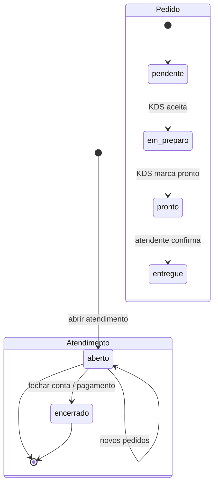
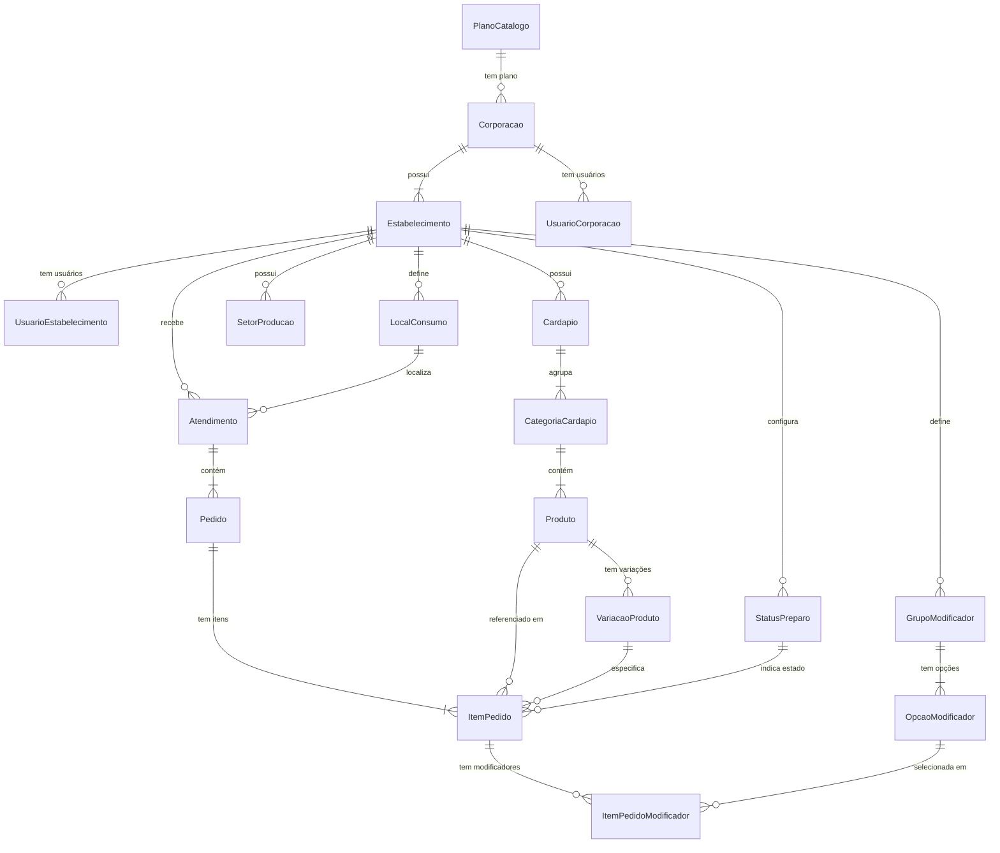

# Plano de Reconstrução
**Data:** 21 de maio de 2026  **Versão:** 1.0

---
## Sumário Executivo

O **NeuraBar** é uma plataforma SaaS multi-tenant para gestão de bares e restaurantes. Possui ciclo completo: cardápio digital, anotação de pedidos (touch + voz), KDS (tela de preparo), pagamento com divisão de conta, chamada de garçom via QR, integração WhatsApp (Evolution API) e backoffice para corporações e planos de assinatura.

**5 pontos críticos para o CTO:**

1. **Credenciais de produção vazadas no repositório** — `.env.example` contém URL real do Supabase, anon key JWT válida e chave de operações. Risco imediato de acesso não autorizado ao banco.
2. **Autenticação completamente bypassada em dev** — `VITE_DEV_MODE=true` está como padrão no `.env.example`. Um build de produção mal configurado expõe todo o sistema sem senha.
3. **RLS permissiva (USING true) em tabelas de pedidos** — qualquer usuário anônimo pode ler, inserir, alterar e deletar atendimentos, pedidos e itens de qualquer estabelecimento.
4. **God Objects inviabilizam manutenção** — 11 arquivos acima de 1.000 linhas (maior: `MenuDelivery.tsx` com 2.137 linhas). Lógica de negócio, queries de banco e UI misturadas na mesma função.
5. **Sem testes automatizados** — único arquivo de teste é um placeholder. Zero cobertura em fluxos críticos (pagamento, pedido, auth).

A reconstrução deve priorizar segurança (MLP obrigatório) e separação de responsabilidades, migrando para Laravel + Vue.js 3 + Inertia.js com PostgreSQL mantido.

---
## Tabela de Decisões-Chave

| Decisão | Escolha | Justificativa |
|---------|---------|---------------|
| Stack backend | Laravel 11 (PHP 8.3) | Substituir BaaS direto por camada de serviços testável |
| Stack frontend | Vue.js 3 + Inertia.js + Vite + Tailwind | Monólito coeso; não há necessidade de SPA desacoplada |
| Banco de dados | PostgreSQL 16 (manter) | Schema existente é compatível; remover dependências de extensões Supabase |
| Autenticação | Laravel Sanctum | Substituir RPC customizada; eliminar mock users e VITE_DEV_MODE |
| RLS → Policies | Laravel Policies + Gates | Cada RLS do Supabase vira uma Policy explícita e testável |
| RPCs → Services | Laravel Service Layer | Cada RPC catalogada recebe destino em Service ou Job |
| Realtime | Laravel Reverb (WebSockets) | Substituir polling da PrepScreen; Supabase Realtime não migra |
| WhatsApp | Evolution API (manter) | Integração via service Laravel, não direto do browser |
| Escopo MLP | Auth + Pedidos + Preparo + Pagamento + Cardápio | Core operacional mínimo para demonstrar e vender |
| Migração de dados | ⚠️ Avaliar — banco pode ter dados reais | Schema compatível; executar scripts de limpeza/migração |

---
## Índice

- [Gaps Acumulados](#gaps-acumulados)
- [Fase 0 — Glossário de Domínio](#fase-0--glossário-de-domínio)
- [Fase 1 — Mapeamento Geral da Codebase](#fase-1--mapeamento-geral-da-codebase)
- [Fase 2 — Extração de Requisitos Funcionais](#fase-2--extração-de-requisitos-funcionais)
- [Fase 3 — Extração de Regras de Negócio](#fase-3--extração-de-regras-de-negócio)
- [Fase 4 — Extração da Estrutura de Dados](#fase-4--extração-da-estrutura-de-dados)
- [Fase 5 — Extração da Identidade Visual (Design Tokens)](#fase-5--extração-da-identidade-visual-design-tokens)
- [Fase 6 — Identificação de Problemas, Gaps e Débitos Técnicos](#fase-6--identificação-de-problemas-gaps-e-débitos-técnicos)
- [Fase 7 — Análise de UX e Oportunidades de Melhoria](#fase-7--análise-de-ux-e-oportunidades-de-melhoria)
- [Fase 8 — Avaliação da Stack e Recomendação Técnica](#fase-8--avaliação-da-stack-e-recomendação-técnica)
- [Fase 9 — Plano de Reconstrução (Orientado a MLP)](#fase-9--plano-de-reconstrução-orientado-a-mlp)

---
## Gaps Acumulados

| ID | Pergunta / Ambiguidade | Origem | Impacto |
|----|------------------------|--------|---------|
| GAP-001 | ❓ O banco Supabase em produção contém dados reais de clientes? | Fase 1 | Fase 8.4 (migração) |
| GAP-002 | ❓ A integração Evolution API é usada em produção? Qual instância? | Fase 2 | Fase 9 (infra) |
| GAP-003 | ❓ O módulo de pagamento registra pagamentos reais ou apenas divide conta localmente? | Fase 2 | Fase 3 / 9 |
| GAP-004 | ❓ Existe um gateway de pagamento (Stripe, Mercado Pago) previsto ou futuro? | Fase 2 | Fase 9 (Fase 3+) |
| GAP-005 | ❓ O campo `couvert` e `taxa_servico` (localStorage) devem persistir no banco? | Fase 3 | Fase 4 / 9 |
| GAP-006 | ❓ Quantos estabelecimentos e corporações estão em produção hoje? | Fase 1 | Fase 8 (volume) |
| GAP-007 | ❓ O recurso `PedidoPorVoz` é usado em produção? Qual nível de precisão é aceitável? | Fase 2 | Fase 9 (MLP vs Fase 2) |
| GAP-008 | ❓ O painel interno (`PlataformaInterna`) é acessado por quem? URL secreta é suficiente ou precisa de 2FA? | Fase 2 | Fase 9 (segurança) |

---
## Fase 0 — Glossário de Domínio

| Termo no Código | Significado de Negócio Inferido | Confiança | Arquivo fonte |
|-----------------|---------------------------------|-----------|---------------|
| `corporacao` | Empresa cliente do SaaS que possui um ou mais estabelecimentos | Alta | `src/lib/supabase.ts:44` |
| `estabelecimento` | Unidade física (barra/restaurante) vinculada a uma corporação | Alta | `src/lib/supabase.ts:56` |
| `atendimento` | Sessão de serviço de um cliente (mesa ou comanda aberta) | Alta | `src/lib/supabase.ts` |
| `pedido` | Conjunto de itens solicitados dentro de um atendimento | Alta | `src/lib/supabase.ts` |
| `item_pedido` | Linha individual de um pedido (produto + quantidade + modificadores) | Alta | `src/lib/supabase.ts` |
| `comanda` | Identificador físico ou virtual de um cliente (número/código) | Alta | `src/lib/supabase.ts` |
| `local_consumo` | Local físico onde o cliente está (mesa, balcão, varanda etc.) | Alta | `sql/criar-locais-preparo.sql` |
| `setor_producao` | Área da cozinha/bar responsável por preparar um tipo de produto | Alta | `sql/create_status_preparo.sql` |
| `status_preparo` | Estado do pedido no workflow de preparo (ex: aguardando, em preparo, pronto) | Alta | `sql/create_status_preparo.sql` |
| `cardapio` | Menu digital do estabelecimento (agrupamento de categorias) | Alta | `src/lib/supabase.ts` |
| `categoria_cardapio` | Grupo de produtos dentro do cardápio (ex: Bebidas, Lanches) | Alta | `src/lib/supabase.ts` |
| `produto` | Item vendável com nome, preço e variações | Alta | `src/lib/supabase.ts` |
| `variacao_produto` | Variante de um produto (ex: tamanho P/M/G) | Alta | `src/lib/supabase.ts` |
| `modificador` | Customização de um item (ex: sem cebola, ponto da carne) | Alta | `src/lib/supabase.ts` |
| `combo` | Conjunto de produtos com regra de preço especial | Alta | `src/lib/supabase.ts` |
| `chama_garcom` | Funcionalidade de solicitação de assistência via QR pelo cliente | Alta | `src/lib/solicitacaoCliente.ts` |
| `plano_catalogo` | Catálogo de planos de assinatura disponíveis para corporações | Alta | `sql/create_plano_catalogo.sql` |
| `plataforma_interna` | Backoffice administrativo da NeuraBar (não é o painel do cliente) | Alta | `src/pages/PlataformaInterna.tsx` |
| `anotador` | Interface operacional para garçons anotarem pedidos | Alta | `src/pages/OrderTaker.tsx` |
| `KDS` / `tela_preparo` | Kitchen Display System — tela para cozinha/bar acompanhar pedidos | Alta | `src/pages/PrepScreen.tsx` |
| `couvert` | Taxa por pessoa cobrada ao abrir um atendimento | Média ❓ | `src/hooks/useConfigPagamento.ts` |
| `taxa_servico` | Percentual adicional aplicado ao total da conta | Média ❓ | `src/hooks/useConfigPagamento.ts` |
| `canal` | Origem de um pedido (`balcao`, `mesa`, `delivery`, `solicitacao`) | Alta | `src/lib/supabase.ts` |
| `modo_servir` | Como o pedido é entregue (ex: na mesa, balcão, retirada) | Média ❓ | `sql/adicionar-campo-modo-servir.sql` |
| `slug` | Identificador público único do estabelecimento para URL do Chama Garçom | Alta | `sql/add_chama_garcom_public_slug.sql` |

---
## Fase 1 — Mapeamento Geral da Codebase

### 1.1 Stack Tecnológica

| Camada | Tecnologia | Versão |
|--------|-----------|--------|
| Runtime de desenvolvimento | Node.js / Bun | — |
| Framework UI | React | 18.3.1 |
| Linguagem | TypeScript | 5.8.3 |
| Bundler | Vite + SWC | 7.3.1 |
| Estilização | Tailwind CSS + shadcn/ui (Radix UI) | 3.4.17 |
| Roteamento | React Router DOM | 6.30.1 |
| Estado global | React Context API + localStorage | — |
| Fetching/Cache | TanStack React Query (instalado, **não utilizado**) | 5.83 |
| BaaS / Banco | Supabase (PostgreSQL + Edge Functions Deno) | 2.95.3 |
| Autenticação | RPC customizada (`app_neurabar_login`) — **não usa Supabase Auth nativo** | — |
| Formulários | react-hook-form + Zod (**instalados, pouco utilizados**) | — |
| Animações | Framer Motion | 12.34 |
| Gráficos | Recharts | 2.15.4 |
| QR Code | qrcode.react | 4.2.0 |
| Ícones | Lucide React | 0.462 |
| Deploy | Vercel (SPA com rewrite `/*` → `index.html`) | — |

**Ambiente de execução:** 100% web SPA. Sem backend próprio — todo acesso a dados é feito diretamente do browser via Supabase JS SDK.

### 1.2 Estrutura de Pastas

| Diretório / Arquivo | Descrição |
|--------------------|-----------|
| `src/main.tsx` | Ponto de entrada; monta `ErrorBoundary` + `App` |
| `src/App.tsx` | Roteador principal (BrowserRouter + 29 rotas) |
| `src/index.css` | Design tokens CSS (variáveis HSL + dark mode) |
| `src/pages/` | 31 componentes de página — repositório de toda a lógica de negócio |
| `src/components/ui/` | 42 componentes shadcn/ui (Radix primitivos) |
| `src/components/dialogs/` | Dialogs CRUD (`CadastrosDialogs.tsx` — 1.161 linhas) |
| `src/components/` | Navbar, ProtectedRoute, landing page sections |
| `src/context/` | AuthContext (mock + RPC) e AuthContextReal (não usado) |
| `src/hooks/` | 4 hooks (localStorage e toast) |
| `src/lib/` | Supabase client + tipos, utilitários, Evolution API |
| `src/test/` | Placeholder de teste (sem cobertura real) |
| `sql/` | 48 arquivos de migração / RPCs (sem numeração sequencial) |
| `supabase/functions/` | 2 Edge Functions Deno (evolution-proxy, reset-senha) |
| `public/sounds/` | Áudio `novo-pedido.mp3` para alerta de pedido |

### 1.3 Dependências Externas

| Dependência | Categoria | Observação |
|-------------|-----------|------------|
| Supabase | Banco de dados + Auth | Acesso direto do browser |
| Evolution API | Integração externa (WhatsApp) | Self-hosted; URL configurável por estabelecimento |
| Vercel | Deploy / Hosting | SPA com rewrite |
| Resend (via Edge Function) | Integração externa (email) | Apenas para reset de senha do painel interno |
| Radix UI / shadcn | UI | Componentes primitivos acessíveis |
| Framer Motion | UI / Animações | Landing page |
| Recharts | UI / Gráficos | Painel de métricas da plataforma |

### 1.4 Variáveis de Ambiente

| Variável | Obrigatória | Descrição |
|----------|-------------|-----------|
| `VITE_SUPABASE_URL` | ✅ | URL do projeto Supabase |
| `VITE_SUPABASE_ANON_KEY` | ✅ | JWT anon key (exposta no bundle) |
| `VITE_DEV_MODE` | ❌ | `true` bypassa autenticação completamente — **NUNCA em produção** |
| `VITE_DEV_ESTABELECIMENTO_ID` | ❌ | ID do estabelecimento usado em modo dev |
| `VITE_PLATAFORMA_PATH` | ❌ | Segmento opaco da URL do painel interno |
| `VITE_PLATAFORMA_OPS_SECRET` | ❌ | Chave de operações do backoffice — **viaja no bundle** |

---
## Fase 2 — Extração de Requisitos Funcionais

### 2.1 Módulos e Funcionalidades

#### Módulo: Autenticação
- **Descrição:** Login com email/senha via RPC customizada; sessão em localStorage; controle de roles.
- **Funcionalidades:**
  - [ ] RF-001: Login com email/senha — `src/context/AuthContext.tsx:LoginFn` / `sql/deploy_app_neurabar_login.sql`
  - [ ] RF-002: Logout e limpeza de sessão — `src/context/AuthContext.tsx`
  - [ ] RF-003: Guard de rota por role (`allowedRoles`) — `src/components/ProtectedRoute.tsx`
  - [ ] RF-004: Troca de estabelecimento ativo (corporação) — `src/context/AuthContext.tsx:setEstabelecimentoAtual`
- **Tipo de usuário:** todos os perfis autenticados

#### Módulo: Cardápio
- **Descrição:** Gestão completa do menu digital (categorias, produtos, variações, modificadores, combos).
- **Funcionalidades:**
  - [ ] RF-005: Listar/criar/editar/excluir categorias do cardápio — `src/pages/MenuCompleto.tsx`
  - [ ] RF-006: Listar/criar/editar/excluir produtos com preço, imagem e local de preparo — `src/pages/MenuCompleto.tsx`
  - [ ] RF-007: Gerenciar variações de produto (tamanhos) — `src/pages/MenuCompleto.tsx`
  - [ ] RF-008: Gerenciar grupos e opções de modificadores — `src/pages/MenuCompleto.tsx`
  - [ ] RF-009: Gerenciar combos (regras + itens) — `src/pages/MenuCompleto.tsx`
  - [ ] RF-010: Exibir cardápio público para cliente (sem login) — `src/pages/CatalogoCliente.tsx`
  - [ ] RF-011: Cardápio delivery com pedido online — `src/pages/MenuDelivery.tsx`
- **Tipo de usuário:** dono, gerente_geral (gestão); público (visualização)

#### Módulo: Anotador de Pedidos
- **Descrição:** Interface para garçons registrarem pedidos em tempo real com suporte a modificadores, combos e observações.
- **Funcionalidades:**
  - [ ] RF-012: Selecionar ou criar atendimento (mesa/comanda/local) — `src/pages/OrderTaker.tsx`
  - [ ] RF-013: Adicionar itens ao pedido com modificadores — `src/pages/OrderTaker.tsx`
  - [ ] RF-014: Adicionar combos ao pedido — `src/pages/OrderTaker.tsx`
  - [ ] RF-015: Registrar observações por item — `src/pages/OrderTaker.tsx`
  - [ ] RF-016: Enviar pedido para a cozinha — `src/pages/OrderTaker.tsx`
  - [ ] RF-017: Anotar pedido por reconhecimento de voz — `src/pages/PedidoPorVoz.tsx`
- **Tipo de usuário:** atendente, gerente_setorial

#### Módulo: Tela de Preparo (KDS)
- **Descrição:** Interface para cozinha/bar acompanhar e atualizar status dos pedidos em tempo real (polling).
- **Funcionalidades:**
  - [ ] RF-018: Listar pedidos por setor de produção — `src/pages/PrepScreen.tsx`
  - [ ] RF-019: Atualizar status de preparo de um item/pedido — `src/pages/PrepScreen.tsx`
  - [ ] RF-020: Filtrar pedidos por status (aguardando, em preparo, pronto) — `src/pages/PrepScreen.tsx`
  - [ ] RF-021: Alerta sonoro para novo pedido — `public/sounds/novo-pedido.mp3`
  - [ ] RF-022: Monitor de status visível para o cliente (telão) — `src/pages/TelaClienteMonitor.tsx`
- **Tipo de usuário:** cozinha (sem login formal), atendente

#### Módulo: Atendimentos
- **Descrição:** Gestão das sessões de atendimento abertas e histórico.
- **Funcionalidades:**
  - [ ] RF-023: Listar atendimentos abertos com mesas e comandas — `src/pages/Atendimentos.tsx`
  - [ ] RF-024: Encerrar atendimento — `src/pages/Atendimentos.tsx`
  - [ ] RF-025: Histórico de atendimentos encerrados — `src/pages/RegistroAtendimentos.tsx`
- **Tipo de usuário:** atendente, gerente_geral

#### Módulo: Pagamento
- **Descrição:** Cálculo e registro de pagamento com suporte a divisão de conta, couvert e taxa de serviço.
- **Funcionalidades:**
  - [ ] RF-026: Calcular total do atendimento (itens + couvert + taxa) — `src/pages/Pagamento.tsx`
  - [ ] RF-027: Dividir conta entre N pessoas — `src/pages/Pagamento.tsx`
  - [ ] RF-028: Registrar pagamento por forma (dinheiro, cartão, pix) — `src/pages/Pagamento.tsx`
  - [ ] RF-029: Configurar couvert e taxa de serviço — `src/hooks/useConfigPagamento.ts` (localStorage)
- **Tipo de usuário:** atendente, gerente_geral

#### Módulo: Chama Garçom
- **Descrição:** Cliente acessa URL pública via QR Code e solicita assistência sem login.
- **Funcionalidades:**
  - [ ] RF-030: Cliente envia solicitação via QR (slug público) — `src/pages/ChamaGarcom.tsx` / `sql/deploy_app_cliente_solicitacao.sql`
  - [ ] RF-031: Verificação de palavra-chave antes da solicitação — `src/lib/chamaGarcomGate.ts`
  - [ ] RF-032: Solicitação aparece na tela de preparo (canal: solicitacao) — `src/pages/PrepScreen.tsx`
  - [ ] RF-033: Configurar imagem de cabeçalho da página pública — `src/pages/Dashboard.tsx`
- **Tipo de usuário:** cliente (sem login), staff (visualiza no KDS)

#### Módulo: Acompanhar Pedido
- **Descrição:** Cliente acompanha status do seu pedido via link/QR (sem login).
- **Funcionalidades:**
  - [ ] RF-034: Exibir status do pedido por ID público — `src/pages/AcompanharPedido.tsx`
- **Tipo de usuário:** cliente (sem login)

#### Módulo: Dashboard e Configurações
- **Descrição:** Painel principal com configurações do estabelecimento, mesas abertas e acesso rápido.
- **Funcionalidades:**
  - [ ] RF-035: Exibir resumo de mesas/atendimentos abertos — `src/pages/Dashboard.tsx`
  - [ ] RF-036: Editar dados do estabelecimento (nome, endereço, WhatsApp, logo) — `src/pages/Dashboard.tsx`
  - [ ] RF-037: Configurar setores de produção — `src/pages/Dashboard.tsx`
  - [ ] RF-038: Configurar status de preparo (nome + cor) — `src/pages/Dashboard.tsx`
  - [ ] RF-039: Gerenciar locais de atendimento — `src/pages/LocaisAtendimento.tsx`
  - [ ] RF-040: Gerenciar usuários do estabelecimento — `src/pages/ManageUsers.tsx`
  - [ ] RF-041: Vincular instância WhatsApp (Evolution API) — `src/pages/VincularWhatsapp.tsx`
- **Tipo de usuário:** dono, gerente_geral

#### Módulo: Corporação
- **Descrição:** Painel para gestores de corporação visualizarem todos os estabelecimentos.
- **Funcionalidades:**
  - [ ] RF-042: Listar estabelecimentos da corporação — `src/pages/PainelCorporacao.tsx`
  - [ ] RF-043: Trocar estabelecimento ativo via seletor — `src/components/EstabelecimentoSelector.tsx`
- **Tipo de usuário:** admin_corporacao, dono, gerente_geral

#### Módulo: Plataforma Interna (Backoffice NeuraBar)
- **Descrição:** Painel administrativo da NeuraBar para gerenciar corporações, planos e assinaturas.
- **Funcionalidades:**
  - [ ] RF-044: Login no painel interno (URL secreta + credenciais) — `src/pages/PlataformaInterna.tsx`
  - [ ] RF-045: Listar e criar corporações — `src/pages/PlataformaBackofficeCadastros.tsx`
  - [ ] RF-046: Atribuir plano e vigência a uma corporação — `src/pages/PlataformaBackofficeCadastros.tsx`
  - [ ] RF-047: Gerenciar catálogo de planos — `src/pages/PlataformaPlanoCatalogo.tsx`
  - [ ] RF-048: Gerenciar usuários internos da plataforma — `src/pages/PlataformaUsuariosInternos.tsx`
  - [ ] RF-049: Dashboard de métricas (corporações, MRR) — `src/pages/PlataformaInterna.tsx`
  - [ ] RF-050: Reset de senha via email (Edge Function) — `src/lib/plataformaSolicitaResetEmail.ts`
- **Tipo de usuário:** equipe interna NeuraBar (super_admin, financeiro, cadastros, leitura)

### 2.2 Fluxos de Usuário

**Fluxo: Atendimento Completo** — refs: RF-012, RF-013, RF-016, RF-018, RF-026, RF-028
- **Trigger:** Garçom abre o anotador e seleciona uma mesa/comanda
- **Passos:** Seleciona atendimento → adiciona itens com modificadores → envia pedido → cozinha recebe no KDS → atualiza status → atendente fecha conta em Pagamento
- **Resultado esperado:** Atendimento encerrado, pagamento registrado
- **Casos de erro:** Mesa não encontrada, produto sem estoque ❓, falha na conexão com Supabase

**Fluxo: Chama Garçom** — refs: RF-030, RF-031, RF-032
- **Trigger:** Cliente escaneia QR Code na mesa
- **Passos:** Abre página pública → digita palavra-chave (se configurado) → informa mesa/texto → envia solicitação
- **Resultado esperado:** Solicitação aparece no KDS (canal: solicitacao)
- **Casos de erro:** Palavra-chave incorreta, estabelecimento não encontrado

**Fluxo: Login na Plataforma** — refs: RF-001
- **Trigger:** Usuário acessa `/login`
- **Passos:** Tenta mock → tenta RPC `app_neurabar_login` → redireciona por role
- **Resultado esperado:** Sessão persistida em localStorage, redirect para `/painel`

### 2.3 Rotas e Endpoints

| Tipo | Rota | Descrição | Auth | Ref |
|------|------|-----------|------|-----|
| GET | `/` | Landing page | Não | — |
| GET | `/precos` | Página de preços | Não | — |
| GET | `/login` | Formulário de login | Não | RF-001 |
| GET | `/cardapio` | Cardápio público | Não | RF-010 |
| GET | `/cardapio-digital` | Cardápio delivery | Não | RF-011 |
| GET | `/acompanhar/:pedidoId` | Status do pedido | Não | RF-034 |
| GET | `/tela-cliente` | Monitor de status | Não | RF-022 |
| GET | `/chama-garcom/s/:slug` | Chama garçom por slug | Não | RF-030 |
| GET | `/chama-garcom` | Chama garçom sem slug | Não | RF-030 |
| GET | `/painel` | Dashboard | Sim | RF-035 |
| GET | `/painel/corporacao` | Painel corporação | Sim (admin/dono/gerente_geral) | RF-042 |
| GET | `/cardapio/completo` | Gestão cardápio | Sim | RF-005 |
| GET | `/pedidos/anotar` | Anotador de pedidos | Sim | RF-012 |
| GET | `/pedidos/voz` | Anotador por voz | Sim | RF-017 |
| GET | `/atendimentos` | Gestão atendimentos | Sim | RF-023 |
| GET | `/pagamento` | Pagamento | Sim | RF-026 |
| GET | `/tela-preparo` | KDS | Sim | RF-018 |
| GET | `/admin/usuarios` | Gestão usuários | Sim (dono/gerente_geral) | RF-040 |
| GET | `/registro-atendimentos` | Histórico | Sim | RF-025 |
| GET | `/cadastro/locais-atendimento` | Locais | Sim | RF-039 |
| GET | `/painel/vincular-whatsapp` | WhatsApp | Sim | RF-041 |
| GET | `/:PLATAFORMA_PATH` | Painel interno | Secret URL | RF-044 |
| GET | `/:PLATAFORMA_PATH/redefinir` | Reset senha | Secret URL | RF-050 |

### 2.4 RPCs e Funções Remotas

| Nome da Função | Parâmetros de Entrada | Retorno | Auth | Arquivo cliente | Arquivo servidor | Ref |
|----------------|-----------------------|---------|------|-----------------|------------------|-----|
| `app_neurabar_login` | `{ p_email: text, p_senha: text }` | `jsonb (user data)` | anon | `src/context/AuthContext.tsx` | `sql/deploy_app_neurabar_login.sql` | RF-001 |
| `app_cliente_enviar_solicitacao` | `{ p_estabelecimento_id, p_mesa, p_comanda, p_local, p_texto }` | `jsonb { pedido_id }` | anon | `src/lib/solicitacaoCliente.ts` | `sql/deploy_app_cliente_solicitacao.sql` | RF-030 |
| `app_chama_garcom_verificar_palavra` | `{ p_estabelecimento_id, p_palavra }` | `boolean` | anon | `src/lib/chamaGarcomGate.ts` | ❓ não localizado | RF-031 |
| `plataforma_interna_login` | `{ p_email, p_senha, p_secret }` | `jsonb` | anon | `src/pages/PlataformaInterna.tsx` | `sql/plataforma_interna_usuario.sql` | RF-044 |
| `plataforma_interna_permissoes` | `{ p_usuario_id }` | `jsonb` | DEFINER | `src/pages/PlataformaInterna.tsx` | `sql/plataforma_niveis_e_pagamentos.sql` | RF-044 |
| `plataforma_cadastrar_corporacao` | dados da corporação | `jsonb` | DEFINER | `src/pages/PlataformaBackofficeCadastros.tsx` | `sql/plataforma_backoffice_rpc.sql` | RF-045 |
| `plataforma_atualizar_plano_corporacao` | `{ p_corporacao_id, p_plano_id, ... }` | `jsonb` | DEFINER | `src/pages/PlataformaBackofficeCadastros.tsx` | `sql/plataforma_backoffice_rpc.sql` | RF-046 |
| `plataforma_atualizar_dados_estabelecimento` | dados do estab | `jsonb` | DEFINER | painel interno | `sql/deploy_plataforma_atualizar_dados_estabelecimento.sql` | RF-036 |
| `plataforma_painel_metricas` | — | `jsonb (MRR, counts)` | DEFINER | `src/pages/PlataformaInterna.tsx` | `sql/deploy_plataforma_painel_metricas.sql` | RF-049 |

---
## Fase 3 — Extração de Regras de Negócio

### 3.1 Regras de Validação

- **RN-001:** Email e senha não podem ser nulos/vazios no login — `sql/deploy_app_neurabar_login.sql:11-13`
- **RN-002:** Usuário inativo (`ativo = false`) não pode fazer login — `sql/deploy_app_neurabar_login.sql:20-23`
- **RN-003:** Senha validada com `extensions.crypt()` (bcrypt); fallback para PIN se não há hash — `sql/deploy_app_neurabar_login.sql:24-32`
- **RN-004:** Corporação deve ter ao menos um estabelecimento ativo para login ser permitido — `sql/deploy_app_neurabar_login.sql:60-64`
- **RN-005:** Texto da solicitação (chama garçom) não pode ser vazio — `sql/deploy_app_cliente_solicitacao.sql:38`
- **RN-006:** Solicitação exige ao menos um de: mesa, comanda ou local — `sql/deploy_app_cliente_solicitacao.sql:41`
- **RN-007:** Estabelecimento deve existir para aceitar solicitação — `sql/deploy_app_cliente_solicitacao.sql:43-45`
- **RN-008:** Número de mesas configurável entre 1 e 999 — `src/hooks/useConfigMesas.ts`

### 3.2 Regras de Autorização e Acesso

**Perfis/roles identificados:**
- `super_admin` — plataforma interna (acesso total)
- `financeiro` — plataforma interna (leitura financeira)
- `cadastros` — plataforma interna (CRUD de corporações)
- `leitura` — plataforma interna (somente leitura)
- `admin_corporacao` — painel operacional (todos estabelecimentos da corporação)
- `dono` — painel operacional (gerenciar estabelecimento + usuários)
- `gerente_geral` — painel operacional (operação completa)
- `gerente_setorial` — painel operacional (operação parcial)
- `atendente` — painel operacional (pedidos e atendimentos)

**Recursos por perfil (painel operacional):**

| Recurso | admin_corp | dono | gerente_geral | gerente_setorial | atendente |
|---------|-----------|------|--------------|-----------------|-----------|
| Dashboard | ✅ | ✅ | ✅ | ✅ | ✅ |
| Cardápio (editar) | ✅ | ✅ | ✅ | ❌ | ❌ |
| Anotador | ✅ | ✅ | ✅ | ✅ | ✅ |
| KDS (tela preparo) | ✅ | ✅ | ✅ | ✅ | ✅ |
| Pagamento | ✅ | ✅ | ✅ | ✅ | ✅ |
| Usuários (gerenciar) | ❌ | ✅ | ✅ | ❌ | ❌ |
| Configurações | ❌ | ✅ | ✅ | ❌ | ❌ |
| Painel corporação | ✅ | ✅ | ✅ | ❌ | ❌ |

**Como a autorização é verificada:** `src/components/ProtectedRoute.tsx` — verifica `user` no contexto e `allowedRoles` via prop. Não há verificação no servidor para a maioria das rotas.

### 3.3 Regras de Cálculo e Processamento

- **RN-009:** Total do atendimento = soma(item_pedido.preco_unitario × quantidade) + couvert_por_pessoa × num_pessoas + (total × taxa_servico / 100) — `src/pages/Pagamento.tsx`
- **RN-010:** Divisão de conta = total / N pessoas (arredondamento não especificado) ❓ — `src/pages/Pagamento.tsx`
- **RN-011:** Couvert padrão = R$ 10,00 por pessoa; taxa serviço padrão = 10% — `src/hooks/useConfigPagamento.ts`
- **RN-012:** Número do pedido dentro de um atendimento = max(pedido.numero_pedido) + 1 — `sql/deploy_app_cliente_solicitacao.sql:68-71`

### 3.4 Regras de Status e Ciclo de Vida



### 3.5 Regras Embutidas em RPCs

#### RPC: `app_neurabar_login` — ver Fase 2.4 · RF-001
- **Lógica de negócio:** Dois caminhos de autenticação (estabelecimento vs corporação). Valida ativo, verifica hash bcrypt com fallback para PIN. Para corporação, coleta todos os estabelecimentos ativos e retorna o primeiro como `id_estabelecimento` padrão.
- **Regras identificadas:** RN-001, RN-002, RN-003, RN-004
- **Por que existe como RPC?** Bypass de Supabase Auth nativo — auth customizada sem JWT
- **Nota sobre reconstrução:** Substituir integralmente por `Laravel Sanctum` com `LoginController`

#### RPC: `app_cliente_enviar_solicitacao` — ver Fase 2.4 · RF-030
- **Lógica de negócio:** Cria ou reutiliza `local_consumo`, cria `atendimento` (canal: solicitacao), cria `pedido` sem produtos, cria item fictício "Solicitação" com texto como observação. Transação atômica.
- **Regras identificadas:** RN-005, RN-006, RN-007, RN-012
- **Por que existe como RPC?** Atomicidade — múltiplas inserções sem RLS para anon, evita expor tabelas diretamente
- **Nota sobre reconstrução:** Virar `SolicitacaoService::enviar()` em Laravel, protegido por rate limiting

#### RPC: `plataforma_painel_metricas` — ver Fase 2.4 · RF-049
- **Lógica de negócio:** Agrega MRR, contagens de corporações ativas, estabelecimentos, planos — provavelmente com CTEs ou subqueries
- **Por que existe como RPC?** Performance — query analítica complexa
- **Nota sobre reconstrução:** Virar `MetricasService` com cache Redis (TTL 5 min)

### 3.6 Integrações e Regras de Sincronização

- **Evolution API (WhatsApp):** Chamada via Edge Function `evolution-proxy` (JWT bearer do Supabase). Actions: fetchInstances, createInstance, connect, connectionState. — `src/lib/evolutionApi.ts`
- **Resend (email):** Usado apenas na Edge Function `plataforma-interna-solicita-reset` para envio de email de reset. — `supabase/functions/plataforma-interna-solicita-reset/index.ts`

---
## Fase 4 — Extração da Estrutura de Dados

### 4.1 Entidades e Modelos

#### Entidade: PlanoCatalogo — ENT-001
| Campo | Tipo | Obrigatório | Descrição |
|-------|------|-------------|-----------|
| id | Int | Sim | PK |
| codigo | String | Sim | Código único do plano |
| nome | String | Sim | Nome comercial |
| descricao | String? | Não | Descrição |
| ordem | Int | Sim | Ordem de exibição |
| ativo | Boolean? | Não | |
| valor_mensal | Decimal? | Não | Mensalidade de referência |

#### Entidade: Corporacao — ENT-002
| Campo | Tipo | Obrigatório | Descrição |
|-------|------|-------------|-----------|
| id | Int | Sim | PK |
| nome | String | Sim | |
| cpf / cnpj | String? | Não | |
| email | String? | Não | |
| telefone_contato | String? | Não | |
| plano_catalogo_id | Int? | Não | FK → ENT-001 |
| plano_nome | String? | Não | (desnormalizado) |
| valor_mensalidade | Decimal? | Não | Valor acordado |
| plano_validade_inicio/fim | String? | Não | Vigência do plano |
| criado_em / atualizado_em | Timestamp | Não | |

#### Entidade: Estabelecimento — ENT-003
| Campo | Tipo | Obrigatório | Descrição |
|-------|------|-------------|-----------|
| id | Int | Sim | PK |
| corporacao_id | Int | Sim | FK → ENT-002 |
| nome | String | Sim | |
| cnpj / telefone / whatsapp_agente | String? | Não | |
| endereço (logradouro, numero, etc.) | String? | Não | |
| fuso_horario | String | Sim | ex: "America/Sao_Paulo" |
| ativo | Boolean | Sim | |
| mesa_obrigatorio / comanda_obrigatorio / local_obrigatorio | Boolean? | Não | Obrigatoriedade no pedido |
| chama_garcom_cabecalho_url | String? | Não | Imagem da página pública |
| chama_garcom_palavra_chave | String? | Não | Palavra de acesso |
| chama_garcom_public_slug | String? | Não | URL do QR code |
| evolution_api_url / key / instance | String? | Não | Config WhatsApp |
| logo_url | String? | Não | Logo do estab (base64 ou URL) |
| modo_pagamento | String? | Não | ❓ campo adicionado via migration |
| plano_mensalidade / data_limite_cancelamento | mixed | Não | Controle de plano |

#### Entidade: UsuarioEstabelecimento — ENT-004
| Campo | Tipo | Obrigatório | Descrição |
|-------|------|-------------|-----------|
| id | Int | Sim | PK |
| estabelecimento_id | Int | Sim | FK → ENT-003 |
| nome / email | String | Sim | |
| senha_hash | String? | Não | bcrypt |
| pin | String? | Não | Alternativa à senha |
| perfil | String | Sim | dono, gerente_geral, etc. |
| ativo | Boolean | Sim | |

#### Entidade: UsuarioCorporacao — ENT-005
| Campo | Tipo | Obrigatório | Descrição |
|-------|------|-------------|-----------|
| id | Int | Sim | PK |
| corporacao_id | Int | Sim | FK → ENT-002 |
| nome / email | String | Sim | |
| senha_hash | String | Sim | bcrypt |
| perfil | String | Sim | admin_corporacao |
| ativo | Boolean | Sim | |

#### Entidade: Cardapio — ENT-006
| Campo | Tipo | Obrigatório | Descrição |
|-------|------|-------------|-----------|
| id | Int | Sim | PK |
| estabelecimento_id | Int | Sim | FK → ENT-003 |
| nome | String | Sim | |
| ativo | Boolean | Não | |

#### Entidade: CategoriaCardapio — ENT-007
| Campo | Tipo | Obrigatório | Descrição |
|-------|------|-------------|-----------|
| id | Int | Sim | PK |
| cardapio_id | Int | Sim | FK → ENT-006 |
| nome | String | Sim | |
| ordem | Int | Não | |

#### Entidade: Produto — ENT-008
| Campo | Tipo | Obrigatório | Descrição |
|-------|------|-------------|-----------|
| id | Int | Sim | PK |
| categoria_id | Int | Sim | FK → ENT-007 |
| nome / descricao | String | Sim / Não | |
| preco | Decimal | Sim | |
| imagem_url | String? | Não | |
| ativo | Boolean | Não | |
| local_preparo_id | Int? | Não | FK → SetorProducao |
| disponivel_delivery | Boolean? | Não | |

#### Entidade: VariacaoProduto — ENT-009
| Campo | Tipo | Obrigatório | Descrição |
|-------|------|-------------|-----------|
| id | Int | Sim | PK |
| produto_id | Int | Sim | FK → ENT-008 |
| nome | String | Sim | ex: "500ml" |
| preco | Decimal | Sim | |

#### Entidade: GrupoModificador — ENT-010
| Campo | Tipo | Obrigatório | Descrição |
|-------|------|-------------|-----------|
| id | Int | Sim | PK |
| estabelecimento_id | Int | Sim | FK → ENT-003 |
| nome | String | Sim | ex: "Ponto da Carne" |
| obrigatorio | Boolean | Não | |
| selecao_multipla | Boolean | Não | |

#### Entidade: OpcaoModificador — ENT-011
| Campo | Tipo | Obrigatório | Descrição |
|-------|------|-------------|-----------|
| id | Int | Sim | PK |
| grupo_modificador_id | Int | Sim | FK → ENT-010 |
| nome | String | Sim | ex: "Bem passado" |
| preco_adicional | Decimal | Não | |

#### Entidade: Atendimento — ENT-012
| Campo | Tipo | Obrigatório | Descrição |
|-------|------|-------------|-----------|
| id | Int | Sim | PK |
| estabelecimento_id | Int | Sim | FK → ENT-003 |
| identificador_cliente | String | Não | Mesa/comanda |
| local_consumo_id | Int? | Não | FK → LocalConsumo |
| canal | String | Sim | balcao, mesa, delivery, solicitacao |
| status | String | Sim | aberto, encerrado |
| observacoes | String? | Não | |
| quantidade_pessoas | Int? | Não | Para cálculo do couvert |
| criado_em / encerrado_em | Timestamp | Não | |

#### Entidade: Pedido — ENT-013
| Campo | Tipo | Obrigatório | Descrição |
|-------|------|-------------|-----------|
| id | Int | Sim | PK |
| atendimento_id | Int | Sim | FK → ENT-012 |
| numero_pedido | Int | Não | Sequencial por atendimento |
| status | String | Não | aberto, finalizado |
| observacoes | String? | Não | |
| criado_em | Timestamp | Não | |

#### Entidade: ItemPedido — ENT-014
| Campo | Tipo | Obrigatório | Descrição |
|-------|------|-------------|-----------|
| id | Int | Sim | PK |
| pedido_id | Int | Sim | FK → ENT-013 |
| produto_id | Int? | Não | FK → ENT-008 (nulo em solicitações) |
| variacao_id | Int? | Não | FK → ENT-009 |
| quantidade | Int | Sim | |
| preco_unitario | Decimal | Sim | |
| observacoes | String? | Não | |
| status_preparo_id | Int? | Não | FK → StatusPreparo |
| hora_pronto | Timestamp? | Não | |

#### Entidade: SetorProducao — ENT-015
| Campo | Tipo | Obrigatório | Descrição |
|-------|------|-------------|-----------|
| id | Int | Sim | PK |
| estabelecimento_id | Int | Sim | FK → ENT-003 |
| nome | String | Sim | ex: "Cozinha", "Bar" |
| ordem | Int? | Não | |

#### Entidade: StatusPreparo — ENT-016
| Campo | Tipo | Obrigatório | Descrição |
|-------|------|-------------|-----------|
| id | Int | Sim | PK |
| estabelecimento_id | Int | Sim | FK → ENT-003 |
| nome | String | Sim | ex: "Aguardando" |
| cor | String? | Não | Hex color |
| ordem | Int? | Não | |
| exibir_tela_cliente | Boolean? | Não | |

#### Entidade: LocalConsumo — ENT-017
| Campo | Tipo | Obrigatório | Descrição |
|-------|------|-------------|-----------|
| id | Int | Sim | PK |
| estabelecimento_id | Int | Sim | FK → ENT-003 |
| nome | String | Sim | ex: "Mesa 1", "Varanda" |
| tipo | String | Não | mesa, balcao, outro |
| ativo | Boolean | Não | |

### 4.2 Diagrama de Relacionamentos (ERD)



### 4.3 Dados de Configuração e Seed

- **Status de preparo padrão:** Aguardando, Em Preparo, Pronto (com cores) — `sql/create_status_preparo.sql`
- **Locais de preparo padrão:** Cozinha, Bar, Balcão — `sql/criar-locais-preparo.sql`
- **Planos de catálogo iniciais:** inseridos via `plataforma_ops_config_inserir.sql` e `create_plano_catalogo.sql`

---
## Fase 5 — Extração da Identidade Visual (Design Tokens)

### 5.1 Paleta de Cores

| Nome/Uso | Valor HSL | Hex Aproximado | Onde é usado | Arquivo fonte |
|----------|-----------|----------------|--------------|---------------|
| primary (azul oceano) | `200 75% 45%` | `#1a8fbf` | Botões, links, destaques | `src/index.css:16` |
| primary (dark) | `200 70% 50%` | `#1ea0d5` | Dark mode | `src/index.css:65` |
| accent (teal) | `180 55% 40%` | `#2e9e8c` | Ícones de destaque | `src/index.css:24` |
| background (areia) | `40 30% 97%` | `#f8f5f0` | Fundo geral | `src/index.css:7` |
| background (dark) | `210 30% 8%` | `#0d131c` | Dark mode | `src/index.css:62` |
| destructive (vermelho) | `0 84% 60%` | `#f03e3e` | Erros, exclusão | `src/index.css:28` |
| sand | `35 40% 85%` | `#e8d5b5` | Detalhes decorativos | `src/index.css:35` |
| ocean-light | `200 60% 90%` | `#c9e8f5` | Fundos suaves | `src/index.css:36` |
| ocean-deep | `210 70% 30%` | `#1a3d6b` | Textos escuros, headers | `src/index.css:37` |
| warm-gold | `38 80% 55%` | `#e8a020` | Preços, badges de destaque | `src/index.css:38` |
| muted | `40 20% 94%` | `#f0ede8` | Fundos neutros | `src/index.css:19` |
| border | `35 20% 88%` | `#e4ddd2` | Bordas | `src/index.css:32` |

### 5.2 Tipografia

| Uso | Fonte | Peso | Fonte fonte |
|-----|-------|------|-------------|
| Títulos (h1–h6) | Space Grotesk | 400–700 | `tailwind.config.ts:11` |
| Corpo / UI | DM Sans | 400–600 | `tailwind.config.ts:12` |

### 5.3 Espaçamento e Grid

- **BorderRadius padrão:** `0.75rem` (variável `--radius`) — `src/index.css:33`
- **Container max-width:** `1400px` (breakpoint `2xl`) — `tailwind.config.ts:8`
- **Container padding:** `2rem` — `tailwind.config.ts:7`
- **Breakpoints:** padrão Tailwind (sm/md/lg/xl/2xl)

### 5.4 Componentes Visuais Recorrentes

- **Button:** primário (azul, rounded-lg, hover escurece), secundário (borda, fundo muted), destrutivo (vermelho)
- **Card:** fundo branco, `shadow-card` (sombra suave), rounded-lg, padding interno generoso
- **Badge:** pequeno, arredondado, cores semânticas (status de preparo usa cor configurável)
- **Dialog/Modal:** overlay escuro, card centralizado, botão de fechar no canto superior direito
- **Toast (Sonner):** canto inferior direito, ícone + mensagem, auto-dismiss
- **Table:** cabeçalho muted, linhas com hover, sem bordas externas
- **Sidebar:** fundo `sidebar-background`, items com hover `sidebar-accent`

### 5.5 Ícones e Assets

- **Biblioteca:** Lucide React (exclusivo) — `package.json`
- **Assets:** `public/sounds/novo-pedido.mp3`, `src/assets/hero-bg.jpg`
- **Logo do estabelecimento:** armazenada como base64 ou URL no banco (ENT-003)

### 5.6 Design Tokens (CSS Custom Properties)

```css
:root {
  /* Cores */
  --color-primary: hsl(200 75% 45%);          /* #1a8fbf */
  --color-primary-dark: hsl(200 70% 50%);     /* dark mode */
  --color-accent: hsl(180 55% 40%);           /* #2e9e8c */
  --color-background: hsl(40 30% 97%);        /* #f8f5f0 */
  --color-foreground: hsl(210 30% 12%);
  --color-muted: hsl(40 20% 94%);
  --color-muted-foreground: hsl(210 15% 46%);
  --color-destructive: hsl(0 84% 60%);        /* #f03e3e */
  --color-border: hsl(35 20% 88%);
  --color-sand: hsl(35 40% 85%);
  --color-ocean-light: hsl(200 60% 90%);
  --color-ocean-deep: hsl(210 70% 30%);
  --color-warm-gold: hsl(38 80% 55%);

  /* Tipografia */
  --font-family-heading: 'Space Grotesk', sans-serif;
  --font-family-body: 'DM Sans', sans-serif;

  /* Espaçamento */
  --radius: 0.75rem;

  /* Sombras */
  --shadow-ocean: 0 10px 40px -10px hsl(200 75% 45% / 0.25);
  --shadow-card: 0 4px 24px -4px hsl(210 30% 12% / 0.08);

  /* Gradientes */
  --gradient-ocean: linear-gradient(135deg, hsl(200 75% 45%), hsl(180 55% 40%));
  --gradient-hero: linear-gradient(180deg, hsl(200 60% 90% / 0.6) 0%, hsl(40 30% 97%) 100%);
}
```

---
## Fase 6 — Identificação de Problemas, Gaps e Débitos Técnicos

### 6.1 Problemas de Arquitetura

| ID | Problema | Arquivo(s) | Impacto | Como é resolvido na reconstrução |
|----|----------|------------|---------|----------------------------------|
| ARQ-001 | God Objects — 11 arquivos > 1.000 linhas | `OrderTaker.tsx` (1920l), `MenuDelivery.tsx` (2137l), `PrepScreen.tsx`, etc. | 🔴 Alto | Extrair em Services + Composables (Vue) |
| ARQ-002 | Lógica de negócio direto no componente | Todos os `pages/` | 🔴 Alto | Camada de Services + Repository pattern |
| ARQ-003 | Queries Supabase espalhadas em 28+ arquivos | `src/pages/*.tsx` | 🟠 Alto | Centralizar em Services/Repositories |
| ARQ-004 | `AuthContextReal.tsx` não utilizado — duplicação | `src/context/AuthContextReal.tsx` | 🟡 Médio | Descartar, usar Sanctum |
| ARQ-005 | TanStack Query instalado e não usado | `package.json` | 🟡 Médio | Remover ou adotar com disciplina |
| ARQ-006 | Zod e react-hook-form instalados, pouco usados | `package.json` | 🟡 Médio | Substituir por Laravel Form Requests |
| ARQ-007 | Sem camada de cache — polling a cada 3–5s no KDS | `src/pages/PrepScreen.tsx` | 🟠 Alto | Substituir por WebSockets (Reverb) |
| ARQ-008 | Tipos TypeScript mantidos manualmente (divergência provável) | `src/lib/supabase.ts` | 🟠 Alto | Gerar via Supabase CLI ou eliminar com Laravel models |
| ARQ-009 | Sem migração versionada — 48 arquivos SQL sem ordem | `sql/` | 🟠 Alto | Adotar Laravel Migrations numeradas |
| ARQ-010 | `plugin:lovable-tagger` em vite.config — artefato de geração | `vite.config.ts` | 🟢 Baixo | Remover na reconstrução |

### 6.2 Bugs e Comportamentos Incorretos

| ID | Bug / Comportamento | Criticidade | Arquivo(s) |
|----|---------------------|-------------|------------|
| BUG-001 | `VITE_DEV_MODE=true` como padrão no `.env.example` — build sem .env usa bypass de auth | 🔴 Crítico | `.env.example:3` |
| BUG-002 | Credenciais reais de produção no `.env.example` versionado | 🔴 Crítico | `.env.example:1-2` |
| BUG-003 | `VITE_PLATAFORMA_OPS_SECRET` viaja no bundle do browser | 🔴 Crítico | `src/lib/plataformaOpsSecret.ts` |
| BUG-004 | Mock users hardcoded com senhas no bundle de produção | 🔴 Crítico | `src/context/AuthContext.tsx` |
| BUG-005 | RLS permissiva `USING true` — qualquer anon pode CRUD em pedidos | 🔴 Crítico | `sql/configurar-rls-pedidos.sql` / `sql/rls_anotador_pedidos.sql` |
| BUG-006 | Sessão em localStorage sem expiração nem validação de integridade | 🟠 Alto | `src/context/AuthContext.tsx` |
| BUG-007 | `supabase/config.toml`: `verify_jwt = false` para ambas as Edge Functions | 🟠 Alto | `supabase/config.toml` |
| BUG-008 | `couvert` e `taxa_servico` em localStorage — não sincronizados entre dispositivos/garçons | 🟡 Médio | `src/hooks/useConfigPagamento.ts` |
| BUG-009 | Configuração de mesas em localStorage — mesmo problema de BUG-008 | 🟡 Médio | `src/hooks/useConfigMesas.ts` |

### 6.3 Funcionalidades Incompletas

| ID | Descrição | Localização | Decisão |
|----|-----------|-------------|---------|
| INC-001 | `AuthContextReal.tsx` — auth via Supabase Auth nativo criada mas nunca conectada | `src/context/AuthContextReal.tsx` | Descartar (substituir por Sanctum) |
| INC-002 | `PedidoPorVoz.tsx` — reconhecimento de voz (Web Speech API) sem feedback de erros | `src/pages/PedidoPorVoz.tsx` | Redesenhar na Fase 2 |
| INC-003 | `example.test.ts` — placeholder sem nenhum teste real | `src/test/example.test.ts` | Criar testes reais no MLP |
| INC-004 | TanStack Query configurado mas sem uso — cache inexistente | `src/App.tsx:36` | Remover na reconstrução |
| INC-005 | `modo_pagamento` adicionado via migration mas sem uso claro no frontend ❓ | `sql/add_estabelecimento_modo_pagamento.sql` | GAP-003 |

### 6.4 Débitos Técnicos

| ID | Débito técnico | Status | Arquivo(s) |
|----|----------------|--------|------------|
| DEB-001 | Ausência de validação de entrada em endpoints | ❌ Presente | Todos os `pages/` |
| DEB-002 | Tratamento de erros inexistente ou inconsistente | ❌ Presente | Todos os `pages/` — catch genérico |
| DEB-003 | Lógica de negócio misturada com apresentação | ❌ Presente | Todos os `pages/` |
| DEB-004 | Queries N+1 não otimizadas | ⚠️ Parcial | `PrepScreen.tsx`, `OrderTaker.tsx` |
| DEB-005 | Segredos ou credenciais hardcoded | ❌ Presente | `.env.example`, `AuthContext.tsx` |
| DEB-006 | Rotas sensíveis sem autenticação servidor | ❌ Presente | Todo o backend via RLS |
| DEB-007 | Ausência de paginação em listagens | ❌ Presente | `PlataformaBackofficeCadastros.tsx` |
| DEB-008 | Sem tratamento de concorrência em operações críticas | ⚠️ Parcial | RPCs com SECURITY DEFINER (parcialmente ok) |
| DEB-009 | Ausência de soft delete onde necessário | ❓ | Schema não verificado completamente |
| DEB-010 | Falta de índices em campos de busca/filtro | ⚠️ Parcial | Alguns índices em `sql/` |
| DEB-011 | Sem logs estruturados | ❌ Presente | Nenhum sistema de logging |
| DEB-012 | Ausência de testes automatizados | ❌ Presente | `src/test/example.test.ts` (placeholder) |
| DEB-013 | Configurações de negócio em localStorage (couvert, taxa, mesas) | ❌ Presente | `src/hooks/useConfigPagamento.ts`, `useConfigMesas.ts` |
| DEB-014 | Schema de tipos TypeScript mantido manualmente sem geração automática | ❌ Presente | `src/lib/supabase.ts` (1500+ linhas) |

### 6.5 Consolidação dos Gaps de Requisitos

| ID Definitivo | ID Provisório | Pergunta / Ambiguidade | Fase de origem | Fase onde impacta |
|---------------|---------------|------------------------|----------------|-------------------|
| GAP-001 | GAP-P1-001 | ❓ Banco de produção tem dados reais de clientes? | Fase 1 | Fase 8.4 |
| GAP-002 | GAP-P2-001 | ❓ Evolution API está em produção? Qual instância? | Fase 2 | Fase 9 |
| GAP-003 | GAP-P2-002 | ❓ Pagamento registra valores reais ou apenas divide conta? | Fase 2 | Fase 3 / 9 |
| GAP-004 | GAP-P2-003 | ❓ Gateway de pagamento previsto (Stripe, MP)? | Fase 2 | Fase 9 Fase 3+ |
| GAP-005 | GAP-P3-001 | ❓ Couvert/taxa devem persistir no banco? | Fase 3 | Fase 4 / 9 |
| GAP-006 | GAP-P1-002 | ❓ Quantos estabelecimentos em produção? | Fase 1 | Fase 8 |
| GAP-007 | GAP-P2-004 | ❓ PedidoPorVoz é usado em produção? | Fase 2 | Fase 9 MLP vs Fase 2 |
| GAP-008 | GAP-P2-005 | ❓ Painel interno: URL secreta é suficiente ou precisa 2FA? | Fase 2 | Fase 9 segurança |

---
## Fase 7 — Análise de UX e Oportunidades de Melhoria

### 7.1 Análise de Fricção nos Fluxos Principais

#### Fluxo: Atendimento Completo — RF-012, RF-013, RF-016
- **Passos atuais:** ~7 (abrir → selecionar mesa → buscar produto → adicionar → modificadores → enviar → confirmar)
- **Fricções identificadas:**
  - UX-001: God Object `OrderTaker.tsx` tem UX inconsistente entre categorias — `src/pages/OrderTaker.tsx` — Impacto: 🔴 Alto
  - UX-002: Sem feedback visual de "item adicionado" ao carrinho — Impacto: 🟡 Médio
  - UX-003: Modificadores obrigatórios não bloqueiam envio se não selecionados (não confirmado ❓) — Impacto: 🔴 Alto
- **Oportunidade:** Dividir anotador em steps: Identificar mesa → Adicionar itens → Revisar → Enviar

#### Fluxo: Chama Garçom — RF-030, RF-031
- **Passos atuais:** 3–4 (abrir URL → palavra-chave → preencher → enviar)
- **Fricções identificadas:**
  - UX-004: Palavra-chave não tem campo de ajuda "esqueci" — Impacto: 🟡 Médio
  - UX-005: Sem confirmação de recebimento da solicitação ao cliente — Impacto: 🔴 Alto
- **Oportunidade:** Animação de "pedido enviado" + número de protocolo

#### Fluxo: KDS / Tela de Preparo — RF-018, RF-019
- **Passos atuais:** 2 (ver pedido → marcar status)
- **Fricções identificadas:**
  - UX-006: Polling a cada poucos segundos causa flicker na tela — Impacto: 🟠 Alto
  - UX-007: Sem agrupamento visual por urgência/tempo de espera — Impacto: 🟡 Médio
- **Oportunidade:** WebSockets elimina polling; badge de tempo de espera por cor

### 7.2 Análise de Feedback e Comunicação do Sistema

| ID | Situação | Existe no protótipo? | Recomendação | Fase |
|----|----------|----------------------|--------------|------|
| UX-010 | Loading states | Parcial | Padronizar skeleton em todas as listagens | MLP |
| UX-011 | Mensagens de sucesso | Parcial | Toast padrão pós-ação (já existe Sonner) | MLP |
| UX-012 | Mensagens de erro acionáveis | Não | Substituir `catch (e)` genérico por mensagens contextuais | MLP |
| UX-013 | Confirmação antes de ações destrutivas | Parcial | Dialog de confirmação global para excluir/encerrar | MLP |
| UX-014 | Empty states | Não | Componente padrão com CTA (ex: "Nenhum pedido — criar primeiro") | MLP |
| UX-015 | Indicadores de progresso multi-etapa | Não | Para fluxo de pedido e pagamento | Fase 2 |

### 7.3 Consistência e Padrões de Interação

- UX-016: Nomenclatura inconsistente — "Anotador" vs "Pedidos" vs "OrderTaker" (mistura PT/EN) — Impacto: 🟡 Médio
- UX-017: Botão "Enviar pedido" sem resumo do que será enviado — Impacto: 🟡 Médio
- UX-018: Tabelas sem paginação em listagens do backoffice — Impacto: 🟡 Médio

### 7.4 Oportunidades de Otimização

| ID | Funcionalidade | Como está | Oportunidade | Impacto | Fase |
|----|----------------|-----------|--------------|---------|------|
| UX-020 | KDS polling | Polling a cada ~5s | Substituir por WebSockets | 🔴 Alto | MLP |
| UX-021 | Configurações em localStorage | Não sincronizadas | Persistir no banco por estabelecimento | 🟠 Alto | MLP |
| UX-022 | Busca de produto no anotador | Busca local simples | Busca com debounce + highlight | 🟡 Médio | Fase 2 |

### 7.5 Sugestões de Funcionalidades de UX Não Previstas

#### UX-030: Dashboard com resumo operacional em tempo real
- **Descrição:** Painel inicial com cards: mesas abertas, pedidos em preparo, tempo médio de preparo, pedidos do dia
- **Problema que resolve:** Atualmente o dashboard é apenas lista de mesas; sem visão operacional
- **Impacto:** 🔴 Alto | **Esforço:** M | **Fase:** MLP

#### UX-031: Histórico de pedidos por mesa/comanda
- **Descrição:** Timeline de pedidos de um atendimento específico
- **Impacto:** 🟡 Médio | **Esforço:** P | **Fase:** Fase 2

#### UX-032: Exportação do relatório de atendimentos (CSV/PDF)
- **Impacto:** 🟡 Médio | **Esforço:** M | **Fase:** Fase 2

#### UX-033: Onboarding guiado para novo estabelecimento
- **Descrição:** Wizard: criar cardápio → configurar setores → cadastrar usuários
- **Impacto:** 🟡 Médio | **Esforço:** M | **Fase:** Fase 2

### 7.6 Análise por Perfil de Usuário

#### Perfil: Atendente / Garçom
- **Tarefas mais frequentes:** Anotar pedido (RF-012–RF-016), verificar status (RF-018), pagamento (RF-026)
- **Tarefas críticas:** Envio de pedido sem erros, receber alerta de novo pedido
- **Gaps:** UX-002, UX-003, UX-010 (loading no envio de pedido)
- **O que tornaria notavelmente melhor:** UX-020 (KDS sem polling) + confirmação visual pós-envio

#### Perfil: Cozinha / Bar
- **Tarefas mais frequentes:** Visualizar pedidos (RF-018), atualizar status (RF-019)
- **Tarefas críticas:** Velocidade de atualização, clareza visual por setor
- **Gaps:** UX-006 (flicker), UX-007 (urgência por tempo)
- **O que tornaria notavelmente melhor:** WebSockets + badge de tempo de espera

#### Perfil: Dono / Gerente
- **Tarefas mais frequentes:** Dashboard (RF-035), configurações, relatórios
- **Tarefas críticas:** Visibilidade operacional em tempo real
- **Gaps:** UX-030 (dashboard operacional), UX-032 (exportação)

### 7.7 Scorecard de UX

| Dimensão | Nota (1–5) | Justificativa |
|----------|------------|---------------|
| Clareza e intuitividade | 3 | Funcional, mas nomenclatura mista PT/EN e fluxos longos |
| Eficiência nos fluxos | 3 | God Objects com etapas redundantes |
| Feedback e comunicação | 2 | Sem loading states consistentes, erros genéricos |
| Consistência visual/interação | 3 | shadcn/ui mantém consistência mínima |
| Tratamento de erros | 1 | Catch genérico em quase todos os componentes |
| Acessibilidade | 2 | Radix UI traz base, mas sem testes WCAG |
| Onboarding / orientação | 1 | Sem wizard, sem empty states com CTA |
| **Média geral** | **2.1** | |

### 7.8 Melhorias de UX Priorizadas

| # | ID | Melhoria | Tipo | Impacto | Esforço | Fase |
|---|-----|----------|------|---------|---------|------|
| 1 | UX-020 | KDS via WebSockets (eliminar polling) | Otimização | 🔴 Alto | M | MLP |
| 2 | UX-021 | Configurações de negócio no banco | Correção | 🔴 Alto | P | MLP |
| 3 | UX-012 | Mensagens de erro acionáveis | Correção | 🔴 Alto | M | MLP |
| 4 | UX-010 | Loading states padronizados | Otimização | 🟡 Médio | P | MLP |
| 5 | UX-014 | Empty states com CTA | Nova feature | 🟡 Médio | P | MLP |
| 6 | UX-030 | Dashboard operacional em tempo real | Nova feature | 🔴 Alto | M | MLP |
| 7 | UX-005 | Confirmação de recebimento no Chama Garçom | Correção | 🔴 Alto | P | MLP |
| 8 | UX-013 | Confirmação antes de ações destrutivas | Correção | 🟡 Médio | P | MLP |
| 9 | UX-022 | Busca de produto com debounce | Otimização | 🟡 Médio | P | Fase 2 |
| 10 | UX-032 | Exportação CSV de atendimentos | Nova feature | 🟡 Médio | M | Fase 2 |

---
## Fase 8 — Avaliação da Stack e Recomendação Técnica

### 8.1 Avaliação por Camada

#### Camada: Backend — Atual: Supabase (BaaS direto do browser) → Recomendada: Laravel 11
- **Problema com a stack atual:** Sem camada de serviços; lógica distribuída em RPCs SQL e componentes React; impossível testar unitariamente; credenciais no bundle do browser
- **Por que a recomendada resolve:** Camada de serviços testável, Form Requests para validação, Sanctum para auth, sem expor banco ao browser
- **Benefício direto:** Segurança, testabilidade, manutenibilidade
- **Tecnologia fora da lista considerada?** Não

#### Camada: Frontend — Atual: React 18 + SPA desacoplada → Recomendada: Vue.js 3 + Inertia.js
- **Problema com a stack atual:** Gestão de estado manual (Context API + localStorage), sem SSR/SSG, sem cache de server state
- **Por que a recomendada resolve:** Inertia.js elimina gestão de estado de servidor; Vue 3 Composition API mais ergonômica que React para formulários; Tailwind + shadcn equivalente disponível (shadcn-vue)
- **Decisão Inertia.js vs API desacoplada:** Inertia.js — não há app mobile ou múltiplos clientes identificados
- **Tecnologia fora da lista considerada?** Não

#### Camada: Banco — Atual: PostgreSQL (via Supabase) → Recomendada: PostgreSQL 16 (manter)
- **Schema compatível.** Apenas remover dependências de `extensions.crypt()` e `pg_cron` do Supabase
- **Decisão:** Manter PostgreSQL, descartar camada Supabase (PostgREST, Supabase Auth, Realtime)

#### Camada: Realtime — Atual: Polling no PrepScreen → Recomendada: Laravel Reverb
- **Problema:** Polling a cada ~5s cria flicker e carga desnecessária no banco
- **Solução:** Laravel Reverb (WebSockets nativos do Laravel) ou Pusher

### 8.2 Tabela de Decisão Final

| Camada | Stack Atual | Stack Preferencial | Veredicto |
|--------|-------------|-------------------|-----------|
| Backend | Supabase BaaS (sem backend próprio) | Laravel 11 (PHP 8.3) | ✅ Adotar padrão |
| Frontend | React 18 + Vite SPA | Vue.js 3 + Inertia.js + Vite + Tailwind | ✅ Adotar padrão |
| Banco | PostgreSQL (Supabase) | PostgreSQL 16 | ✅ Adotar padrão (migrar fora do Supabase) |
| Cache/Filas | Nenhum | Redis 7 | ✅ Adotar padrão |
| Mensageria | Nenhuma | N/A — Redis Queues suficiente | ❌ Não adotar Kafka |
| Containerização | Nenhuma (Vercel) | Docker + Docker Compose | ✅ Adotar padrão |
| Proxy | Vercel edge | Nginx | ✅ Adotar padrão |
| Realtime | Polling manual | Laravel Reverb | ✅ Adotar (elimina polling) |

### 8.3 Decisões Específicas

**Go:** Volume não justifica. N de operações por minuto é baixo (bares e restaurantes). Laravel suficiente.
**Decisão:** ✅ Laravel suficiente

**Kafka:** Sem múltiplos consumidores ou replay de eventos. Redis Queues cobre os casos de fila (ex: disparo de WhatsApp).
**Decisão:** ✅ Redis Queues suficiente

**Inertia.js vs API desacoplada:** Sem app mobile identificada. Monólito coeso.
**Decisão:** ✅ Inertia.js (padrão)

**Supabase → Laravel:**

| Recurso Supabase | Equivalente Laravel | Decisão |
|------------------|---------------------|---------|
| Supabase Auth (não usado nativamente) | Laravel Sanctum | Migrar — substituir RPC customizada |
| RLS permissiva (USING true) | Laravel Policies + Gates | Cada policy RLS vira uma Policy Laravel |
| RPCs (8 catalogadas) | Laravel Service Layer | Cada RPC → Service ou Job |
| Supabase Storage (não identificado uso) | Laravel Storage + S3/local | Avaliar — logo e imagens base64 no banco agora |
| Supabase Realtime (não usado) | Laravel Reverb | Implementar para KDS no MLP |
| Supabase DB (PostgreSQL) | PostgreSQL 16 (mantido) | Schema compatível; remover `extensions.crypt` → usar bcrypt PHP |

**Decisão consolidada:** ✅ Migração completa no MLP

### 8.4 Estratégia de Migração de Dados

- **Banco populado que precisa ser migrado?** ❓ (GAP-001 — verificar com cliente)
- **Schemas compatíveis ou exigem transformação?** Compatíveis; remover dependências de extensões Supabase (`extensions.crypt` → passwords PHP)
- **Estratégia:** Incremental — exportar dados via `pg_dump`, importar no PostgreSQL standalone, migrar hashes de senha (re-hash com Laravel Hash::make no primeiro login)
- **Risco:** Senhas hasheadas com `extensions.crypt` (bcrypt Supabase) precisam ser re-hasheadas na primeira autenticação com Laravel
- **Scripts de migração necessários:** Export tabelas, transformação de hashes, seed de status e locais padrão

### 8.5 Stack Final Adotada

```
┌──────────────────────────────────────────────────────────────┐
│              STACK ADOTADA PARA RECONSTRUÇÃO                 │
├────────────────────────────┬─────────────────────────────────┤
│ Backend API                │ Laravel 11 (PHP 8.3)            │
│ Workers / Serviços         │ N/A (Laravel Jobs suficiente)   │
│ Frontend                   │ Vue.js 3 + Inertia.js + Tailwind│
│ Banco de Dados             │ PostgreSQL 16                   │
│ Cache / Filas              │ Redis 7                         │
│ Mensageria                 │ N/A (Redis Queues)              │
│ WebSockets / Realtime      │ Laravel Reverb                  │
│ Containerização            │ Docker + Docker Compose         │
│ Proxy                      │ Nginx                           │
│ Autenticação               │ Laravel Sanctum                 │
│ Email                      │ Laravel Mail + Resend driver    │
│ WhatsApp                   │ Evolution API (via HTTP Service) │
└────────────────────────────┴─────────────────────────────────┘
```

### 8.6 Serviços de Infraestrutura (Docker Compose MLP)

- **app:** Laravel (PHP-FPM) + Inertia.js views compiladas via Vite
- **worker:** Laravel Queue Worker (disparos WhatsApp, emails)
- **reverb:** Laravel Reverb (WebSocket server para KDS)
- **nginx:** proxy reverso
- **postgres:** banco principal
- **redis:** cache, filas e sessions

---
## Fase 9 — Plano de Reconstrução (Orientado a MLP)

### 9.1 Classificação por Critério MLP

| ID | Item | Tipo | Módulo | Classificação | Justificativa |
|----|------|------|--------|---------------|---------------|
| RF-001 | Login com email/senha | Funcional | Auth | 🟢 MLP | Essencial para acesso operacional |
| RF-002 | Logout | Funcional | Auth | 🟢 MLP | |
| RF-003 | Guard de rota por role | Funcional | Auth | 🟢 MLP | |
| RF-005 | CRUD categorias cardápio | Funcional | Cardápio | 🟢 MLP | Sem cardápio não há pedido |
| RF-006 | CRUD produtos | Funcional | Cardápio | 🟢 MLP | |
| RF-007 | Variações de produto | Funcional | Cardápio | 🔵 Fase 2 | Não bloqueante para demonstrar |
| RF-008 | Modificadores | Funcional | Cardápio | 🔵 Fase 2 | Complexidade extra; não essencial no MLP |
| RF-009 | Combos | Funcional | Cardápio | 🟣 Fase 3+ | Funcionalidade avançada |
| RF-010 | Cardápio público | Funcional | Cardápio | 🟢 MLP | Demonstra ao cliente |
| RF-012 | Selecionar/criar atendimento | Funcional | Pedidos | 🟢 MLP | Core operacional |
| RF-013 | Adicionar itens ao pedido | Funcional | Pedidos | 🟢 MLP | |
| RF-016 | Enviar pedido para cozinha | Funcional | Pedidos | 🟢 MLP | |
| RF-017 | Pedido por voz | Funcional | Pedidos | 🔵 Fase 2 | GAP-007 — confirmar se em uso |
| RF-018 | KDS por setor | Funcional | Preparo | 🟢 MLP | |
| RF-019 | Atualizar status de preparo | Funcional | Preparo | 🟢 MLP | |
| RF-021 | Alerta sonoro | Funcional | Preparo | 🟢 MLP | Quick win crítico para cozinha |
| RF-022 | Monitor cliente (telão) | Funcional | Preparo | 🔵 Fase 2 | |
| RF-023 | Listar atendimentos | Funcional | Atendimentos | 🟢 MLP | |
| RF-024 | Encerrar atendimento | Funcional | Atendimentos | 🟢 MLP | |
| RF-026 | Calcular total | Funcional | Pagamento | 🟢 MLP | |
| RF-027 | Dividir conta | Funcional | Pagamento | 🟢 MLP | |
| RF-028 | Registrar pagamento | Funcional | Pagamento | 🟢 MLP | |
| RF-029 | Config couvert/taxa | Funcional | Config | 🟢 MLP | Mover para banco (BUG-008) |
| RF-030 | Chama garçom (QR) | Funcional | ChamaGarcom | 🟢 MLP | Diferencial do produto |
| RF-034 | Acompanhar pedido | Funcional | Público | 🔵 Fase 2 | |
| RF-035 | Dashboard | Funcional | Config | 🟢 MLP | |
| RF-036 | Editar dados do estabelecimento | Funcional | Config | 🟢 MLP | |
| RF-037 | Setores de produção | Funcional | Config | 🟢 MLP | |
| RF-038 | Status de preparo | Funcional | Config | 🟢 MLP | |
| RF-040 | Gerenciar usuários | Funcional | Config | 🟢 MLP | |
| RF-041 | Vincular WhatsApp | Funcional | Integração | 🔵 Fase 2 | GAP-002 — confirmar se crítico |
| RF-042 | Painel corporação | Funcional | Corp | 🔵 Fase 2 | |
| RF-044–RF-050 | Plataforma interna | Funcional | Backoffice | 🔵 Fase 2 | Não bloqueante para MLP operacional |
| UX-020 | KDS via WebSockets | UX | Preparo | 🟢 MLP | Elimina polling/flicker |
| UX-021 | Config no banco | UX | Config | 🟢 MLP | BUG-008/009 |
| UX-030 | Dashboard operacional | UX | Config | 🟢 MLP | |

### 9.2 Cobertura dos Débitos e Gaps de UX

| ID | Item | Origem | Framework cobre? | Requer implementação ativa? | Fase |
|----|------|--------|------------------|-----------------------------|------|
| DEB-001 | Validação ausente | Fase 6 | ✅ Laravel Form Requests | Criar Request classes por endpoint | MLP |
| DEB-002 | Tratamento de erros inconsistente | Fase 6 | ✅ Laravel Handler global | Mapear exceções → responses JSON/Inertia | MLP |
| DEB-003 | Lógica no componente | Fase 6 | ❌ | Criar Service Layer | MLP |
| DEB-004 | Queries N+1 | Fase 6 | ✅ Eloquent eager loading | Revisar relacionamentos com `with()` | MLP |
| DEB-005 | Credenciais hardcoded | Fase 6 | ❌ | Migrar para .env; revogar chaves expostas | MLP |
| DEB-006 | Rotas sem auth | Fase 6 | ✅ Sanctum + middleware | Mapear e proteger todas as rotas | MLP |
| DEB-007 | Sem paginação | Fase 6 | ✅ Eloquent paginate() | Aplicar em listagens | MLP |
| DEB-008 | Sem concorrência | Fase 6 | ⚠️ Parcial (DB transactions) | Transações em pagamento e pedido | MLP |
| DEB-011 | Sem logs | Fase 6 | ✅ Laravel Logging | Configurar canais (daily + Slack critico) | MLP |
| DEB-012 | Sem testes | Fase 6 | ❌ | Escrever testes dos fluxos core | MLP |
| DEB-013 | Config em localStorage | Fase 6 | ❌ | Criar tabela `configuracao_estabelecimento` | MLP |
| BUG-001 | VITE_DEV_MODE bypass | Fase 6 | ❌ (conceito eliminado) | Não existe na nova stack | MLP |
| BUG-002 | Credenciais em .env.example | Fase 6 | ❌ | Revogar chaves, remover do repo | MLP (urgente) |
| BUG-005 | RLS permissiva USING true | Fase 6 | ❌ | Substituir por Laravel Policies | MLP |
| BUG-006 | Sessão localStorage sem expiração | Fase 6 | ✅ Sanctum (token expiração configurável) | Configurar TTL | MLP |
| ARQ-007 | Polling no KDS | Fase 6 | ❌ | Implementar Reverb channels | MLP |
| ARQ-009 | Migrações sem versionamento | Fase 6 | ✅ Laravel Migrations | Criar migrações numeradas | MLP |
| UX-010 | Loading states | Fase 7 | ❌ | Skeleton components no Design System | MLP |
| UX-012 | Erros acionáveis | Fase 7 | ❌ | Mapeamento error → mensagem PT-BR | MLP |
| UX-013 | Confirmação destrutiva | Fase 7 | ❌ | Modal de confirmação global | MLP |
| UX-014 | Empty states | Fase 7 | ❌ | Componente padrão Vue com CTA | MLP |
| UX-022 | Busca com debounce | Fase 7 | ❌ | useDebounce composable | Fase 2 |
| UX-032 | Exportação CSV | Fase 7 | ✅ Laravel Excel / CSV | Implementar | Fase 2 |

### 9.3 Arquitetura Antecipada para Funcionalidades Futuras

| ID | Funcionalidade Futura | O que prever no MLP | Por quê antecipar |
|----|----------------------|---------------------|-------------------|
| ANT-001 | App mobile (garçom) | API RESTful com Sanctum tokens (além de Inertia) | Não quebrar contrato de auth |
| ANT-002 | Notificações push | Tabela `notifications` + evento `Notifiable` | Evitar schema posterior |
| ANT-003 | Auditoria de ações | `created_by` / `updated_by` em tabelas críticas | Rastreabilidade desde o início |
| ANT-004 | Relatórios e BI | Índices em `atendimento.criado_em`, `pedido.criado_em` | Evitar refatoração de schema |
| ANT-005 | Gateway de pagamento | Campo `gateway_transacao_id` em `pagamento` (nullable) | GAP-004 — integração futura |
| ANT-006 | Multi-idioma | Strings de UI em arquivos de tradução desde o início | Custo alto de retrospectar |
| ANT-007 | Plano de assinatura no frontend | Tabela `configuracao_estabelecimento` com `plano_ativo`, `features_habilitadas` | Feature flags por plano |

### 9.4 Épicos e User Stories por Fase

---

#### 🟢 MLP — Entrega Confiável e Vendável

**Critério de saída:**
- [ ] RF-001, RF-012, RF-016, RF-018, RF-026 implementados e demonstráveis sem erro
- [ ] UX-010 a UX-014 cobertos
- [ ] BUG-001, BUG-002, BUG-005 resolvidos
- [ ] DEB-005 (credenciais) eliminado
- [ ] Pipeline CI verde

---

##### Épico: Fundação de Infraestrutura e Segurança
**Como** desenvolvedor, **quero** um ambiente seguro e containerizado, **para que** o sistema possa ser deployado com confiança.

- **Critérios de aceite:**
  - [ ] Revogar credenciais Supabase expostas (BUG-002) — imediato
  - [ ] Docker Compose com app, nginx, postgres, redis, reverb, worker
  - [ ] `.env.example` sem credenciais reais
  - [ ] Laravel Sanctum configurado (auth por token)
  - [ ] Pipeline CI: lint + testes + build
- **Débitos cobertos:** BUG-002, DEB-005, ARQ-009
- **Estimativa:** M

---

##### Épico: Autenticação e Controle de Acesso
**Como** usuário, **quero** fazer login com email/senha, **para que** eu acesse apenas os recursos do meu perfil.

- **Critérios de aceite funcionais:**
  - [ ] Login via `LoginController` com `Auth::attempt()` (RF-001)
  - [ ] Sessões com expiração configurável via Sanctum (BUG-006)
  - [ ] Middleware de role em todas as rotas protegidas (RF-003)
  - [ ] Usuário corporação acessa múltiplos estabelecimentos (RF-004)
  - [ ] Logout limpa token server-side (RF-002)
- **Critérios de aceite de UX:**
  - [ ] Loading state no botão de login (UX-010)
  - [ ] Mensagem de erro clara em credencial inválida (UX-012)
- **Débitos cobertos:** BUG-001, BUG-004, DEB-006
- **Estimativa:** M

---

##### Épico: Cardápio Digital (CRUD)
**Como** dono, **quero** gerenciar categorias e produtos, **para que** garçons possam anotar pedidos.

- **Critérios de aceite funcionais:**
  - [ ] CRUD categorias com ordem (RF-005)
  - [ ] CRUD produtos com preço, descrição, imagem e setor de produção (RF-006)
  - [ ] Cardápio público sem login (RF-010)
- **Critérios de aceite de UX:**
  - [ ] Skeleton loading na listagem de produtos (UX-010)
  - [ ] Empty state "Nenhum produto — adicionar primeiro" (UX-014)
  - [ ] Toast de sucesso ao salvar produto (UX-011)
- **Débitos cobertos:** DEB-001, DEB-002
- **Estimativa:** M

---

##### Épico: Anotador de Pedidos
**Como** garçom, **quero** anotar pedidos por mesa/comanda, **para que** a cozinha receba os pedidos imediatamente.

- **Critérios de aceite funcionais:**
  - [ ] Selecionar ou criar atendimento (mesa, comanda, local) — RF-012
  - [ ] Adicionar itens com quantidade — RF-013
  - [ ] Enviar pedido — RF-016
  - [ ] Configurações de obrigatoriedade (mesa/comanda) respeitadas — RN-008
- **Critérios de aceite de UX:**
  - [ ] Feedback visual ao adicionar item ao carrinho (UX-002)
  - [ ] Confirmação antes de limpar carrinho (UX-013)
  - [ ] Toast de sucesso ao enviar pedido (UX-011)
- **Débitos cobertos:** DEB-003, DEB-013 (config no banco)
- **Estimativa:** G → Decompor em:
  - G.1: Gestão de atendimento (criar, selecionar) — P
  - G.2: Adicionar itens ao carrinho — M
  - G.3: Envio e confirmação — P

---

##### Épico: KDS — Tela de Preparo com Realtime
**Como** cozinheiro, **quero** ver pedidos em tempo real por setor, **para que** eu prepare e entregue sem depender de impressão.

- **Critérios de aceite funcionais:**
  - [ ] Listar pedidos por setor via WebSocket (RF-018, UX-020)
  - [ ] Atualizar status de item (RF-019)
  - [ ] Alerta sonoro para novo pedido (RF-021)
  - [ ] Canal `chama-garcom` exibido separadamente (RF-032)
- **Critérios de aceite de UX:**
  - [ ] Sem flicker (substituição do polling — UX-006)
  - [ ] Badge de tempo de espera por cor (UX-007)
  - [ ] Toast ao atualizar status (UX-011)
- **Débitos cobertos:** ARQ-007, DEB-004
- **Estimativa:** M

---

##### Épico: Atendimentos e Pagamento
**Como** atendente, **quero** visualizar, encerrar atendimentos e registrar pagamentos, **para que** o fluxo de caixa funcione.

- **Critérios de aceite funcionais:**
  - [ ] Listar atendimentos abertos — RF-023
  - [ ] Encerrar atendimento — RF-024
  - [ ] Calcular total com couvert e taxa — RF-026, RN-009
  - [ ] Dividir conta — RF-027
  - [ ] Registrar pagamento por forma — RF-028
  - [ ] Configurar couvert/taxa no banco por estabelecimento — RF-029, DEB-013
- **Critérios de aceite de UX:**
  - [ ] Confirmação antes de encerrar atendimento (UX-013)
  - [ ] Resumo claro do total antes de confirmar pagamento (UX-017)
- **Débitos cobertos:** BUG-008, BUG-009, DEB-013
- **Estimativa:** G → Decompor:
  - G.1: Listagem e encerramento — P
  - G.2: Cálculo e configuração — M
  - G.3: Registro de pagamento — M

---

##### Épico: Chama Garçom (QR Público)
**Como** cliente, **quero** chamar o garçom via QR Code, **para que** eu não precise gesticular ou esperar.

- **Critérios de aceite funcionais:**
  - [ ] Página pública por slug (RF-030)
  - [ ] Verificação de palavra-chave (RF-031)
  - [ ] Solicitação aparece no KDS — RF-032
  - [ ] Rate limiting: máx 1 solicitação por mesa / 30s (segurança)
- **Critérios de aceite de UX:**
  - [ ] Animação de confirmação de recebimento (UX-005)
  - [ ] Mensagem de erro amigável para palavra-chave incorreta (UX-012)
- **Débitos cobertos:** BUG-005 (substituir RPC por Service com auth)
- **Estimativa:** M

---

##### Épico: Dashboard e Configurações do Estabelecimento
**Como** dono, **quero** configurar o estabelecimento e ver um resumo operacional, **para que** eu opere com eficiência.

- **Critérios de aceite funcionais:**
  - [ ] Dashboard com mesas abertas, pedidos em preparo — RF-035, UX-030
  - [ ] Editar dados do estabelecimento — RF-036
  - [ ] CRUD setores de produção — RF-037
  - [ ] CRUD status de preparo com cor — RF-038
  - [ ] CRUD usuários — RF-040
- **Critérios de aceite de UX:**
  - [ ] Empty state em cada listagem de config (UX-014)
- **Estimativa:** M

---

#### 🔵 Fase 2 — Incremento Comercial

**Critério de saída:** RFs Fase 2 implementados, testados; melhorias UX de médio esforço entregues.

##### Épicos Fase 2:
- Variações de produto (RF-007) — P
- Modificadores e grupos (RF-008) — M
- Acompanhar pedido público (RF-034) — P
- Monitor cliente / telão (RF-022) — P
- Histórico de atendimentos com filtros (RF-025) — M
- Vincular WhatsApp / Evolution API (RF-041) — M (GAP-002)
- Painel Corporação + seletor de estabelecimento (RF-042, RF-043) — M
- Plataforma interna / backoffice NeuraBar (RF-044–RF-050) — G (decompor)
- Anotador por voz (RF-017) — M (GAP-007)
- Busca de produto com debounce (UX-022) — P
- Exportação CSV de atendimentos (UX-032) — M
- Onboarding guiado (UX-033) — M

---

#### 🟣 Fase 3+ — Expansão e Escala

**Critério de saída:** Features avançadas com dados reais de produção.

##### Épicos Fase 3+:
- Combos e regras de preço (RF-009) — M
- Gateway de pagamento integrado (GAP-004) — G
- App mobile para garçom (ANT-001) — G
- Relatórios e BI (UX-032 avançado, ANT-004) — G
- Notificações push (ANT-002) — M
- Multi-idioma (ANT-006) — M
- Plano por feature flag (ANT-007) — G

---

### 9.5 Roadmap Visual e Infraestrutura

```
══════════════════════════════════════════════════════
FASE 0 — INFRAESTRUTURA E DESIGN SYSTEM
──────────────────────────────────────────────────────
[ ] URGENTE: Revogar credenciais Supabase expostas (BUG-002)
[ ] Repositório + estrutura Laravel + Vue.js 3 + Inertia.js
[ ] Docker Compose (app, nginx, postgres, redis, reverb, worker)
[ ] CI/CD: lint + testes + build
[ ] Ambientes: development e staging
[ ] Design System: tokens, Button, Card, Toast, Modal,
    Skeleton, Empty State, Badge, Table

══════════════════════════════════════════════════════
🟢 MLP
──────────────────────────────────────────────────────
FUNDAÇÃO TÉCNICA
[ ] Laravel 11 + estrutura modular (Módulos: Auth, Cardapio,
    Pedidos, Preparo, Atendimentos, Pagamento, ChamaGarcom, Config)
[ ] Laravel Sanctum (auth + roles)
[ ] Schema PostgreSQL completo (campos antecipados: ANT-001 a ANT-007)
[ ] Redis cache + filas
[ ] Laravel Reverb (WebSockets para KDS)
[ ] Migração de dados Supabase → PostgreSQL standalone

MÓDULOS CORE
[ ] Auth + Controle de Acesso
[ ] Cardápio Digital (categorias + produtos + público)
[ ] Anotador de Pedidos
[ ] KDS com Realtime (Reverb)
[ ] Atendimentos + Pagamento
[ ] Chama Garçom (QR público + KDS)
[ ] Dashboard + Configurações

COBERTURA OBRIGATÓRIA
[ ] Todos bugs críticos (BUG-001 a BUG-009)
[ ] Todos débitos de segurança (DEB-005, DEB-006)
[ ] UX-010 a UX-014 implementados no Design System
[ ] Testes de feature nos fluxos core
[ ] OpenAPI docs para endpoints REST (para ANT-001 futuro)

══════════════════════════════════════════════════════
🔵 FASE 2 — INCREMENTO COMERCIAL
──────────────────────────────────────────────────────
[ ] Variações, modificadores, combos no cardápio
[ ] Acompanhar pedido público
[ ] Plataforma interna / backoffice
[ ] Painel corporação multiestablecimento
[ ] WhatsApp / Evolution API
[ ] Histórico e relatórios
[ ] Onboarding guiado

══════════════════════════════════════════════════════
🟣 FASE 3+ — EXPANSÃO E ESCALA
──────────────────────────────────────────────────────
[ ] Gateway de pagamento (GAP-004)
[ ] App mobile (ANT-001)
[ ] BI e relatórios avançados
[ ] Multi-idioma
[ ] Feature flags por plano
══════════════════════════════════════════════════════
```

### 9.5b Design System — tailwind.config.js (gerado dos tokens da Fase 5.6)

```js
// tailwind.config.js — NeuraBar Design System
/** @type {import('tailwindcss').Config} */
module.exports = {
  darkMode: 'class',
  content: ['./resources/**/*.{vue,js,ts,jsx,tsx,blade.php}'],
  theme: {
    container: {
      center: true,
      padding: '2rem',
      screens: { '2xl': '1400px' },
    },
    extend: {
      fontFamily: {
        heading: ['Space Grotesk', 'sans-serif'],
        body: ['DM Sans', 'sans-serif'],
        sans: ['DM Sans', 'sans-serif'],
      },
      colors: {
        primary: {
          DEFAULT: 'hsl(200 75% 45%)',   // #1a8fbf
          foreground: '#ffffff',
          hover: 'hsl(200 75% 38%)',
        },
        accent: {
          DEFAULT: 'hsl(180 55% 40%)',   // #2e9e8c
          foreground: '#ffffff',
        },
        destructive: {
          DEFAULT: 'hsl(0 84% 60%)',     // #f03e3e
          foreground: '#ffffff',
        },
        sand: 'hsl(35 40% 85%)',
        'ocean-light': 'hsl(200 60% 90%)',
        'ocean-deep': 'hsl(210 70% 30%)',
        'warm-gold': 'hsl(38 80% 55%)',
        muted: {
          DEFAULT: 'hsl(40 20% 94%)',
          foreground: 'hsl(210 15% 46%)',
        },
      },
      borderRadius: {
        DEFAULT: '0.75rem',
        lg: '0.75rem',
        md: 'calc(0.75rem - 2px)',
        sm: 'calc(0.75rem - 4px)',
      },
      boxShadow: {
        ocean: '0 10px 40px -10px hsl(200 75% 45% / 0.25)',
        card: '0 4px 24px -4px hsl(210 30% 12% / 0.08)',
      },
      keyframes: {
        'accordion-down': {
          from: { height: '0' },
          to: { height: 'var(--radix-accordion-content-height)' },
        },
        'accordion-up': {
          from: { height: 'var(--radix-accordion-content-height)' },
          to: { height: '0' },
        },
      },
      animation: {
        'accordion-down': 'accordion-down 0.2s ease-out',
        'accordion-up': 'accordion-up 0.2s ease-out',
      },
    },
  },
  plugins: [require('tailwindcss-animate')],
}
```

### 9.6 Docker Compose (MLP)

```yaml
version: '3.8'

services:
  app:
    build:
      context: .
      dockerfile: Dockerfile
    volumes:
      - .:/var/www/html
    depends_on:
      - postgres
      - redis
    environment:
      APP_ENV: local
      APP_KEY: ${APP_KEY}
      DB_CONNECTION: pgsql
      DB_HOST: postgres
      DB_PORT: 5432
      DB_DATABASE: neurabar
      DB_USERNAME: sail
      DB_PASSWORD: ${DB_PASSWORD}
      REDIS_HOST: redis
      REDIS_PORT: 6379
      REVERB_APP_ID: ${REVERB_APP_ID}
      REVERB_APP_KEY: ${REVERB_APP_KEY}
      REVERB_APP_SECRET: ${REVERB_APP_SECRET}
      BROADCAST_CONNECTION: reverb
      QUEUE_CONNECTION: redis
      MAIL_MAILER: resend
      RESEND_API_KEY: ${RESEND_API_KEY}

  worker:
    build:
      context: .
      dockerfile: Dockerfile
    command: php artisan queue:work redis --sleep=3 --tries=3
    depends_on:
      - postgres
      - redis
    environment:
      APP_ENV: local
      DB_HOST: postgres
      REDIS_HOST: redis

  reverb:
    build:
      context: .
      dockerfile: Dockerfile
    command: php artisan reverb:start --host=0.0.0.0 --port=8080
    ports:
      - "8080:8080"
    depends_on:
      - redis
    environment:
      APP_ENV: local
      REVERB_APP_ID: ${REVERB_APP_ID}
      REVERB_APP_KEY: ${REVERB_APP_KEY}
      REVERB_APP_SECRET: ${REVERB_APP_SECRET}

  nginx:
    image: nginx:alpine
    volumes:
      - ./docker/nginx.conf:/etc/nginx/conf.d/default.conf
      - .:/var/www/html
    ports:
      - "80:80"
    depends_on:
      - app

  postgres:
    image: postgres:16
    environment:
      POSTGRES_DB: neurabar
      POSTGRES_USER: sail
      POSTGRES_PASSWORD: ${DB_PASSWORD}
    volumes:
      - postgres_data:/var/lib/postgresql/data
    ports:
      - "5432:5432"

  redis:
    image: redis:7-alpine
    volumes:
      - redis_data:/data
    ports:
      - "6379:6379"

volumes:
  postgres_data:
  redis_data:
```

### 9.7 Checklist Final de Entregáveis do MLP

- [ ] ⚠️ **URGENTE:** Revogar credenciais Supabase expostas (BUG-002) — antes de qualquer outro trabalho
- [ ] Todos os gaps e bugs críticos da Fase 6 com fase atribuída
- [ ] Melhorias UX da Fase 7.8 posição 1–8 alocadas no MLP
- [ ] Glossário de domínio (Fase 0) revisado e aprovado pelo cliente
- [ ] Documento de requisitos aprovado
- [ ] ERD validado com campos futuros antecipados (ANT-001 a ANT-007)
- [ ] Design System com tokens convertidos para tailwind.config.js (Fase 9.5b)
- [ ] Docker Compose funcional para development e staging
- [ ] Estratégia de migração de dados definida (GAP-001 — verificar com cliente)
- [ ] Pipeline de testes verde
- [ ] Documentação de API (OpenAPI) publicada (base para ANT-001)
- [ ] Runbook básico de deploy documentado
- [ ] Sumário executivo revisado pelo decisor técnico
- [ ] Time comercial validou que o MLP é demonstrável e vendável
- [ ] Critérios de aceite de UX validados com ao menos um usuário real (garçom ou cozinheiro)
